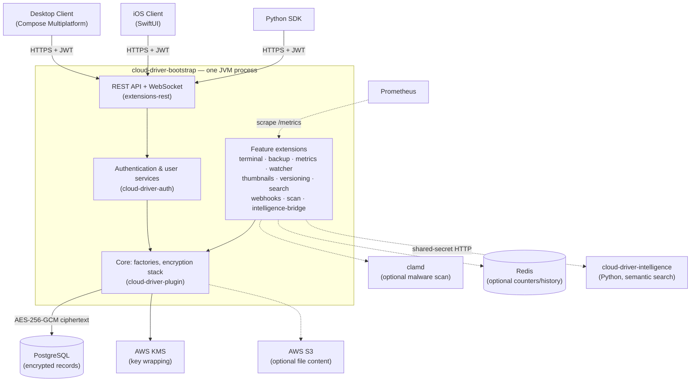
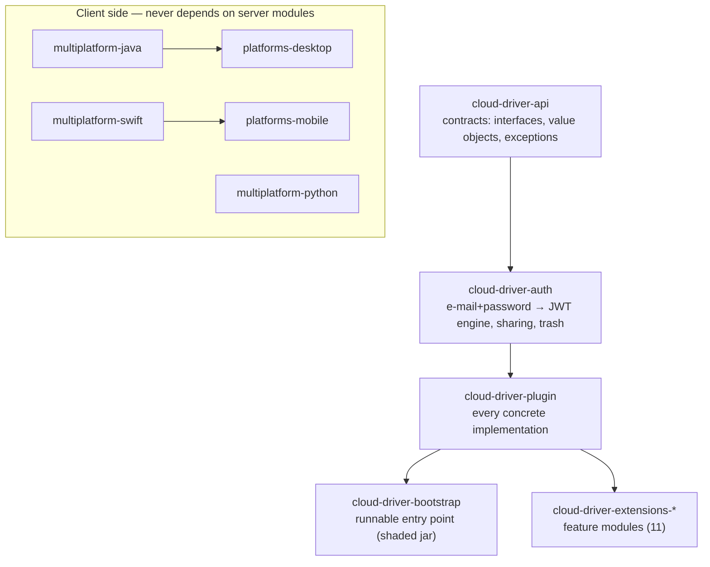
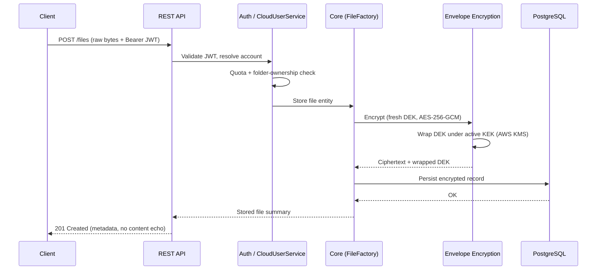
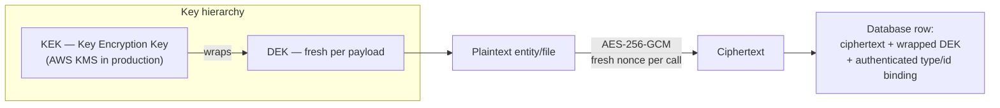
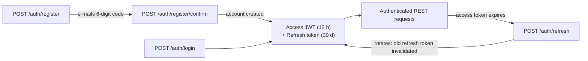
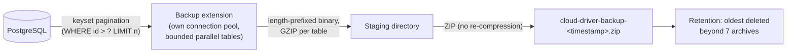
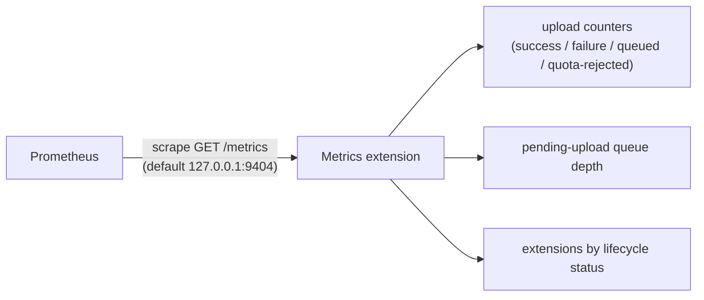

# CloudDriver


`cloud-driver` is a self-hosted cloud storage system for securely storing, managing, and sharing
files through a modular Java backend, a JWT-authenticated REST API, an encrypted PostgreSQL
persistence layer, and native desktop and iOS clients. Every stored record is envelope-encrypted
(AES-256-GCM with DEK/KEK key wrapping) before it ever reaches the database.

This README is the map of the project. Deeper, cross-cutting documentation lives under
[`docs/`](docs/); the full operator-facing prerequisites live in
[`docs/requirements.md`](docs/requirements.md).

---

## Table of Contents

- [Overview](#overview)
- [Features](#features)
- [Architecture](#architecture)
  - [System Architecture](#system-architecture)
  - [Module Architecture](#module-architecture)
  - [Data Flow](#data-flow)
  - [Security Architecture](#security-architecture)
- [Modules](#modules)
- [Project Structure](#project-structure)
- [Requirements](#requirements)
- [Installation](#installation)
- [Configuration](#configuration)
- [Quick Start](#quick-start)
- [REST API](#rest-api)
- [Authentication & Authorization](#authentication--authorization)
- [File Storage](#file-storage)
- [Encryption & Security](#encryption--security)
- [Database](#database)
- [Extensions](#extensions)
- [Desktop Client](#desktop-client)
- [Mobile Client](#mobile-client)
- [Client SDKs](#client-sdks)
- [Backup & Recovery](#backup--recovery)
- [Monitoring](#monitoring)
- [Development](#development)
- [Testing](#testing)
- [Deployment](#deployment)
- [Known Limitations](#known-limitations)
- [Roadmap](#roadmap)
- [Documentation](#documentation)
- [License](#license)
- [Author](#author)

---

## Overview

`cloud-driver` provides personal cloud storage you run yourself: accounts register with an
e-mail-verified signup, log in, and manage their files and folders through a desktop app
(macOS/Windows/Linux), a native iOS app, or one of three client SDKs (Java, Swift, Python) — all
speaking the same REST/WebSocket API.

The backend is **one JVM process** built from a multi-module Maven project. What look like
separate services — the REST API, the operator terminal, the backup job, metrics, thumbnails,
versioning, search, webhooks, malware scanning — are *extensions*: independent jars loaded into
that one process from an `extensions/` folder at startup. Three genuinely separate processes sit
alongside it, each optional: a ClamAV daemon (malware scanning), Redis (restart-surviving rate
limits and webhook history), and `cloud-driver-intelligence`, a Python service owning the
embedding model behind semantic search.

Security is the project's central design constraint: nothing plaintext is ever written to the
database. Every entity — file content included — passes through envelope encryption
(AES-256-GCM, a fresh data-encryption key per payload, wrapped under a key-encryption key held in
AWS KMS in production) before persistence, and passwords are hashed with Argon2id.

## Features

### Storage

- File upload and download, including a streaming download route with no JSON/base64 wrapping
- Folder management: create, rename, move, per-folder display color
- Recycle bin / trash: soft delete, restore, "empty trash", automatic retention-window purge
- Per-account upload quotas and usage accounting
- File versioning: prior content versions kept on overwrite, with restore
- Per-account content deduplication (byte-identical uploads stored once)
- Thumbnails for images and PDF first pages
- Optional S3-backed file content and presigned direct-to-storage transfer
- Offline-safe uploads: queued locally and retried when connectivity returns

### Authentication & Accounts

- Two-step, e-mail-verified self-registration
- Login with JWT access tokens (12 h) plus rotating, single-use refresh tokens (30 days)
- Password reset and e-mail change, both two-step and e-mail-verified
- Logout with server-side refresh-token revocation
- Admin flag (grantable only through the operator terminal, never over the network)
- Static API-key authentication as a separate, machine-to-machine alternative
- Persisted audit log of security-relevant actions

### Sharing

- File and folder sharing between accounts (read-only by default)
- Permission levels (`VIEW`/`EDIT`) and optional share expiry
- Public, unauthenticated, read-only file links with optional expiry
- "Shared with me" listings and browsing/downloading inside shared folders
- Shares are automatically revoked when the shared item is deleted

### Search & Intelligence

- Keyword search over file names and extracted text content
- Semantic ("by meaning") search backed by the separate Python embedding service
- Near-duplicate detection and zero-shot auto-tag suggestions
- Optional PDF text extraction, OCR, and CLIP image embeddings

### Security

- Envelope encryption at rest: AES-256-GCM, DEK/KEK split, key rotation
- Production key management via AWS KMS (key material never leaves AWS HSMs)
- Argon2id password hashing; general hashing restricted to SHA-256/384/512
- Malware scanning of uploads via ClamAV, with download gating on the scan verdict
- Per-IP auth rate limiting and per-user API rate limiting (Redis-backed when available)
- Secret redaction before logging; ownership scoping on every user-facing route

### Infrastructure & Operations

- PostgreSQL persistence with automatic per-entity table creation
- Live push over WebSocket, driven by PostgreSQL `LISTEN`/`NOTIFY`
- Signed, retried outbound webhooks for file events
- Prometheus-scrapeable metrics endpoint
- Streaming, keyset-paginated database backups with retention rotation
- An interactive operator terminal with a diagnostics/operations command catalog
- A plugin/extension framework for adding backend features without touching the core

### Clients

- Desktop app (Compose Multiplatform): file browser, drag & drop, previews, trash, sharing,
  dashboard, admin panel, live refresh
- iOS app (SwiftUI): file browser, document scanner, photo upload, previews, trash, sharing
- Java, Swift, and Python client libraries covering the full API surface

## Architecture

Full detail: [docs/architecture.md](docs/architecture.md)

### System Architecture



Solid arrows are required paths; dashed arrows are optional integrations that degrade gracefully
when absent.

### Module Architecture

Dependency direction is strictly one-way:



Never add a dependency against the arrow direction: `cloud-driver-api` must never depend on
`cloud-driver-auth`/`cloud-driver-plugin`, and `cloud-driver-auth` must never depend on
`cloud-driver-plugin`. The client modules talk to the backend purely over HTTP/WebSocket.

### Data Flow

A representative authenticated file upload:



Downloading reverses the path, with two independent integrity checks before the caller ever sees
plaintext:

```text
PostgreSQL ──> encrypted record ──> unwrap DEK ──> AES-256-GCM decrypt
                                                       │  (authentication tag verified)
                                                       ▼
                                            plaintext checksum verified
                                                       │
                                                       ▼
                                        REST streaming response ──> client
```

### Security Architecture



- **DEK (Data Encryption Key)** — generated fresh for every payload, used once, destroyed after
  use.
- **KEK (Key Encryption Key)** — never stored beside the data; in production it lives in AWS KMS,
  so unwrapping a DEK is a KMS call and raw KEK material never enters this process.
- The entity's **type name and primary key are bound into the authenticated data**, so a
  ciphertext can't be silently swapped in for a different record.
- Key **rotation** is supported: new payloads wrap under the new KEK while old ones remain
  readable.

See [docs/security.md](docs/security.md) for the complete model.

## Modules

| Module | Responsibility |
|---|---|
| `cloud-driver-api` | Shared contracts: interfaces, abstract classes, records/value objects, exceptions, the terminal engine |
| `cloud-driver-auth` | Authentication engine (registration, login, JWT, refresh tokens), user/file/folder services, sharing, trash, audit log |
| `cloud-driver-plugin` | Every concrete implementation: encryption stack, database client, key services, REST server, object storage, Redis support |
| `cloud-driver-bootstrap` | The runnable backend entry point — one self-contained shaded jar |
| `cloud-driver-extensions` | Aggregator for the eleven feature extensions below |
| `cloud-driver-extensions-rest` | Starts the JWT-authenticated REST API and WebSocket |
| `cloud-driver-extensions-watcher` | PostgreSQL `LISTEN`/`NOTIFY` change notifications, feeding live push |
| `cloud-driver-extensions-terminal` | Operator terminal command catalog (diagnostics, ops, hard reset) |
| `cloud-driver-extensions-backup` | Streaming, keyset-paginated database backup job with retention |
| `cloud-driver-extensions-metrics` | Prometheus-scrapeable `/metrics` endpoint on its own port |
| `cloud-driver-extensions-thumbnails` | Image/PDF preview thumbnail generation |
| `cloud-driver-extensions-versioning` | File version capture on overwrite, with restore |
| `cloud-driver-extensions-search` | In-memory keyword search index over names and text content |
| `cloud-driver-extensions-webhooks` | Signed, retried outbound HTTP callbacks for file events |
| `cloud-driver-extensions-scan` | Malware scanning via an external `clamd` daemon |
| `cloud-driver-extensions-intelligence` | Java bridge to the Python semantic-search service |
| `cloud-driver-intelligence` | Standalone Python/FastAPI service: embeddings, vector store, semantic search, duplicates, tagging |
| `cloud-driver-multiplatform` | Parent for the three per-language client SDKs |
| `cloud-driver-multiplatform-java` | Java REST/WebSocket client library (used by the desktop app) |
| `cloud-driver-multiplatform-swift` | Swift REST client library (used by the iOS app) |
| `cloud-driver-multiplatform-python` | Full-coverage Python SDK (`cloud-driver-client` on pip) |
| `cloud-driver-platforms` | Parent directory for the client apps |
| `cloud-driver-platforms-desktop` | Desktop app — Kotlin / Compose Multiplatform (Gradle build) |
| `cloud-driver-platforms-mobile` | iOS app — Swift / SwiftUI (Xcode project, generated via XcodeGen) |

## Project Structure

```text
cloud-driver/
├── cloud-driver-api/                    # contracts
├── cloud-driver-auth/                   # auth + user services
├── cloud-driver-plugin/                 # implementations
├── cloud-driver-bootstrap/              # runnable backend jar
├── cloud-driver-extensions/             # 11 feature extensions
│   ├── cloud-driver-extensions-rest/
│   ├── cloud-driver-extensions-watcher/
│   ├── cloud-driver-extensions-terminal/
│   ├── cloud-driver-extensions-backup/
│   ├── cloud-driver-extensions-metrics/
│   ├── cloud-driver-extensions-thumbnails/
│   ├── cloud-driver-extensions-versioning/
│   ├── cloud-driver-extensions-search/
│   ├── cloud-driver-extensions-webhooks/
│   ├── cloud-driver-extensions-scan/
│   └── cloud-driver-extensions-intelligence/
├── cloud-driver-intelligence/           # Python semantic-search service (own process)
├── cloud-driver-multiplatform/          # client SDKs (Java / Swift / Python)
├── cloud-driver-platforms/              # client apps (desktop / mobile)
├── homepage/                            # static informational website for cloud-driver.de
├── docs/                                # cross-cutting documentation (incl. requirements.md)
├── .github/workflows/                   # CI
├── pom.xml                              # Maven reactor root
└── README.md
```

## Requirements

Full, operator-grade detail (including every configuration key, IAM permissions, and system
sizing): [`docs/requirements.md`](docs/requirements.md).

### Backend

| Requirement | Notes |
|---|---|
| JDK **21** | Every module's compiler source/target |
| Maven 3.x | No wrapper is committed — use a local install |
| PostgreSQL (10+) | The only supported database; tables are auto-created |
| GitHub Packages read access | The external `de.lino.database:database-driver-*` dependency is published to `linoalessio/database-driver-v2`, not Maven Central — a PAT with `read:packages` must be configured in `~/.m2/settings.xml` under server id `database-driver-github` |
| AWS account with a KMS key | **Required at boot** in the current code — the production key service is constructed unconditionally |
| SMTP or AWS SES (optional) | Verification e-mails; falls back to log-only delivery |
| AWS S3, `clamd`, Redis (optional) | S3-backed content, malware scanning, durable rate limits |

### Clients

| Requirement | Needed for |
|---|---|
| Nothing beyond a JDK | Desktop app ships its own Gradle wrapper |
| Full Xcode with an iOS SDK + [XcodeGen](https://github.com/yonaskolb/XcodeGen) | iOS app (Command Line Tools alone are not sufficient) |
| Python **3.10+** | Python SDK and the intelligence service |

## Installation

```bash
git clone https://github.com/linoalessio/cloud-driver.git
cd cloud-driver
```

Configure read access to the external `database-driver` dependency (one-time), then build:

```bash
mvn clean install                          # build every backend module, in dependency order
mvn -pl cloud-driver-bootstrap -am package # produce the runnable, shaded jar
```

Client apps are built separately — see [Desktop Client](#desktop-client) and
[Mobile Client](#mobile-client).

## Configuration

All environment-specific values live in two gitignored JSON files under a `cloud-driver/`
directory next to the running jar. **Never commit real values.**

`cloud-driver/postgres-database.json`:

```json
{
  "address": "<POSTGRES_HOST>",
  "userName": "<POSTGRES_USER>",
  "password": "<POSTGRES_PASSWORD>",
  "port": 5432,
  "database": "<DATABASE_NAME>",
  "fileRepository": "Unknown"
}
```

`cloud-driver/configuration.json` (minimal working example):

```json
{
  "aws-kms-region": "<AWS_REGION>",
  "aws-kms-key-id": "<KMS_KEY_ALIAS_OR_ID>",
  "jwt-signing-key": "<JWT_SIGNING_KEY>",
  "rest-server-port": 8080,
  "cloud-user-max-bytes-to-upload": 5368709120
}
```

- `aws-kms-region` / `aws-kms-key-id` — required; the process crashes at boot without them.
- `jwt-signing-key` — generate via `openssl rand -base64 32`; without it the REST API is skipped
  (with a warning) while everything else still starts.
- `cloud-user-max-bytes-to-upload` — defaults to a **strict 1 MiB** per-account quota if unset,
  not unlimited. Set it deliberately.
- AWS credentials themselves are never read from this file — the AWS SDK's own default provider
  chain resolves them.

Every other key (SMTP/SES, S3, metrics, rate limits, trash retention, ClamAV, semantic search,
…) is optional with a sane default. The complete key-by-key reference:
[docs/configuration.md](docs/configuration.md) and [docs/requirements.md](docs/requirements.md) §3.

## Quick Start

1. Install prerequisites (JDK 21, Maven, PostgreSQL) and provision an AWS KMS key.
2. Clone the repository and configure GitHub Packages access (see [Installation](#installation)).
3. Create a PostgreSQL database and a role that owns it — no tables; they are auto-created.
4. Build: `mvn clean install && mvn -pl cloud-driver-bootstrap -am package`.
5. Assemble a run directory:

   ```text
   run/
   ├── cloud-driver-bootstrap-1.0.7.jar
   ├── cloud-driver/
   │   ├── postgres-database.json
   │   └── configuration.json
   └── extensions/          # copy the extension jars you want (at minimum: -rest)
   ```

   Extension jars are built into each `cloud-driver-extensions/*/target/` by step 4.
6. Start the backend **from inside that directory** (paths resolve against the working dir):

   ```bash
   cd run && java -Xmx6g -jar cloud-driver-bootstrap-1.0.7.jar
   ```

7. Point a client at it (the apps hardcode their server URL — see
   [Desktop Client](#desktop-client)), register an account, confirm the e-mailed code, log in,
   and upload a file.

Alternatively, `shell/`-style helper scripts used by the reference deployment (assemble-and-run
smoke test, deploy, release) exist but are operator-local and deliberately untracked — see
[docs/deployment.md](docs/deployment.md).

## REST API

One JWT-authenticated REST API, mounted by `cloud-driver-extensions-rest`. Full route-by-route
reference: [docs/api-reference.md](docs/api-reference.md). Code samples for every layer:
[docs/api-usage.md](docs/api-usage.md).

| Area | Description |
|---|---|
| Authentication | Registration, login, e-mail verification, password reset, e-mail change, token refresh, logout |
| Users | The caller's own account record, quota/usage, theme preference |
| Files | Upload, download/stream, rename, move, replace content, thumbnails, versions |
| Folders | Create, list, rename/move, color |
| Sharing | Grants (with permission level/expiry), shared-with-me, public links |
| Trash | List, restore, empty |
| Search | Keyword and semantic search, duplicate groups, tag suggestions |
| Activity | Per-file, per-folder, and global audit-backed activity feeds |
| Webhooks | Subscription management and delivery history |
| Administration | Account listing, audit log, metrics snapshot (admin-only) |
| Live updates | WebSocket push when the caller's data changes elsewhere |

Representative call:

```http
POST /auth/login
Content-Type: application/json

{
  "username": "user@example.com",
  "password": "<PASSWORD>"
}
```

```json
{ "token": "<jwt>", "refreshToken": "<opaque>" }
```

Uploads send raw bytes (not JSON) with the file name in the query string:

```http
POST /files?fileName=report.pdf&folderId=root
Authorization: Bearer <jwt>
Content-Type: application/octet-stream

<raw file bytes>
```

## Authentication & Authorization



- **Access tokens** are HMAC-SHA256 JWTs with a 12-hour lifetime; the bearer filter also verifies
  the account still exists, so a deleted account's leftover token is rejected.
- **Refresh tokens** are opaque, single-use, and rotate on every use; logout revokes them
  server-side.
- **Passwords** are Argon2id-hashed and format-validated at registration; login never
  distinguishes "no such account" from "wrong password".
- **Authorization** is ownership-based: every route resolves the caller from the validated token,
  never from the request body; reading someone else's record yields `404`, not `403`, to avoid
  confirming existence. Sharing is an explicit, additive grant on top of ownership.
- **Admin** routes require an account-level flag that can only be set through the operator
  terminal — there is deliberately no network path to grant it.
- A separate **static API-key** mode (constant-time digest comparison) exists for
  machine-to-machine deployments; it is never combined with JWT auth on one server instance.

## File Storage

Files are ordinary encrypted entities, not a separate storage path — the same envelope-encryption
pipeline persists them, plus extra integrity checks:

- A **plaintext checksum** is recorded at upload and re-verified on every read, on top of the
  AES-GCM authentication tag.
- Content is **DEFLATE-compressed before encryption** when that actually shrinks it.
- Three content modes exist per file: inline in the database row (default), **S3-backed**
  (ciphertext object in S3, metadata in PostgreSQL), and **direct transfer** (client ⇄ S3 via
  presigned URLs, SSE-S3 encrypted, bypassing the backend for the bytes).
- **Soft delete**: deleting moves a file/folder to the trash; a purge scheduler permanently
  removes trashed items after a configurable retention window (default 30 days).
- **Deduplication**: a byte-identical re-upload within one account stores an alias, not a second
  copy, and quota is charged once.
- **Versioning**: overwriting a file's content captures the prior version first (bounded per-file
  count and age), restorable through the API.

## Encryption & Security

Summarized in [Security Architecture](#security-architecture) above; the complete model —
including key-service implementations, rate limiting, scan gating, and what "deleted" means — is
documented in [docs/security.md](docs/security.md).

| Layer | Mechanism |
|---|---|
| Encryption at rest | AES-256-GCM, fresh random nonce per call, tag always verified |
| Key management | DEK per payload, wrapped under a rotatable KEK; AWS KMS in production (in-memory/file/database-backed implementations exist for development only) |
| Passwords | Argon2id, cost parameters encoded in the hash |
| Hashing | SHA-256/384/512 only — weaker algorithms are not representable |
| Transport | HTTPS via a TLS-terminating reverse proxy in front of the backend |
| Malware | ClamAV scan on upload; non-clean files can't be downloaded (`409` while pending, `403` when flagged) |
| Abuse | Per-IP auth rate limit, per-user read rate limit, request-size ceiling, upload quotas |
| Secrets | Config files are gitignored; secret redaction runs before audit-log persistence |

## Database

- **PostgreSQL is required and is the only supported database.** The persistence layer (the
  external `database-driver` artifact group) creates one trivial table per entity type
  (`id TEXT, data BYTEA`) automatically on first use — never hand-create tables.
- Rows hold **only ciphertext**: the envelope-encrypted entity plus its wrapped DEK.
- Each entity type gets its own section and a bounded, time-limited decryption cache (decrypted
  plaintext lives in memory for at most ~30 s / 1,000 entries by default).
- `LISTEN`/`NOTIFY` powers live updates: the watcher extension installs a trigger on the stored
  file table and pushes change notifications to connected WebSocket clients — push, not polling.
- Connection credentials come exclusively from `postgres-database.json` (gitignored).

## Extensions

Extensions are how backend features stay modular without becoming separately deployed services:

- An extension is a plain, **unshaded jar** dropped into the `extensions/` folder next to the
  bootstrap jar. At startup the folder is scanned; any jar declaring a concrete extension class
  plus a small `extension.json` manifest (name, version, dependencies on other extensions) is
  loaded into the process and started on its own named thread, in dependency order.
- Extensions reach the core purely through the `CloudDriver` facade and publish their services
  into a shared service container — optional facets are `null` until their extension runs, and
  every consumer degrades gracefully when one is absent.
- One failing extension is isolated: its error is routed to its own handler rather than aborting
  the rest.
- **Version discipline matters**: extension jars resolve shared classes off the host jar's
  classpath, so always deploy extension jars and the bootstrap jar built from the same commit.

The eleven shipped extensions are listed under [Modules](#modules). To add a new one, see
[docs/contributing.md](docs/contributing.md).

## Desktop Client

A Kotlin / Compose Multiplatform desktop app (macOS, Windows, Linux) — Gradle-built, outside the
Maven reactor, depending on `cloud-driver-multiplatform-java` from the local Maven repository:

```bash
mvn -pl cloud-driver-multiplatform/cloud-driver-multiplatform-java -am install
cd cloud-driver-platforms/cloud-driver-platforms-desktop
./gradlew run                              # run from source
./gradlew packageDistributionForCurrentOS  # build a native installer
./build-app.sh                             # build + install into the OS app location
```

Functionality: two-step registration, login with session persistence (OS keychain), a
Finder-style file browser (upload, download, folder tree, drag & drop from the OS, previews for
text/PDF/DOCX/images, ZIP extraction, multi-select, sorting, search), sharing with permission
levels and public links, version history, trash, an account dashboard with storage stats, live
refresh over WebSocket, and a read-only admin panel for admin accounts.

The server URL is a hardcoded constant (`DEFAULT_SERVER_URL` in `Main.kt`) — change it and
rebuild to point the app at your own deployment.

## Mobile Client

A native iOS (iPhone) app in Swift/SwiftUI — a plain Xcode project generated from a committed
`project.yml` via XcodeGen; its networking layer is the local `cloud-driver-multiplatform-swift`
Swift package:

```bash
cd cloud-driver-platforms/cloud-driver-platforms-mobile
xcodegen generate
open CloudDriverMobile.xcodeproj
```

Deployment target iOS 17, iPhone only. Functionality: authentication, file browser with
multi-select, folder upload and ZIP extraction, camera document scanning to PDF, photo-library
upload, single-tap previews, search (keyword + semantic), sharing, version history, trash, and a
dashboard with an activity feed. The server URL is hardcoded in the Swift package's `APIClient` —
change and rebuild to point elsewhere. Regenerate the Xcode project after adding/removing/renaming
any source file.

## Client SDKs

Three hand-maintained client libraries under `cloud-driver-multiplatform/`, one per ecosystem, all
speaking the same REST/WebSocket contract (no shared code between them):

| SDK | Consumed by | Install |
|---|---|---|
| `cloud-driver-multiplatform-java` | The desktop app, or any JVM caller | `mvn install` from the reactor; published to GitHub Packages on release |
| `cloud-driver-multiplatform-swift` | The iOS app | Local Swift Package Manager path dependency |
| `cloud-driver-multiplatform-python` | Python microservices/scripts | `pip install -e .` from its directory (package `cloud-driver-client`) |

All three cover authentication (with transparent refresh-on-401), files/folders, sharing, trash,
search, versions, presigned transfer, and — Java and Python — live updates over WebSocket. Usage
samples for each: [docs/api-usage.md](docs/api-usage.md).

## Backup & Recovery

The backup extension exports the whole PostgreSQL database on a schedule (default: every 3 days)
without ever holding more than one bounded page in memory:



- Rows are exported **still encrypted** — the archive is exactly as sensitive as the database and
  is not additionally encrypted by the backup itself; protect it accordingly.
- Overlapping cycles are prevented; a manual cycle can be triggered from the operator terminal
  (`backup now`).
- **There is no automated restore mechanism** — restoring means re-importing the archived
  `id`/`data` pairs by hand.

## Monitoring

The metrics extension serves a Prometheus text-format endpoint on its own port, separate from the
API:



- **Loopback-only by default and unauthenticated by design** — widening the bind host is a
  deliberate access-control decision.
- The same numbers are readable in-process via the admin-gated `GET /admin/metrics` REST route
  and surface in the desktop app's admin panel.
- The operator terminal's `health` command additionally live-probes clamd, the embedding service,
  Redis, and S3 — the difference between "extension loaded" and "backing process actually
  answers".

## Development

```bash
mvn clean install               # build all backend modules
mvn -pl <module> -am compile    # build one module + its dependencies
mvn -pl cloud-driver-bootstrap -am package   # runnable shaded jar
```

- Dependency direction (`api ← auth ← plugin ← bootstrap/extensions`) is a hard rule — see
  [Module Architecture](#module-architecture). Circular dependencies are forbidden.
- The desktop app builds with its own Gradle wrapper; the iOS app with Xcode/XcodeGen; the Python
  packages with `pip install -e ".[dev]"`.
- Code conventions (`this.`-qualified field access, Javadoc expectations, null-check style) and
  the checklist for adding an extension or a REST route:
  [docs/contributing.md](docs/contributing.md).

## Testing

Honest summary — full detail in [docs/testing.md](docs/testing.md):

- **Java/Kotlin/Swift**: no conventional automated test framework (JUnit, XCTest) is wired in.
  Files under `src/test` are runnable worked examples with a `main` method, not `mvn test`
  targets. Changes are verified by compiling and actually running the built artifact.
- **Python**: both `cloud-driver-intelligence` and the Python SDK have real `pytest` suites, run
  on every push by CI.
- **CI** builds (but does not test) the Maven reactor and the iOS app on every relevant push.

## Deployment

Full detail: [docs/deployment.md](docs/deployment.md).

- The backend deploys as **one shaded jar plus its extension jars to a single server** — there is
  no Docker/Kubernetes/containerized deployment. Operator-local shell scripts (untracked, since
  they hardcode server details) upload the build and run it in a detached, auto-restarting
  session with an explicit heap size (`-Xmx6g` on the reference deployment).
- Put a TLS-terminating reverse proxy in front of the REST port; keep the metrics port
  loopback-only or firewalled.
- The optional companion processes (`clamd`, Redis, the Python intelligence service) run as
  ordinary system services beside the JVM; the intelligence service ships a systemd unit and
  installer under `cloud-driver-intelligence/deploy/`.
- The apex domain `cloud-driver.de` serves the static informational homepage under
  [`homepage/`](homepage/) (with legal-notice/privacy pages) straight from the reverse
  proxy — see [docs/deployment.md](docs/deployment.md#homepage-cloud-driverde).
- CI (GitHub Actions): build checks for the Maven reactor, the iOS app, and both Python packages
  (with pytest), Qodana static analysis, and a publish workflow that pushes every Maven module to
  GitHub Packages when a release is created. **No workflow deploys to a server automatically** —
  production pushes are always a separate, manual decision.

## Known Limitations

- No automated test coverage for the Java/Kotlin/Swift codebases (the Python parts excepted).
- No containerized or orchestrated deployment; deployment tooling is operator-local scripting
  against a single server.
- Encryption/decryption of a file is single-shot: a large file's full content passes through
  memory, so heap must be sized for the largest expected upload (chunked/streaming encryption is
  an open, deliberately deferred design decision).
- Several read paths (login lookup, per-account listings) do a full in-memory scan of an entity
  type — the storage layer has no secondary indexes. Accepted at current data scale.
- The WebSocket live-update session registry is process-local: running multiple backend instances
  behind a load balancer is not supported today.
- Client apps hardcode their server URL; pointing them elsewhere requires a rebuild.
- Malware scanning **fails open**: if the scanner is unreachable after retries, the file is
  marked clean (loudly logged) rather than blocking uploads.
- There is no web client, and no client-side sync engine (the server-side optimistic-concurrency
  primitive for it exists; the client half is deferred).
- No automated backup restore path.

## Roadmap

- [ ] Chunked/streaming encryption so large files never need full-content heap headroom
- [ ] Client-side sync engine on top of the existing conflict-copy server primitive
- [ ] Public links for folders (files-only today)
- [ ] Automated test coverage for the JVM/Swift codebases
- [ ] Secondary-index support to replace the remaining full-scan read paths

## Documentation

| Document | Covers |
|---|---|
| [docs/architecture.md](docs/architecture.md) | How the system fits together, request flow, layering, dependency rules |
| [docs/security.md](docs/security.md) | Encryption, authentication, authorization, network hardening |
| [docs/configuration.md](docs/configuration.md) | Configuration files and keys |
| [docs/getting-started.md](docs/getting-started.md) | Building and running backend, desktop, and mobile locally |
| [docs/api-reference.md](docs/api-reference.md) | The complete REST API route reference |
| [docs/api-usage.md](docs/api-usage.md) | Code samples: in-process Java, raw REST, and each client SDK |
| [docs/testing.md](docs/testing.md) | How changes are verified today |
| [docs/deployment.md](docs/deployment.md) | Release process, CI, and how the backend reaches a server |
| [docs/contributing.md](docs/contributing.md) | Code conventions and extension points |
| [docs/troubleshooting.md](docs/troubleshooting.md) | Real incidents and their fixes |
| [docs/requirements.md](docs/requirements.md) | Every operator-facing prerequisite, key-by-key |

## License

This repository does not currently contain a license file. Until one is added, all rights are
reserved by the author — do not assume any open-source license applies.

## Author

**Lino Alessio Kauschinger**

GitHub: [https://github.com/linoalessio](https://github.com/linoalessio)
