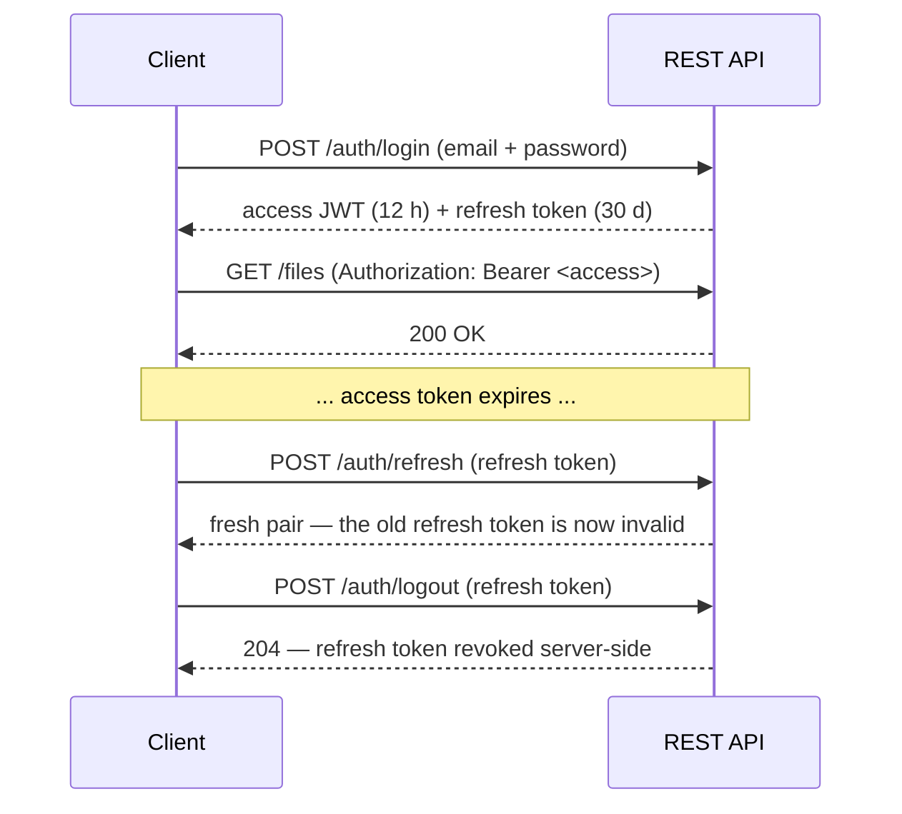

# API Reference

The backend exposes one JWT-authenticated REST API, mounted by the `cloud-driver-extensions-rest`
feature module (the routes themselves are implemented in `cloud-driver-plugin`'s
`DefaultRestFactory`). Both the desktop and mobile apps talk to the exact same routes. This page
is the route-by-route reference.

Client libraries covering these routes: `cloud-driver-multiplatform-java` (Java),
`cloud-driver-multiplatform-swift` (Swift), `cloud-driver-multiplatform-python` (Python) — all
under [`cloud-driver-multiplatform/`](../cloud-driver-multiplatform/).

For code samples calling these routes (and every other way to use the system — the in-process Java
API, each client library, the operator terminal), see [api-usage.md](api-usage.md).

## Authentication

Every route requires an `Authorization: Bearer <token>` header (a short-lived access token,
refreshed via its own route once expired) — except the registration/login/reset/refresh/logout
routes below and the public-link download route, each of which carries its own authority in the
request itself.

| Route | Method | Purpose |
|---|---|---|
| `/auth/register` | POST | Start signup — e-mails a verification code |
| `/auth/register/confirm` | POST | Confirm the code — creates the account, returns a token pair |
| `/auth/login` | POST | Exchange email + password for a token pair |
| `/auth/refresh` | POST | Exchange a still-valid refresh token for a fresh pair (rotates on use) |
| `/auth/logout` | POST | Invalidate a refresh token |
| `/auth/reset-password` | POST | Start a forgotten-password reset — e-mails a code |
| `/auth/reset-password/confirm` | POST | Confirm the code and set a new password |
| `/auth/change-email` | POST | Start an e-mail change (bearer-gated) — e-mails a code to the new address |
| `/auth/change-email/confirm` | POST | Confirm the code and apply the change |
| `/auth/me` | GET | The caller's own account id, email, and admin flag |

How the token pair moves through a session:

## Files and folders

| Route | Method | Purpose |
|---|---|---|
| `/files` | POST | Upload a file (raw body, not JSON) into a folder or the root |
| `/files` | GET | List the caller's files (optionally scoped to a folder). Without `?limit=`, the bare-array response is capped at 500 items — use cursor pagination (`?limit=`/`?cursor=`) for complete listings |
| `/files/{id}` | GET | Fetch one file's metadata + content |
| `/files/{id}/content` | GET | Stream a file's content directly (no JSON/base64 wrapping). Conditional requests supported: the response carries `ETag` (the content checksum, quoted) and `Cache-Control: private, must-revalidate`; sending it back as `If-None-Match` answers `304 Not Modified` with no body when the content is unchanged |
| `/files/{id}/content` | PUT | Replace a file's content in place (raw body; optional `?expectedUpdatedAt=` optimistic-concurrency precondition — a mismatch returns `409` with a "conflicted copy" created instead of silently overwriting) |
| `/files/{id}/content` | PATCH | Chunk-level content update: JSON body `{"totalSizeBytes", "changedChunks": [{"index", "contentBase64"}]}` sends only the 1 MiB chunks that changed (diffed against `GET /files/{id}/chunk-manifest`); same access rule, `?expectedUpdatedAt=` precondition/`409` conflicted-copy handling, versioning capture, and reindexing as `PUT`. `400` when the chunk set no longer lines up with the current content (stale manifest — re-fetch it or fall back to a full `PUT`) |
| `/files/{id}/chunk-manifest` | GET | The file's current per-chunk plaintext SHA-256 manifest (`{"chunkSizeBytes", "totalSizeBytes", "chunkHashes": ["<hex>", ...]}`) — compare positionally against a local copy to find what a `PATCH` must send. `404` when no manifest exists (dedup alias, presigned-upload file, or content last written before manifests existed) — fall back to a full upload |
| `/files/{id}/thumbnail` | GET | A small JPEG preview (images and PDF first pages), if the thumbnails extension is running |
| `/files/{id}/folder` | PUT | Move a file |
| `/files/{id}/rename` | PUT | Rename a file |
| `/files/{id}` | DELETE | Move a file to the trash |
| `/folders` | POST / GET | Create / list folders |
| `/folders/{id}` | PUT / DELETE | Rename+move (combined) / trash a folder |
| `/folders/{id}/color` | PUT | Set a folder's display color |

## File versions

Available when the versioning extension is running (`503` otherwise).

| Route | Method | Purpose |
|---|---|---|
| `/files/{id}/versions` | GET | List a file's captured prior versions |
| `/files/{id}/versions/{n}/content` | GET | Stream one version's content. Same `ETag`/`If-None-Match`/`304` conditional handling as `GET /files/{id}/content` (a version's content is immutable once captured) |
| `/files/{id}/versions/{n}/restore` | POST | Restore a version (the current content is captured as a new version first) |

## Trash

| Route | Method | Purpose |
|---|---|---|
| `/files/trash`, `/folders/trash` | GET | List trashed items (with their scheduled purge dates) |
| `/files/{id}/restore`, `/folders/{id}/restore` | POST | Restore a trashed item |
| `/trash/empty` | POST | Permanently remove everything currently trashed |

## Sharing

| Route | Method | Purpose |
|---|---|---|
| `/files/{id}/share`, `/folders/{id}/share` | POST | Grant another account access — body optionally carries `permissionLevel` (`VIEW`, the default, or `EDIT` for files) and `expiresAtEpochMillis` |
| `/files/{id}/share/{email}`, `/folders/{id}/share/{email}` | DELETE | Revoke access |
| `/files/{id}/share`, `/folders/{id}/share` | GET | List who a file/folder is shared with (owner-side) |
| `/files/shared-with-me`, `/folders/shared-with-me` | GET | List what's been shared with the caller |
| `/folders/{id}/shared-contents` | GET | Browse inside a folder reached via a share |
| `/files/shared-by-me/count` | GET | Count of the caller's own files currently shared with someone |

## Public links

Read-only, files-only, unauthenticated on the download side.

| Route | Method | Purpose |
|---|---|---|
| `/files/{id}/public-link` | POST | Create a public link (owner-only; optional expiry) |
| `/files/{id}/public-link` | GET | List a file's active public links (owner-only) |
| `/files/{id}/public-link/{token}` | DELETE | Revoke a public link (owner-only) |
| `/public/files/{token}` | GET | **Unauthenticated** — stream the linked file's content |

## Search and intelligence

| Route | Method | Purpose |
|---|---|---|
| `/search?q=<query>&limit=<n>` | GET | Keyword search over the caller's file names and extracted text |
| `/search/semantic?q=<query>&limit=<n>` | GET | Semantic ("by meaning") search — `503` when the intelligence service isn't configured, so a client can fall back to keyword search |
| `/files/duplicates` | GET | Similarity-based duplicate groups among the caller's files |
| `/files/{id}/tags` | GET | Zero-shot tag suggestions for one file |

## Activity

Always paginated (`{items, nextCursor}` envelope).

| Route | Method | Purpose |
|---|---|---|
| `/files/{id}/activity` | GET | One file's audit-backed history |
| `/folders/{id}/activity` | GET | One folder's history |
| `/activity` | GET | The caller's global activity feed across everything they can see |

## Webhooks

Available when the webhooks extension is running (`503` otherwise).

| Route | Method | Purpose |
|---|---|---|
| `/webhooks` | POST | Subscribe an `https://` URL to `FILE_UPLOADED`/`FILE_DELETED`/`FILE_SHARED` events — the HMAC signing secret is returned exactly once |
| `/webhooks` | GET | List the caller's subscriptions (no secrets) |
| `/webhooks/{id}` | DELETE | Revoke a subscription |
| `/webhooks/deliveries` | GET | Recent delivery attempts across the caller's webhooks |

## Account and admin

| Route | Method | Purpose |
|---|---|---|
| `/cloudUsers`, `/cloudUsers/{id}` | GET | The caller's own account record |
| `/cloudUsers/theme` | PUT | Sync the caller's light/dark theme preference |
| `/cloudUsers/exists` | GET | Whether an account exists under a given email (defense-in-depth for sharing) |
| `/admin/authUsers`, `/admin/authUsers/{id}` | GET | List/fetch every account (admin-only) |
| `/admin/audit-log` | GET | Security-relevant action history (admin-only) |
| `/admin/metrics` | GET | In-process metrics snapshot (admin-only) |

## Live updates

| Route | Protocol | Purpose |
|---|---|---|
| `/ws/updates` | WebSocket | Push notification when the caller's own data changes elsewhere (another device, a share, etc.) |

## Direct-to-storage transfer (optional, if configured)

| Route | Method | Purpose |
|---|---|---|
| `/files/upload-url` | POST | Get a presigned upload URL, bypassing the backend for the data itself. Body may carry `checksumSha256` (plaintext SHA-256, lowercase hex) to opt into the dedup precheck: a match against content the account already stores answers `{"alreadyStored": 
}` instead of a ticket — nothing to upload |
| `/files/{id}/complete-upload` | POST | Finalize a presigned upload |
| `/files/{id}/download-url` | GET | Get a presigned download URL |
| `/files/upload-session` | POST | Begin a **resumable multipart upload session** (large files): same body as `/files/upload-url` but `checksumSha256` required; answers `{"alreadyStored": ...}` on a dedup hit, otherwise the session's geometry (`fileId`, `partSizeBytes` = 8 MiB, `partCount`, `totalObjectBytes`, `encryption`). `503` when not configured |
| `/files/upload-session/{id}` | GET | The session's durable progress: geometry + `uploadedPartNumbers` (asked of the object store itself) + recovered `encryption` — a crashed client resumes with nothing but the session id, re-sending only missing parts |
| `/files/upload-session/{id}/parts/{n}/url` | POST | Presign one part's upload URL — the client `PUT`s that part's byte range of its object stream there directly |
| `/files/upload-session/{id}/complete` | POST | Assemble the parts and run the standard completion (same body/response/verification as `/files/{id}/complete-upload`) |
| `/files/upload-session/{id}` | DELETE | Abort the session — the store discards uploaded parts (it bills for them until told). Idempotent |

Clients fall back to the ordinary upload/download routes automatically if this isn't configured on
a given deployment (surfaced as a `503` response).

Content transferred this way is still encrypted under the app's own DEK/KEK scheme — by the
client. Both begin responses carry an `encryption` object alongside the URL:

- `POST /files/upload-url` returns `encryption` with `contentKeyBase64` (the raw per-file
  content key, issued fresh by the server and wrapped under the KMS-held KEK before it's ever
  returned), `headerBase64` (the streaming header the client writes verbatim at offset 0),
  `associatedDataPrefix`, `chunkSizeBytes`, and `objectLengthBytes` — the exact ciphertext
  length the declared plaintext size must produce. The client chunk-encrypts locally (same
  v2 streaming AES-GCM layout the server writes) and `PUT`s ciphertext only.
- `POST /files/{id}/complete-upload` verifies the stored object's real length equals
  `objectLengthBytes` exactly, rejecting and deleting the object otherwise. `checksumSha256`
  in its body is always computed over the *plaintext*.
- `GET /files/{id}/download-url` returns `encryption` with `contentKeyBase64` (the recovered
  raw key), `associatedDataPrefix`, and `headerLengthBytes` (leading bytes to skip); the client
  fetches ciphertext directly and decrypts locally.

`encryption` is `null` only for legacy objects uploaded before client-side encryption existed
(on download) — clients must treat that as "use the fetched bytes as-is."

## Observability

| Route | Method | Purpose | Runs on |
|---|---|---|---|
| `/metrics` | GET | Prometheus scrape endpoint | The metrics feature module's own separate port, not the main API port |

## Error conventions

- Reading a record the caller doesn't own yields `404`, never `403` — existence is not confirmed.
- A file that hasn't finished malware scanning yields `409` on download; a flagged file yields
  `403`.
- `503` uniformly means "this optional capability isn't available on this deployment" (presigned
  transfer, thumbnails, versions, search, webhooks, semantic search) — clients treat it as a
  fall-back signal, not an error.
- `429` means a rate limit was exceeded (per-IP on `/auth/*`, per-user on reads elsewhere;
  `GET /files/{id}/thumbnail` is exempt from the read limit so browsing large photo folders —
  one thumbnail request per visible file — can't trip it).
