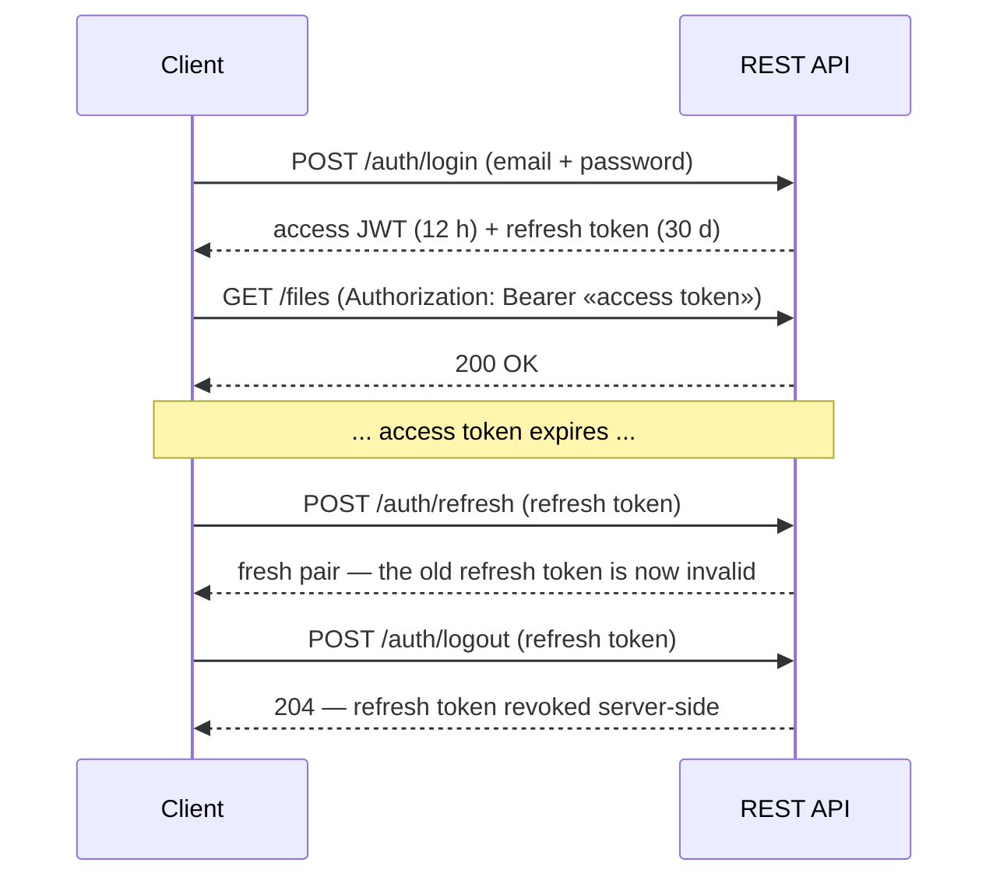

# API Reference

The backend exposes one JWT-authenticated REST API, mounted by the `cloud-driver-extensions-rest`
feature module (the routes themselves are implemented in `cloud-driver-plugin`'s
`DefaultRestFactory`). Both the desktop and mobile apps talk to the exact same routes. This page
is the route-by-route reference.

Client libraries for these routes, all under
[`cloud-driver-multiplatform/`](../cloud-driver-multiplatform/):
`cloud-driver-multiplatform-java` (Java — the only one covering the whole surface),
`cloud-driver-multiplatform-swift` (Swift — no webhooks, no admin routes, no resumable sessions,
no chunk manifest/`PATCH`, no live updates) and `cloud-driver-multiplatform-python` (Python — no
webhooks, resumable sessions or chunk manifest/`PATCH`, and it refuses a presigned ticket that
carries a client-side `encryption` object).

For code samples calling these routes (and every other way to use the system — the in-process Java
API, each client library, the operator terminal), see [api-usage.md](api-usage.md).

## Authentication

Every route requires an `Authorization: Bearer <token>` header (a short-lived access token,
refreshed via its own route once expired) — except the registration/login/reset/refresh/logout
routes below and the public-link download route, each of which carries its own authority in the
request itself.

The token may also travel as a `?token=<jwt>` query parameter on **any** route, not just the
`/ws/updates` handshake — a deliberate fallback for callers that cannot set a header (a browser
address bar, a browser `WebSocket`). The header wins when both are present. A query-parameter
token ends up in browser history, server access logs and any `Referer` the page sends onward, so
prefer the header wherever one can be set.

| Route | Method | Purpose |
|---|---|---|
| `/auth/register` | POST | Start signup — e-mails a verification code |
| `/auth/register/confirm` | POST | Confirm the code — creates the account, returns a token pair |
| `/auth/login` | POST | Exchange email + password for a token pair |
| `/auth/refresh` | POST | Exchange a still-valid refresh token for a fresh pair (rotates on use) |
| `/auth/logout` | POST | Invalidate a refresh token |
| `/auth/reset-password` | POST | Start a forgotten-password reset — e-mails a code |
| `/auth/reset-password/confirm` | POST | Confirm the code and set a new password — **ends every other session immediately** (refresh tokens revoked, already-issued access tokens refused on their next request); the caller keeps the fresh pair this call returns |
| `/auth/change-email` | POST | Start an e-mail change (bearer-gated). Body `{"newEmail", "currentPassword"}` — the caller's **current password** is re-verified before anything is persisted or e-mailed, so a stolen access token alone cannot move an account. `400` if either field is missing or the password is wrong (deliberately not `401`, which clients treat as "log in again"); `409` if another account already holds the address. On success a code is e-mailed to the new address and a notice to the current one |
| `/auth/change-email/confirm` | POST | Confirm the code and apply the change. **Every session ends**: refresh tokens are revoked and every already-issued access token is refused on its next request, so each device must sign in again with the new address. Both the previous and the new address are notified that the move completed. Response is `200` + `{"message"}` — no token pair is returned, so a client must handle its next `/auth/refresh` `401` by prompting for a login |
| `/auth/me` | GET | The caller's own account id, email, and admin flag |

How the token pair moves through a session:

## Files and folders

| Route | Method | Purpose |
|---|---|---|
| `/files` | POST | Upload a file (raw body, not JSON) into a folder or the root |
| `/files` | GET | List the caller's files. `?folderId=<id>` scopes the listing to one folder and `?folderId=root` to the root; omitted lists every file regardless of folder. Without `?limit=`, the bare-array response is capped at 500 items — use cursor pagination (`?limit=`/`?cursor=`, which switches the response to an `{items, nextCursor}` envelope) for complete listings |
| `/files/{id}` | GET | Fetch one file's metadata + content |
| `/files/{id}/content` | GET | Stream a file's content directly (no JSON/base64 wrapping). Conditional requests supported: the response carries `ETag` (the content checksum, quoted) and `Cache-Control: private, must-revalidate`; sending it back as `If-None-Match` answers `304 Not Modified` with no body when the content is unchanged. Range requests supported: a full response always carries `Accept-Ranges: bytes`; one `Range: bytes=<first>-<last>`, `bytes=<first>-` or `bytes=-<suffix length>` answers `206 Partial Content` with `Content-Range`, while a malformed, multi-range or unsatisfiable header answers `416` with `Content-Range: bytes */<total length>` |
| `/files/{id}/content` | PUT | Replace a file's content in place (raw body; optional `?expectedUpdatedAt=` optimistic-concurrency precondition — a mismatch returns `409` with a "conflicted copy" created instead of silently overwriting). With content scanning enabled the file returns to a pending verdict and is unreadable until the rescan completes. A body above 32 MiB is never held in memory: it is chunk-encrypted straight from the server's scratch file, which means it is stored uncompressed and reindexed by file name only (no content text extraction) — the same trade `POST /files` makes above that size. Smaller bodies keep the compressing, text-indexing path |
| `/files/{id}/content` | PATCH | Chunk-level content update: JSON body `{"totalSizeBytes", "changedChunks": [{"index", "contentBase64"}]}` sends only the 1 MiB chunks that changed (diffed against `GET /files/{id}/chunk-manifest`); same access rule, `?expectedUpdatedAt=` precondition/`409` conflicted-copy handling, versioning capture, reindexing and scan-verdict reset as `PUT`. `400` when the chunk set no longer lines up with the current content (stale manifest — re-fetch it or fall back to a full `PUT`); also `400` when `totalSizeBytes` is larger than the current content plus the bytes the body actually carries, or when `changedChunks` holds more than 256 entries (one body can never legitimately carry more — split the patch, or send a full `PUT`) |
| `/files/{id}/chunk-manifest` | GET | The file's current per-chunk plaintext SHA-256 manifest (`{"chunkSizeBytes", "totalSizeBytes", "chunkHashes": ["<hex>", ...]}`) — compare positionally against a local copy to find what a `PATCH` must send. `404` when no manifest exists (dedup alias, presigned-upload file, or content last written before manifests existed) — fall back to a full upload |
| `/files/{id}/thumbnail` | GET | A small JPEG preview (images and PDF first pages), if the thumbnails extension is running |
| `/files/{id}/folder` | PUT | Move a file |
| `/files/{id}/rename` | PUT | Rename a file |
| `/files/{id}` | DELETE | Move a file to the trash |
| `/folders` | POST / GET | Create / list folders. `GET` takes `?parentFolderId=<id-or-root>` (omitted or `root` lists the caller's top-level folders) and the same `?limit=`/`?cursor=` pagination opt-in as `GET /files`; it carries no 500-item cap |
| `/folders/{id}` | PUT / DELETE | Rename+move (combined) / trash a folder |
| `/folders/{id}/color` | PUT | Set a folder's display color |

## File versions

Available when the versioning extension is running (`503` otherwise).

| Route | Method | Purpose |
|---|---|---|
| `/files/{id}/versions` | GET | List a file's captured prior versions |
| `/files/{id}/versions/{n}/content` | GET | Stream one version's content. Same `ETag`/`If-None-Match`/`304` conditional handling as `GET /files/{id}/content` (a version's content is immutable once captured). The one content route with **no** range support — it answers the whole body, or `304` |
| `/files/{id}/versions/{n}/restore` | POST | Restore a version (the current content is captured as a new version first). Counts as a content change: with scanning enabled the file returns to a pending verdict and is rescanned. A restored snapshot larger than 32 MiB takes the same streamed path as a large `PUT`: stored uncompressed and reindexed by name only |

## Trash

| Route | Method | Purpose |
|---|---|---|
| `/files/trash`, `/folders/trash` | GET | List trashed items (with their scheduled purge dates) |
| `/files/{id}/restore`, `/folders/{id}/restore` | POST | Restore a trashed item |
| `/trash/empty` | POST | Permanently remove everything currently trashed |

## Sharing

| Route | Method | Purpose |
|---|---|---|
| `/files/{id}/share`, `/folders/{id}/share` | POST | Grant another account access — body carries `granteeEmail`, optionally `permissionLevel` (`VIEW`, the default, or `EDIT`) and `expiresAtEpochMillis`. `EDIT` is implemented for **file** grants only, and buys exactly one extra power: overwriting that file's content (`PUT`/`PATCH /files/{id}/content`, and `POST /files/{id}/versions/{n}/restore`, which counts as content, not structure). Renaming, moving, trashing and re-sharing stay owner-only at every level, and a folder grant is read-only whatever level it carries |
| `/files/{id}/share/{email}`, `/folders/{id}/share/{email}` | DELETE | Revoke access |
| `/files/{id}/share`, `/folders/{id}/share` | GET | List who a file/folder is shared with (owner-side) |
| `/files/shared-with-me`, `/folders/shared-with-me` | GET | List what's been shared with the caller |
| `/folders/{id}/shared-contents` | GET | Browse inside a folder reached via a share |
| `/files/shared-by-me/count` | GET | Count of the caller's own files currently shared with someone |

## Public links

Read-only, files-only, unauthenticated on the download side.

| Route | Method | Purpose |
|---|---|---|
| `/files/{id}/public-link` | POST | Create a public link (owner-only; optional expiry). Refused while the file's scan verdict is not clean |
| `/files/{id}/public-link` | GET | List a file's active public links (owner-only) |
| `/files/{id}/public-link/{token}` | DELETE | Revoke a public link (owner-only) |
| `/public/files/{token}` | GET | **Unauthenticated** — stream the linked file's content, with the same `Accept-Ranges`/`206`/`416` range handling as `GET /files/{id}/content` (but no `ETag`). The content is streamed straight out of storage, never buffered in the server's memory, so a link to a very large file costs the server no more than a small one. A link to a file that is not clean stops resolving, reporting the same invalid-link error as an expired or unknown token |

## Search and intelligence

| Route | Method | Purpose |
|---|---|---|
| `/search?q=<query>&limit=<n>` | GET | Keyword search over the caller's file names and extracted text |
| `/search/semantic?q=<query>&limit=<n>` | GET | Semantic ("by meaning") search — `503` when the intelligence service isn't configured, so a client can fall back to keyword search |
| `/files/duplicates` | GET | Similarity-based duplicate groups among the caller's files |
| `/files/{id}/tags` | GET | Zero-shot tag suggestions for one file |

## Activity

Always paginated (`{items, nextCursor}` envelope).

| Route | Method | Purpose |
|---|---|---|
| `/files/{id}/activity` | GET | One file's audit-backed history |
| `/folders/{id}/activity` | GET | One folder's history |
| `/activity` | GET | The caller's global activity feed across everything they can see |

## Webhooks

Available when the webhooks extension is running (`503` otherwise).

| Route | Method | Purpose |
|---|---|---|
| `/webhooks` | POST | Subscribe an `https://` URL to `FILE_UPLOADED`/`FILE_DELETED`/`FILE_SHARED` events — the HMAC signing secret is returned exactly once |
| `/webhooks` | GET | List the caller's subscriptions (no secrets) |
| `/webhooks/{id}` | DELETE | Revoke a subscription |
| `/webhooks/deliveries` | GET | Recent delivery attempts across the caller's webhooks |

## Account and admin

| Route | Method | Purpose |
|---|---|---|
| `/cloudUsers`, `/cloudUsers/{id}` | GET | The caller's own account record |
| `/cloudUsers/theme` | PUT | Sync the caller's light/dark theme preference |
| `/cloudUsers/exists` | GET | Whether an account exists under a given email (defense-in-depth for sharing) |
| `/admin/authUsers`, `/admin/authUsers/{id}` | GET | List/fetch every account (admin-only) |
| `/admin/audit-log` | GET | Security-relevant action history (admin-only), newest first — the 20 most recent entries by default. `?all=true` returns every entry instead, `?email=<address>` filters to one account's own actions (case-insensitive), and the two combine |
| `/admin/metrics` | GET | In-process metrics snapshot (admin-only) |

## Live updates

| Route | Protocol | Purpose |
|---|---|---|
| `/ws/updates` | WebSocket | Push notification when one of the caller's **own files** changes — the file table is the only table watched, and only that file's owner is notified. An upload, a content replace/patch, a rename and a finished malware-scan verdict all push; a folder change, a move, a trash and a share grant do **not** (they write the separate ownership/grant rows), and a file shared *with* the caller never pushes to the recipient. Authenticate the handshake with the `Authorization` header or `?token=`; a missing or invalid token closes the socket instead of opening it. Payload shape: see [api-usage.md](api-usage.md) §2.6 |

## Direct-to-storage transfer (optional, if configured)

| Route | Method | Purpose |
|---|---|---|
| `/files/upload-url` | POST | Get a presigned upload URL, bypassing the backend for the data itself. Body may carry `checksumSha256` (plaintext SHA-256, lowercase hex) to opt into the dedup precheck: a match against content the account already stores answers `{"alreadyStored": 
}` instead of a ticket — nothing to upload |
| `/files/{id}/complete-upload` | POST | Finalize a presigned upload |
| `/files/{id}/download-url` | GET | Get a presigned download URL |
| `/files/upload-session` | POST | Begin a **resumable multipart upload session** (large files): same body as `/files/upload-url` but `checksumSha256` required; answers `{"alreadyStored": ...}` on a dedup hit, otherwise the session's geometry (`fileId`, `partSizeBytes` = 8 MiB, `partCount`, `totalObjectBytes`, `encryption`, `checksumSha256`). The declared `checksumSha256` is recorded on the session and echoed back in that geometry — the session is bound to that one content for its whole lifetime. `503` when not configured. The declared size is reserved against the account's quota alongside every other open pending upload for as long as the session lives (`413` when it does not fit); `409` when the account already holds the maximum number of open sessions (configurable, see [configuration.md](configuration.md)); a declared size needing more than 10,000 parts at the 8 MiB part size is refused up front |
| `/files/upload-session/{id}` | GET | The session's durable progress: geometry + `uploadedPartNumbers` (asked of the object store itself) + recovered `encryption` + `checksumSha256`, the digest the session was begun for — a crashed client resumes with nothing but the session id, re-sending only missing parts. A resume must present that exact content; a client whose local file no longer matches aborts the session and begins a new one |
| `/files/upload-session/{id}/parts/{n}/url` | POST | Presign one part's upload URL — the client `PUT`s that part's byte range of its object stream there directly. `n` must lie within `1..partCount` from the begin/status geometry; outside that range answers `400` (the session is untouched — re-read it and continue), an unknown or foreign session `404`. The session routes share their own rate-limit budget (`429`), separate from the general read budget |
| `/files/upload-session/{id}/complete` | POST | Assemble the parts and run the standard completion (same body/response/verification as `/files/{id}/complete-upload`). A `checksumSha256` other than the one the session was begun for is refused with `409`, before anything is assembled — abort and start a new session |
| `/files/upload-session/{id}` | DELETE | Abort the session — the store discards uploaded parts (it bills for them until told). Idempotent |

The quota reservation is released by completion, by an abort, and by the retention sweep, so an
abandoned session never permanently consumes quota.

Clients fall back to the ordinary upload/download routes automatically if this isn't configured on
a given deployment (surfaced as a `503` response).

Content transferred this way is still encrypted under the app's own DEK/KEK scheme — by the
client. Both begin responses carry an `encryption` object alongside the URL:

- `POST /files/upload-url` returns `encryption` with `contentKeyBase64` (the **raw** per-file
  content key, generated fresh for this upload and handed out only over TLS — the KEK-wrapped
  copy of that same key is what travels in `headerBase64` and stays with the stored object),
  `headerBase64` (the streaming header the client writes verbatim at offset 0),
  `associatedDataPrefix`, `chunkSizeBytes`, and `objectLengthBytes` — the exact ciphertext
  length the declared plaintext size must produce. The client chunk-encrypts locally (same
  v2 streaming AES-GCM layout the server writes) and `PUT`s ciphertext only.
- `POST /files/{id}/complete-upload` verifies the stored object's real length equals
  `objectLengthBytes` exactly, rejecting and deleting the object otherwise. `checksumSha256`
  in its body is always computed over the *plaintext*. It also requires a pending ticket issued
  to the calling account and refuses an `{id}` that already has a file, so a completion can only
  ever create a file, never claim or overwrite someone else's. Both refusals return the same
  not-found-shaped error. Where the content-scan extension is deployed, the summary it returns
  carries `scanStatus: "PENDING"` and every read of that file — content, thumbnail, presigned
  download URL, public link — is refused until the verdict lands. Content that cannot be read back
  (a checksum mismatch, or bytes that fail authentication) is flagged and stays refused.
- `GET /files/{id}/download-url` returns `encryption` with `contentKeyBase64` (the recovered
  raw key), `associatedDataPrefix`, and `headerLengthBytes` (leading bytes to skip); the client
  fetches ciphertext directly and decrypts locally. Like every other content route, it refuses a
  file whose scan verdict is not clean.

`encryption` is `null` only for legacy objects uploaded before client-side encryption existed
(on download) — clients must treat that as "use the fetched bytes as-is."

## Observability

| Route | Method | Purpose | Runs on |
|---|---|---|---|
| `/metrics` | GET | Prometheus scrape endpoint | The metrics feature module's own separate port, not the main API port |

## Error conventions

- `401` means the bearer token is missing, malformed or expired — or still well-formed but no
  longer usable, because the account behind it has been deleted (`Invalid or expired token`) or
  suspended by an operator (`This account is suspended`). A suspension takes effect on the
  account's very next request rather than when its current access token expires, so a client must
  treat any `401` as "log in again". A suspended account's `POST /auth/login` is refused with the
  same error as a wrong password, so suspension is never observable from outside. A `401` also
  follows a password reset, an e-mail change or an operator's forced sign-out performed on any
  other device: every access token carries the account's session generation, and those actions
  advance it, so tokens issued before the change stop validating at once instead of living out
  their 12 hours.
- `400` on `POST /auth/change-email` means the body is incomplete or the current password is
  wrong. A failed re-authentication is deliberately **not** `401`, because `401` is reserved for
  "this session is over" and would sign the user out of a client that mistyped a password.
- Reading a record the caller doesn't own yields `404`, never `403` — existence is not confirmed.
- A file that hasn't finished malware scanning yields `409` on download; a flagged file yields
  `403`.
- `413` means the payload was refused on size, in one of two ways: a server-mediated `POST /files`
  or `PUT /files/{id}/content` body above the request-size ceiling (256 MiB, rejected mid-stream
  rather than after the whole body has been read), or an upload that would push the account past
  its own storage quota (`cloud-user-max-bytes-to-upload`, see
  [configuration.md](configuration.md)). Above the ceiling, use the direct-to-storage routes
  instead of the server-mediated ones.
- `503` means "this capability isn't available for this request" — clients treat it as a
  fall-back signal, not an error. It is answered when the feature module behind a route isn't
  running: presigned/resumable transfer, thumbnails, versions, keyword search, semantic search,
  `/files/duplicates`, `/files/{id}/tags`, webhooks, and `GET /admin/metrics`.
  `GET /files/{id}/download-url` additionally answers `503` on a fully configured deployment when
  the file itself isn't eligible for direct transfer (an inline or server-encrypted file) — the
  client falls back to `GET /files/{id}/content` either way.
- `429` means a rate limit was exceeded. Per-IP on `/auth/*` (`GET /auth/me` excepted); elsewhere
  per authenticated caller, covering every `GET`/`HEAD` **and the low-volume writes** — anything
  under `/webhooks`, plus any path ending in `/share` or `/public-link`, since those make the
  server issue outbound requests or mint durable externally-reachable state. Ordinary writes
  (uploads, content replaces, deletes) are deliberately unmetered and bounded by the account quota
  instead. `GET /files/{id}/thumbnail` is exempt from the read limit so browsing large photo
  folders — one thumbnail request per visible file — can't trip it. `GET /public/files/{token}`
  has no account behind it: it does not share the general read budget at all, but has its own,
  tighter limit with its own configuration keys (`public-download-rate-limit-max-requests` /
  `public-download-rate-limit-window-seconds`), metered per client address *and* link token, so one
  link can never exhaust another's allowance.
