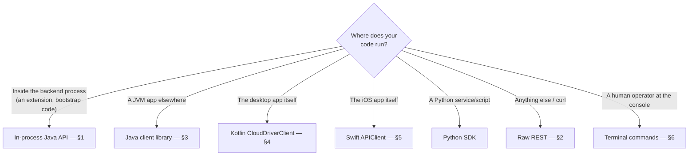

# API Usage Guide

This page is task-oriented: for each way a caller actually reaches `cloud-driver`, it shows the
minimal working code. For the full REST route table, see [api-reference.md](api-reference.md); for
a single class's complete contract (every method, every exception), the source and its Javadoc in
the module named alongside each sample are the reference. This page exists so a first working call
never requires reading either end to end.

## Which layer do I actually want?



| I want to... | Use |
|---|---|
| Build a new backend feature that runs inside the `cloud-driver-bootstrap` process | The in-process Java API — [§1](#1-in-process-java-api-same-jvm) |
| Talk to a running deployment from any language, over the network | The REST API — [§2](#2-the-rest-api-over-http) |
| Talk to it from a JVM app without hand-rolling HTTP | `cloud-driver-multiplatform-java`'s `ApiClient` — [§3](#3-java-client-library-cloud-driver-multiplatform-java) |
| Talk to it from the Kotlin/Compose desktop app's own code | `CloudDriverClient` — [§4](#4-kotlin-desktop-client) |
| Talk to it from the Swift/iOS app's own code | `cloud-driver-multiplatform-swift`'s `APIClient` — [§5](#5-swift-ios-client) |
| Inspect/administer a running deployment as an operator | The interactive terminal — [§6](#6-operator-terminal-commands) |
| Talk to it from a Python microservice | `cloud-driver-multiplatform-python`'s `CloudDriverClient` (`pip install -e .` from `cloud-driver-multiplatform/cloud-driver-multiplatform-python`) |

Everything in §3–§5 ultimately calls the same REST routes described in §2; they exist so three very
different runtimes (plain JVM, Kotlin Multiplatform/Compose Desktop, Swift/SwiftUI) don't each have
to hand-roll HTTP, JSON, retry-on-401, and OS credential storage from scratch.

## 1. In-process Java API (same JVM)

Everything below lives in `cloud-driver-api` (contracts) with implementations in
`cloud-driver-plugin`/`cloud-driver-auth`. It's what you use when writing a new
`cloud-driver-extensions-*` feature module, or any other code that runs inside the
`cloud-driver-bootstrap` process itself. Every class named here is declared in
`cloud-driver-api` — its Javadoc is the complete contract.

### 1.1 Get hold of `CloudDriver`

Exactly one `CloudDriver` is installed process-wide. `cloud-driver-bootstrap`'s `main` does this
once, at startup; everything else (extensions, terminal commands, event handlers) just reaches the
already-installed instance:

```java
// Once, at process startup (cloud-driver-plugin):
DatabaseProvider databaseProvider = DatabaseProvider.create(DatabaseType.POSTGRE_SQL, credentials);
EnvelopeEncryptionService envelopeEncryptionService =
        new EnvelopeEncryptionService(new AwsKmsKeyEncryptionService(region, kmsKeyId));

CloudDriver cloudDriver = DefaultCloudDriver.setInstance(databaseProvider, envelopeEncryptionService);

// From anywhere else in the same process, afterward:
CloudDriver driver = CloudDriver.getInstance();
driver.getFactoryContainer().getDataFactory();   // entities
driver.getFactoryContainer().getFileFactory();   // files
driver.getFactoryContainer().getExtensionFactory();
driver.getFactoryContainer().getEventFactory();
driver.getFactoryContainer().getRestFactory();   // always the unauthenticated instance - see 1.6
driver.getServiceContainer().getAuthService();       // null until cloud-driver-extensions-rest has started
driver.getServiceContainer().getCloudUserService();  // same
```

### 1.2 `DataFactory` — persisting entities

Any `de.lino.database.database.entity.Serialized` subclass can be persisted, envelope-encrypted
transparently on the way in and out:

```java
final class CustomerRecord extends Serialized {
    private final int id;
    private final String iban;

    CustomerRecord(int id, String iban) { this.id = id; this.iban = iban; }

    @Override
    public List<String> keysOf() {
        return List.of(String.valueOf(id)); // first element = primary key
    }
}

DataFactory dataFactory = CloudDriver.getInstance().getFactoryContainer().getDataFactory();

dataFactory.register(new CustomerRecord(42, "DE00..."));              // insert-or-update
CustomerRecord fetched = dataFactory.fetch("42", CustomerRecord.class);        // throws if absent
Optional<CustomerRecord> maybe = dataFactory.findById("42", CustomerRecord.class); // empty() if absent
List<CustomerRecord> all = dataFactory.getEntities(CustomerRecord.class);
dataFactory.delete("42", CustomerRecord.class);

// Every sync method above has a *Async counterpart, generated once on DataFactory itself:
dataFactory.registerAsync(new CustomerRecord(43, "DE01..."))
        .thenRun(() -> System.out.println("stored"));
```

`reload(CustomerRecord.class)` re-reads that type's section from the database — needed if a
*different* process (or a different `DataFactory` instance) wrote a row this one hasn't seen yet;
see the "Cross-process staleness" note in [architecture.md](architecture.md)'s "Data handling"
section for why this isn't automatic.

### 1.3 `FileFactory` — files, and offline-safe uploads

`StoredFile` is itself a `Serialized` entity, so it goes through the exact same pipeline as any
other record, plus a double integrity check on the way back out (AEAD tag, then a plaintext
checksum):

```java
FileFactory fileFactory = CloudDriver.getInstance().getFactoryContainer().getFileFactory();

StoredFile report = new StoredFile("report-1", "quarterly-report.pdf", pdfBytes);
fileFactory.upload(report);

StoredFile downloaded = fileFactory.download("report-1");
downloaded.downloadToDevice(Path.of("/tmp/downloads")); // re-creates the file locally under its own name

fileFactory.delete("report-1");
```

`FileFactory.upload` is already offline-safe — no wrapping needed. If connectivity is down (per
`CloudDriver.getInstance().getConnectivityChecker()`), the file is queued into a
`PendingUploadCache` instead of failing; run a `PendingUploadScheduler` to retry it once
connectivity returns:

```java
PendingUploadScheduler scheduler = new PendingUploadScheduler(
        dataFactory, ((DefaultFileFactory) fileFactory).getPendingUploadCache(),
        cloudDriver.getConnectivityChecker());
scheduler.start(Duration.ofSeconds(30));
```

### 1.4 `ExtensionFactory` — writing a feature module

A feature module (everything under `cloud-driver-extensions-*`) is a class extending `Extension`
with lifecycle hooks, discovered from a jar dropped into the configured extensions folder — see
`docs/architecture.md`'s "How the backend actually runs" section:

```java
public final class DemoExtension extends Extension {
    @Override public void onLoading() { /* prepare resources */ }
    @Override public void onRunning(String[] args) {
        this.cloudDriver().getTerminal().getCommandService().register(new MyCommand());
    }
    @Override public void onEnding() { /* release resources */ }
    @Override public void onException(RuntimeException reason) { /* report/recover */ }
}
```

```json
{ "name": "my-extension", "version": "1.0.0", "dependencies": ["cloud-driver-bootstrap"] }
```

`extension.json` (in the module's `resources` folder) is required — `name`/`version` are mandatory,
`dependencies` names other extensions by *their own* `extension.json` `name`, and
`ExtensionFactory#startAll` won't start this one until every declared dependency is registered and
already `RUNNING`. Registration itself is manual (`extensionFactory.register(new DemoExtension())`)
and normally only ever happens automatically via the folder scan — you rarely call it by hand.

### 1.5 `EventFactory` — reacting to something happening

One singleton instance per registered class, constructed reflectively by the factory itself:

```java
public final class OrderPlacedEvent extends Event {
    @Override
    public void handle(JsonDocument properties) {
        String orderId = properties.get("orderId", String.class);
        // ... react ...
    }
}

EventFactory eventFactory = CloudDriver.getInstance().getFactoryContainer().getEventFactory();
eventFactory.registerEvent(OrderPlacedEvent.class);

eventFactory.dispatch(OrderPlacedEvent.class, new JsonDocument().append("orderId", "42"));
```

Two built-in events already ship and fire on their own: `DatabaseWatchEvent`
(`de.lino.cloud.api.event.database`) fires on a Postgres change notification (installed by the
`cloud-driver-extensions-watcher` feature module), and `PendingUploadEvent` fires once a queued offline
upload from §1.3 finally succeeds. Register a handler for either the same way as above.

### 1.6 `RestFactory` — exposing HTTP routes

`CloudDriver.getInstance().getFactoryContainer().getRestFactory()` is **always the unauthenticated
instance** — fine for local development, never for a real deployment. Two other constructors gate
every route; construct one directly instead of using the `CloudDriver` facet:

```java
// Static key, one header check - simplest option for a service-to-service integration:
RestFactory guarded = new DefaultRestFactory(dataFactory, apiKey); // ApiKey from cloud-driver-api

guarded.register("/notes", NoteRecord.class); // POST /notes
guarded.fetch("/notes", NoteRecord.class);     // GET /notes/{id}, GET /notes
guarded.update("/notes", NoteRecord.class);    // PUT /notes/{id}
guarded.delete("/notes", NoteRecord.class);    // DELETE /notes/{id}
guarded.start("127.0.0.1", 8080);              // register every verb *before* start()
```

```java
// Per-user JWT - what cloud-driver-extensions-rest actually stands up for end-user clients:
RestFactory api = new DefaultRestFactory(dataFactory, authService, cloudUserService);
api.start("0.0.0.0", 8080);
```

All four verbs (`register`/`fetch`/`update`/`delete`) must be called before `start(...)` —
routes are assembled once, up front. Only entities implementing `Owned` are scoped to the calling
user's own data on the JWT-gated instance; see `Owned`'s Javadoc (`cloud-driver-api`,
`de.lino.cloud.api.jwt.rest`) for the exact scoping rules.

### 1.7 `cloud-driver-auth` services — accounts, files, sharing

`AuthService` (account lifecycle → JWTs) and `CloudUserService` (per-account file/folder
bookkeeping) are what `cloud-driver-extensions-rest` wires the REST routes in §2 to. Wiring them up
directly is useful for a terminal command, a batch job, or a test:

```java
AuditLogService auditLogService = new AuditLogServiceImpl(dataFactory, SecretRedactor::redact);
ICloudUserService cloudUserService = new CloudUserService(dataFactory, fileFactory, auditLogService);
IAuthService authService = new AuthService(
        dataFactory, passwordHasher, jwtSigner, emailSender, cloudUserService, auditLogService);

// Registration is two-step and e-mail-verified:
authService.register("jane@example.com", "Str0ng!Pass".toCharArray());
AuthTokens tokens = authService.confirmRegistration("jane@example.com", codeFromEmail);

// Everyday use, once registered:
AuthTokens login = authService.login("jane@example.com", "Str0ng!Pass".toCharArray());
String userId = authService.validate(login.accessToken());

StoredFile uploaded = cloudUserService.uploadFile(userId, "report.pdf", pdfBytes, null); // null = root folder
cloudUserService.shareFile(userId, uploaded.fileId(), "colleague@example.com");
cloudUserService.deleteFile(userId, uploaded.fileId());   // soft delete - moves to trash, revokes the share
cloudUserService.restoreFile(userId, uploaded.fileId());  // back out of trash, stays unshared
```

See `ICloudUserService`/`IAuthService` (`cloud-driver-api`) for the full method list (folders,
trash, sharing, quotas, password reset, e-mail change, refresh tokens, admin).

## 2. The REST API, over HTTP

The full route table lives in [api-reference.md](api-reference.md); this section shows the shape of
an actual request/response for the flows a client goes through most often. Every route requires
`Authorization: Bearer <access-token>` except the nine `/auth/*` flow routes (register, confirm,
login, refresh, logout, and the password-reset/e-mail-change pairs) and the public-link download
route — each of those carries its own authority in the request itself.

### 2.1 Register, confirm, log in

```bash
# Step 1: e-mails a 6-digit code, does not create the account yet.
curl -X POST https://api.cloud-driver.de/auth/register \
     -H "Content-Type: application/json" \
     -d '{"username":"jane@example.com","password":"Str0ng!Pass9"}'
# -> 202 Accepted  {"message": "..."}

# Step 2: confirm the code - this is what actually creates the account.
curl -X POST https://api.cloud-driver.de/auth/register/confirm \
     -H "Content-Type: application/json" \
     -d '{"username":"jane@example.com","code":"123456"}'
# -> 201 Created  {"token": "<jwt>", "refreshToken": "<opaque>"}

# Logging in later:
curl -X POST https://api.cloud-driver.de/auth/login \
     -H "Content-Type: application/json" \
     -d '{"username":"jane@example.com","password":"Str0ng!Pass9"}'
# -> 200 OK  {"token": "<jwt>", "refreshToken": "<opaque>"}

# The access token expires after 12h - exchange the refresh token for a fresh pair
# (the old refresh token is invalidated as part of this call - store the new one):
curl -X POST https://api.cloud-driver.de/auth/refresh \
     -H "Content-Type: application/json" \
     -d '{"refreshToken":"<opaque>"}'
```

### 2.2 Upload, list, download, move a file

```bash
TOKEN="<jwt>"

# The upload body is the raw file bytes - not JSON - fileName travels in the query string.
curl -X POST "https://api.cloud-driver.de/files?fileName=report.pdf" \
     -H "Authorization: Bearer $TOKEN" \
     --data-binary @report.pdf
# -> 201 Created  {"fileId": "...", "fileName": "report.pdf", "sizeBytes": ..., "folderId": null}

# List everything owned by the caller at the root (no content, cheap):
curl -H "Authorization: Bearer $TOKEN" "https://api.cloud-driver.de/files?folderId=root"

# Stream a specific file's content straight to disk:
curl -H "Authorization: Bearer $TOKEN" \
     "https://api.cloud-driver.de/files/<fileId>/content" -o report.pdf

# Move it into a folder (a real JSON null moves it back to the root):
curl -X PUT "https://api.cloud-driver.de/files/<fileId>/folder" \
     -H "Authorization: Bearer $TOKEN" -H "Content-Type: application/json" \
     -d '{"folderId":"<folderId>"}'
```

### 2.3 Conditional download, and patching only what changed

```bash
# Re-download only if the content actually changed. The ETag is the content checksum, quoted.
curl -D- -o report.pdf -H "Authorization: Bearer $TOKEN" \
     "https://api.cloud-driver.de/files/<fileId>/content"
# -> 200 OK  ETag: "9f2b…"  Cache-Control: private, must-revalidate

curl -D- -o /dev/null -H "Authorization: Bearer $TOKEN" -H 'If-None-Match: "9f2b…"' \
     "https://api.cloud-driver.de/files/<fileId>/content"
# -> 304 Not Modified, no body

# A sync client diffs against the per-chunk manifest instead of re-uploading the whole file:
curl -H "Authorization: Bearer $TOKEN" \
     "https://api.cloud-driver.de/files/<fileId>/chunk-manifest"
# -> {"chunkSizeBytes":1048576,"totalSizeBytes":5242880,"chunkHashes":["<hex>", ...]}

# ...then sends only the chunks whose hash moved. Positional index, base64 payload.
curl -X PATCH "https://api.cloud-driver.de/files/<fileId>/content" \
     -H "Authorization: Bearer $TOKEN" -H "Content-Type: application/json" \
     -d '{"totalSizeBytes":5242880,"changedChunks":[{"index":3,"contentBase64":"<...>"}]}'
```

A `404` from the manifest route means the file has none (a dedup alias, a presigned upload, or
content written before manifests existed) — fall back to a full `PUT`. A `400` from `PATCH` means
the chunk set no longer lines up with current content: re-fetch the manifest, or fall back.

### 2.4 Large uploads: resumable multipart sessions

Only available where direct-to-storage transfer is configured (`503` otherwise — clients fall
back to a plain `POST /files`).

```bash
# Begin. checksumSha256 is required here, and doubles as a dedup precheck.
curl -X POST https://api.cloud-driver.de/files/upload-session \
     -H "Authorization: Bearer $TOKEN" -H "Content-Type: application/json" \
     -d '{"fileName":"archive.zip","sizeBytes":2147483648,"checksumSha256":"<hex>"}'
# -> {"alreadyStored": {...}}                       # dedup hit: nothing to upload at all
# -> {"fileId":"...","partSizeBytes":8388608,"partCount":257,
#     "totalObjectBytes":...,"encryption":{...}}    # otherwise: the session's geometry

# Per part: presign, then PUT that byte range of the client-encrypted object stream directly.
curl -X POST "https://api.cloud-driver.de/files/upload-session/<fileId>/parts/1/url" \
     -H "Authorization: Bearer $TOKEN"
curl -X PUT "<presigned-url>" --data-binary @part-1.bin

# After a crash, the session id alone is enough — the part list comes from the object store itself.
curl -H "Authorization: Bearer $TOKEN" \
     "https://api.cloud-driver.de/files/upload-session/<fileId>"
# -> {..., "uploadedPartNumbers":[1,2,5], "encryption":{...}}   # re-send only what's missing

curl -X POST "https://api.cloud-driver.de/files/upload-session/<fileId>/complete" \
     -H "Authorization: Bearer $TOKEN" -H "Content-Type: application/json" \
     -d '{"checksumSha256":"<hex>"}'      # checksum is always over the PLAINTEXT

# Abandoning one costs money until aborted — the store bills for uploaded parts. Idempotent:
curl -X DELETE "https://api.cloud-driver.de/files/upload-session/<fileId>" \
     -H "Authorization: Bearer $TOKEN"
```

The `encryption` object on the begin/status responses is not optional bookkeeping: the client
must chunk-encrypt its content into the same v2 layout the server writes, using the
server-issued (KEK-wrapped) content key, before uploading any part. Completion verifies the
stored object's exact length and deletes it on a mismatch. See
[api-reference.md](api-reference.md#direct-to-storage-transfer-optional-if-configured) for the
field-by-field contract, and [security.md](security.md) for why it works this way.

### 2.5 Folders, sharing, trash

```bash
# Create a folder, then list the caller's top-level folders:
curl -X POST https://api.cloud-driver.de/folders \
     -H "Authorization: Bearer $TOKEN" -H "Content-Type: application/json" \
     -d '{"name":"Invoices","parentFolderId":null}'
curl -H "Authorization: Bearer $TOKEN" https://api.cloud-driver.de/folders

# Share a file with another account (read-only), then let them list what's shared with them:
curl -X POST "https://api.cloud-driver.de/files/<fileId>/share" \
     -H "Authorization: Bearer $TOKEN" -H "Content-Type: application/json" \
     -d '{"granteeEmail":"colleague@example.com"}'
curl -H "Authorization: Bearer <colleague-jwt>" https://api.cloud-driver.de/files/shared-with-me

# Delete a file (soft - moves to trash), then restore it:
curl -X DELETE "https://api.cloud-driver.de/files/<fileId>" -H "Authorization: Bearer $TOKEN"
curl -X POST "https://api.cloud-driver.de/files/<fileId>/restore" -H "Authorization: Bearer $TOKEN"
```

### 2.6 Live updates (WebSocket)

`GET /ws/updates` (bearer token via `Authorization` header, or `?token=` for a client that can't set
one, e.g. a browser) pushes `{"table","operation","id"}` whenever the connected account's own data
changes elsewhere — another device, a share, a live-push-triggering database write. Server-side,
the `cloud-driver-extensions-watcher` feature module's Postgres change notifications are what
trigger it.

## 3. Java client library (`cloud-driver-multiplatform-java`)

For any JVM app that would rather not hand-roll HTTP, retry-on-401, and OS keychain access. Depends
on nothing else in this repo — it talks to the backend purely over HTTP/WebSocket. Lives
under `cloud-driver-multiplatform` — the Maven-built sibling of `cloud-driver-multiplatform-swift` (Swift) and
`cloud-driver-multiplatform-python` (Python), formerly named `cloud-driver-platforms-rest`.

```java
import de.lino.cloud.platform.rest.api.ApiClient;
import de.lino.cloud.platform.rest.api.SessionManager;
import de.lino.cloud.platform.rest.api.session.TokenStoreFactory;
import de.lino.cloud.platform.rest.api.dto.Dtos.StoredFileSummaryResponse;

try (ApiClient apiClient = new ApiClient("https://api.cloud-driver.de", "https://api.cloud-driver.de")) {
    SessionManager session = new SessionManager(apiClient, TokenStoreFactory.create().store());

    if (!session.tryRestoreSession()) {
        session.login("jane@example.com", "Str0ng!Pass9"); // or session.register(...) + confirmRegistration(...)
    }

    // Upload straight from disk, then list what's owned at the root.
    java.nio.file.Path report = java.nio.file.Path.of("report.pdf");
    apiClient.uploadFile(report.getFileName().toString(), report, null);

    for (StoredFileSummaryResponse file : apiClient.listFiles()) {
        System.out.println(file.fileName() + " (" + file.sizeBytes() + " bytes)");
    }

    // Folders, sharing, trash - same "one call, sync or *Async" shape throughout:
    var invoices = apiClient.createFolder("Invoices", null);
    apiClient.shareFile(apiClient.listFiles().get(0).fileId(), "colleague@example.com");
    apiClient.listSharedWithMe();

    session.logout();
} catch (ApiClient.ApiException e) {
    e.printStackTrace();
}
```

Every method above also has an `*Async` form returning `CompletableFuture<T>` (`loginAsync`,
`uploadFileAsync`, `listFilesAsync`, ...). `ApiClient` also covers uploads/downloads streamed
to/from disk with progress callbacks, cursor-paginated listings, and the admin/audit-log routes —
its Javadoc is the full method list.

## 4. Kotlin desktop client

`cloud-driver-platforms-desktop`'s `CloudDriverClient` wraps `ApiClient` above as `suspend`
functions, adding session persistence and live-update push:

```kotlin
val client = CloudDriverClient(
    authPanelBaseUrl = "https://api.cloud-driver.de",
    apiBaseUrl = "https://api.cloud-driver.de",
)

// Restore a previous session, or fall back to a fresh login.
val restoredToken = client.tryRestoreSession()
if (restoredToken == null) {
    client.login("jane@example.com", "Str0ng!Pass9")
}

val uploaded = client.uploadFile(Path.of("report.pdf"), folderId = null)
val files = client.listFiles(folderId = null)
client.shareFile(uploaded.fileId(), "colleague@example.com")

client.startLiveUpdates { /* another device or a share changed something - reload */ }

client.close() // shuts down the wrapped ApiClient's executor
```

`client.usedKeychainFallback` is `true` if no real OS keychain was found and the session token fell
back to a permission-restricted plain file — surface that to the user rather than silently
degrading. `CloudDriverClient` (the desktop app's thin suspend-function wrapper over
`ApiClient`) covers the full surface — folders, trash, sharing, admin, metrics.

## 5. Swift iOS client

`cloud-driver-platforms-mobile`'s networking/session layer is `cloud-driver-multiplatform-swift`
(`cloud-driver-multiplatform/cloud-driver-multiplatform-swift`, a local Swift Package Manager dependency — no
shared code with the JVM client, deliberately: each SDK hand-mirrors the same REST contract in its
own ecosystem's idiom), a Swift `actor` built on
`async`/`await`:

```swift
let client = APIClient(baseURL: URL(string: "https://api.cloud-driver.de")!)
let sessionManager = SessionManager(client: client)

if await !sessionManager.tryRestoreSession() {
    _ = try await client.login(email: "jane@example.com", password: "Str0ng!Pass9")
    await sessionManager.persistCurrentSession()
}

let uploaded = try await client.uploadFile(
    fileName: "report.pdf", data: fileData, folderId: nil)
let files = try await client.listFiles(folderId: nil)
try await client.shareFile(fileId: uploaded.fileId, granteeEmail: "colleague@example.com")
```

## 6. Operator terminal commands

`cloud-driver-extensions-terminal` registers a fixed catalog of commands against the interactive
console (the terminal engine itself lives in `cloud-driver-api`'s `terminal` package).
Typed directly at the console the running `cloud-driver-bootstrap` process opens — not called from
code:

| Command | Aliases | Purpose |
|---|---|---|
| `help` | `?`, `h` | List every registered command |
| `exit` | `quit`, `q` | Shut down the whole process (`CloudDriver#shutdown()`) |
| `clear` | `clc` | Clear the terminal window |
| `screen-leave` | `l`, `sl` | Detach the terminal session without killing the process |
| `extensions` | `extension`, `ext` | List every registered extension and its status |
| `dispatch` | `exec`, `sudo`, `d` | Run a system-level command through the terminal |
| `statistics` | `stats` | Basic counts (accounts, files, uploaded bytes) — computed from row metadata only, never by fetching file content. One caveat: the first run against a corpus migrated to S3 before 2026-09-10 resolves each still-sizeless row's content once and backfills its size onto the row, so that run is slow and every later one fast |
| `cloudUser list` / `info <email>` / `reset <email>` / `delete <email>` / `limit <email> <bytes> <unit>` (unit: `B`/`KB`/`MB`/`GB`) | `cu`, `user` | Inspect/manage one or every account |
| `recomputeStorage <email>` / `recomputeStorage all` | `recompute` | Recompute an account's uploaded-bytes total from its actual files — physical, dedup-aware: each distinct content is counted once no matter how many alias copies point at it, matching what upload/delete accounting would have produced |
| `admin grant <email>` / `admin revoke <email>` | `isAdmin` | The only writer of the admin flag anywhere in this codebase |
| `auditLog` / `auditLog all` / `auditLog <email>` | `audit`, `log` | Browse the persisted security-audit trail |
| `migrateToS3` | `migrateS3` | Move every not-yet-S3-backed file's content onto the configured bucket (dedup aliases own no content and are skipped, reported in their own counter) |
| `hardReset` (run twice within 5s to confirm) | `reset` | Wipe every entity section — irreversible, no undo |

Diagnostics and operations. These reach optional facets through the service/factory containers and
null-check them, so all of them are registered unconditionally — on a deployment running none of
the extensions behind them, each simply reports that its subsystem is absent, which is itself the
useful answer:

| Command | Aliases | Purpose |
|---|---|---|
| `health` | `status`, `facets` | Which optional subsystems are published, and which of the external ones (clamd, the embedding service, Redis, S3) actually answer a live probe. "Published" only means an extension loaded — this draws the distinction |
| `config` | `cfg`, `configuration` | The configuration this process is *running with*, secrets redacted — not what the file on disk currently says |
| `reload` | `refresh` | Re-read one entity type's section from the database, discarding this process's cached mirror (a row written by another process is otherwise invisible indefinitely) |
| `file <id>` | `storedFile` | Everything known about one file in one place — the `StoredFile`, its ownership row, trash state, scan verdict, versions, shares |
| `session list <email>` / `revoke …` | `sessions` | List and revoke an account's refresh tokens. Only refresh tokens are revocable; the access JWT is stateless and lives out its 12 hours |
| `share <email>` | `shares` | What an account has shared — grants to other accounts, and public links (the one unauthenticated read path in the system) |
| `trash` | `recycleBin` | Deployment-wide recycle-bin view: trashed items still occupy storage and still count against quota until the retention window elapses |
| `backup now` / `backup status` | `db` | Take a backup on demand (deliberately bypassing the Redis scheduler lock, so an explicit operator backup is never a silent no-op) and check whether the scheduled one is actually running |
| `rateLimit` | `rl` | Inspect and clear the running REST layer's rate-limit windows — otherwise an exhausted window can only be waited out or restarted away |
| `searchIndex` | `si` | Keyword-index visibility, on-demand rebuild, and a query passthrough |
| `intelligence` | `ai`, `semantic` | Semantic-search health, on-demand backfill, and the query/duplicate/tag surfaces |
| `scan` | `contentScan` | Content-scan visibility and on-demand rescans — scanning fails open, so files marked clean unscanned need a way to be revisited |
| `mail` | `email` | Send a test message through whichever `EmailSender` the startup fallback actually selected (SES → SMTP → log-only) |
| `s3` | `objectStorage` | Reconcile the bucket against the `StoredFile` rows that reference it and, on explicit confirmation, delete orphaned objects |

Registering your own command from a new extension:

```java
public void onRunning(String[] args) {
    this.cloudDriver().getTerminal().getCommandService().register(new MyCommand());
}
```

## Where to go next

- [architecture.md](architecture.md) — how these pieces run together as one process
- [api-reference.md](api-reference.md) — the complete REST route table
- [security.md](security.md) — what's actually encrypted, and how authentication/authorization work
- [configuration.md](configuration.md) — every config key referenced above (`jwt-signing-key`,
  SMTP, quotas, rate limiting)
- [contributing.md](contributing.md) — adding a new REST route or feature module
