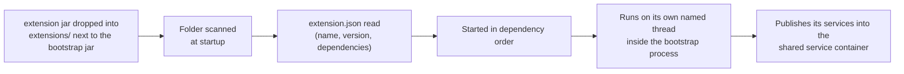
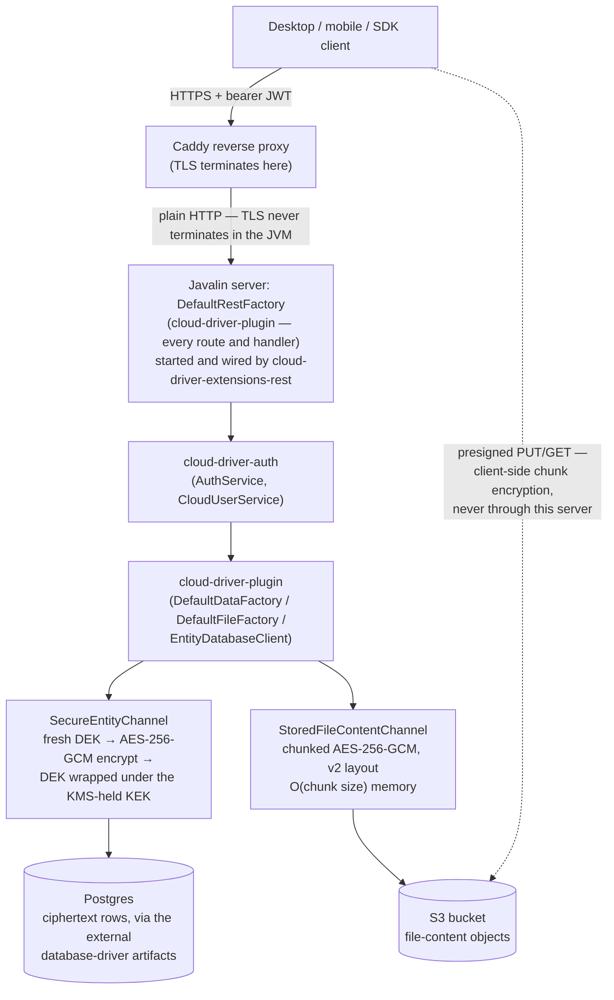
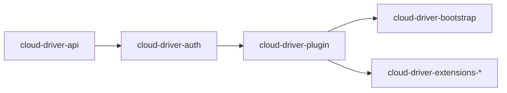

# Architecture

This page covers how the system fits together. For the module-by-module map (and the diagrams
that visualize what this page describes), see the [root README](../README.md); for
implementation detail, the source (and its Javadoc) of the module in question is the reference.

## Components

| Component | Kind | Deployable unit |
|---|---|---|
| `cloud-driver-api` | Backend contracts | Compiled into `cloud-driver-bootstrap` |
| `cloud-driver-auth` | Backend auth engine | Compiled into `cloud-driver-bootstrap` |
| `cloud-driver-plugin` | Backend implementations | Compiled into `cloud-driver-bootstrap` |
| `cloud-driver-bootstrap` | Backend entry point | One shaded, runnable jar (`java -jar`) |
| `cloud-driver-extensions-*` | Backend feature modules (REST API, Postgres change watcher, terminal, backup, metrics, thumbnails, versioning, search, webhooks, content scanning, semantic-search bridge) | Unshaded jars, loaded into the bootstrap process from a folder at startup |
| `cloud-driver-intelligence` | Semantic-search service (Python) | **Its own process**, started and stopped independently |
| `cloud-driver-platforms-desktop` | Desktop client app | Native installer (macOS/Windows/Linux) |
| `cloud-driver-platforms-mobile` | Mobile client app (iOS) — GUI only | iOS app build |
| `cloud-driver-multiplatform-java` | Client networking library (Java) | Consumed by the desktop app only |
| `cloud-driver-multiplatform-swift` | Client networking library (Swift) | Consumed by the mobile app only |
| `cloud-driver-multiplatform-python` | Client SDK (Python) | Standalone `pip` package |
| `cloud-driver-installer` | Operator-side GUI installer (Python/tkinter) | Runs on the operator's machine, not the server; provisions a whole deployment over one SSH connection (see [deployment.md](deployment.md#gui-installer-cloud-driver-installer)) |
| S3-compatible object store | File-content storage (optional) | External AWS service; enabled by `aws-s3-bucket` |

## How the backend actually runs

The backend is **one JVM process** (`cloud-driver-bootstrap`), not a fleet of independently deployed
services. What look like separate "services" are `cloud-driver-extensions-*` modules: each one is a
plain, unshaded jar dropped into an `extensions/` folder next to the running bootstrap jar, scanned
(in file-name order, so the load order is the same on every host) and loaded into that same process
at startup, and run on its own dedicated thread inside it. Two jars declaring the same extension
name abort the boot before any extension starts — which is why an extension jar and the bootstrap
jar must always be deployed from the same build. This
gives most of the benefit of modular services — a feature can be built, versioned, and reasoned
about independently — without the operational overhead of running and coordinating separate
processes.

| Extension | Responsibility |
|---|---|
| `cloud-driver-extensions-rest` | The JWT-authenticated REST API (login, registration, files, folders, sharing, trash, admin routes, live push) |
| `cloud-driver-extensions-watcher` | Postgres `LISTEN`/`NOTIFY` change notification; forwards live updates to connected clients over WebSocket |
| `cloud-driver-extensions-terminal` | The operator-facing interactive terminal and its command catalog |
| `cloud-driver-extensions-backup` | Streaming, keyset-paginated database backup job |
| `cloud-driver-extensions-metrics` | Prometheus-scrapeable `/metrics` endpoint on its own loopback-only port |
| `cloud-driver-extensions-thumbnails` | Generates preview thumbnails for images and PDF first pages |
| `cloud-driver-extensions-versioning` | Keeps prior versions of a file's content on overwrite, with a restore path |
| `cloud-driver-extensions-search` | Keyword search index over file names and extracted text — Postgres `tsvector`/GIN-backed (persistent, restart-surviving, shared across instances; a documented plaintext exception, see [security.md](security.md)), with an in-memory fallback when Postgres isn't available |
| `cloud-driver-extensions-webhooks` | Delivers signed, retried HTTP callbacks for file events |
| `cloud-driver-extensions-scan` | Malware-scans uploaded content via an external `clamd` daemon |
| `cloud-driver-extensions-intelligence` | Bridges uploads to the `cloud-driver-intelligence` Python service, and backs semantic search |

### The exception: external processes

Three pieces of the backend are genuinely separate processes rather than in-process extensions,
because each owns something a JVM extension cannot: `clamd` (virus definitions), Redis (state that
survives a restart), and `cloud-driver-intelligence` (an embedding model and vector store, in
Python). None of the three is required for `cloud-driver` to boot, but they degrade differently.
Redis genuinely has an in-process counterpart: without it the pending-upload cache is
`InMemoryPendingUploadCache`, the rate limiters fall back to in-process buckets, and every
scheduler lock returns "run" — a single-instance deployment behaves exactly as it always did.
`clamd` and `cloud-driver-intelligence` have none. With `clamd` unreachable,
`DefaultContentScanService` retries and then **fails open**, marking the file `CLEAN` with a
warning (the one exception is an integrity failure, which is marked `FLAGGED` rather than let
through). With the intelligence extension absent, `IServiceContainer#getIntelligenceService()` is
`null` and `/search/semantic`, `/files/duplicates` and `/files/{id}/tags` answer `503`.

`cloud-driver-intelligence` additionally never touches Postgres — its only data store is its own
vector store, chosen in a strict order of preference: the encrypted `DatabaseDriverVectorStore`
(database-driver's SQLite backend, AES-GCM per vector) when an encryption key is configured,
Chroma when no key is set and `chromadb` is installed, and an in-memory store otherwise. A
configured-but-unusable key falls all the way through to in-memory, never to Chroma: an operator
who asked for encryption must never silently get unencrypted persistence instead. It is never
permitted to decide who may see what. Every semantic search is
two-staged on the Java side: a **pre-filter** offers the service only the file ids the caller
currently has access to (resolved from authoritative ownership/sharing data), and a **post-check**
re-validates every returned id against that same access check, treating the service's answer as
untrusted input. A compromised or stale instance can therefore at worst return nothing — never
another account's files.

## Request flow, end to end

Reading reverses every step, additionally verifying the AES-256-GCM authentication tag and (for
files) a plaintext checksum before the caller ever sees decrypted data. Nothing plaintext is ever
written to the database — with one deliberate, documented exception: the keyword-search index
table (derived lexemes, see [security.md](security.md)).

**Where a file's bytes actually live.** With `aws-s3-bucket` and `aws-s3-region` configured, a
`StoredFile` row holds metadata only and the content is one object in the bucket, encrypted by
`StoredFileContentChannel` under the same KEK before it leaves the process. Without them,
`ObjectStorageService` is `null` and content stays inline in the encrypted row, exactly as before
the feature existed — so every read path dispatches on `StoredFile#isS3Backed()`, and every object
read dispatches again on the 4-byte schema-version tag (v1 one-shot, v2 chunked streaming).
Presigned direct-to-store transfers keep the same guarantee by having the client write the v2
layout itself under a server-issued, KEK-wrapped per-file key.

## Layering rule

The codebase follows one rule almost everywhere: **`cloud-driver-api` defines the contract,
`cloud-driver-plugin`/`cloud-driver-auth` supply the implementation.**

- **`CloudDriver` is a facade, not a monolith.** It exposes an `IFactoryContainer` (the
  data/file/extension/event/REST factories, plus the optional object-storage, content-key,
  file-change-listener and Redis facets) and an `IServiceContainer` (fifteen facets today: auth
  and cloud-user services, live-update publisher, audit log, metrics recorder and snapshot
  provider, thumbnails, versioning, search index, webhooks, content scan, intelligence, e-mail
  sender, rate-limit admin, backup), plus a connectivity checker, a terminal, a logger and a
  re-read-on-every-call `getConfiguration()`. It holds no persistence or lifecycle logic of its
  own.
- **Optional facets are `null` until an extension publishes them.** `IServiceContainer` starts out
  empty: `CloudRestExtension` publishes the auth/cloud-user/audit/e-mail/live-update/rate-limit
  facets (and only when a `jwt-signing-key` is configured at all), and each feature extension
  publishes its own on load — **every** publishing extension withdrawing it again on stop *and* on
  a failed start (`IServiceContainer#withdrawService`), so a stopped extension's facet reads as
  absent rather than stopped-but-present. Every getter can therefore return `null`, and a consumer
  must degrade rather than assume non-null **at runtime, not only at boot** — a facet that was
  there on the previous request can be gone on this one. That is what lets a deployment run with
  any subset of the eleven extension jars present, and what lets one be stopped and started again
  without restarting the process.
- **Abstract primitives + generic concrete async methods.** Every factory-shaped contract
  (`DataFactory`, `FileFactory`, `ExtensionFactory`, `EventFactory`, `RestFactory`) shares one
  shape: a handful of abstract synchronous primitives a concrete class must implement, plus every
  async variant implemented once, generically, on the abstract class itself. Adding a new facade
  means implementing the primitives; the async surface comes for free.
- **A layered security stack.** Raw AEAD (one-shot for in-memory payloads, chunked streaming for
  file content of any size — STREAM-style AES-GCM, O(chunk size) memory) → DEK/KEK envelope
  encryption → hashing/password → secret redaction → entity binding (ties an entity's type and
  primary key into the encryption's authenticated data) → the one class that actually touches the
  database. Each layer is independently replaceable.
- **Extensions are host-agnostic plugins, not compiled-in features.** A jar dropped into the
  configured extensions folder is picked up purely by declaring a concrete extension class and
  shipping a small manifest file — no compile-time dependency on `cloud-driver-bootstrap` required.

## Dependency direction

An arrow `A --> B` reads "B builds on A" — i.e. `B` is allowed to depend on `A`'s types, never
the reverse.

Never add a dependency the other way — `cloud-driver-api` must never depend on `cloud-driver-auth`
or `cloud-driver-plugin`, and `cloud-driver-auth` must never depend on `cloud-driver-plugin`.
`cloud-driver-multiplatform-java`/`cloud-driver-multiplatform-swift`/`cloud-driver-multiplatform-python`/`cloud-driver-platforms-desktop`/
`cloud-driver-platforms-mobile` sit entirely outside this chain — none of them depend on any
server-side module, only on each other (desktop depends on `cloud-driver-multiplatform-java`; mobile depends on
`cloud-driver-multiplatform-swift`; the Python SDK depends on neither, being a separate-ecosystem client of the
same HTTP/WebSocket API).

## Data handling

- **A file is one entity row plus, usually, one object.** The `StoredFile` row itself goes through
  the same envelope-encryption/persistence pipeline as any other record (`SecureEntityChannel`,
  type name and primary key bound into the authenticated data). Its *content* does not: once
  `aws-s3-bucket` is configured, the bytes are encrypted separately by `StoredFileContentChannel`
  — a deliberately independent channel that binds only the file id into the associated data and
  writes one of two versioned layouts (v1 one-shot, v2 chunked streaming) — and stored as an S3
  object, leaving the database row metadata-only. Both paths use the same AES-256-GCM/DEK-KEK
  scheme and the same KMS-held KEK, and both keep the double integrity check on read (the AEAD
  authentication tag, then the plaintext checksum recorded at upload time).
- **Cross-process staleness is explicit, not silent — for the types that cache.** For an entity
  type on the default `FULL` section cache, a row written by a *different* process stays invisible
  to this one indefinitely — not just past a cache expiry — until an explicit reload. `StoredFile`
  is the exception: it is pinned to `SectionConfig.none()`, so every access reads through to
  Postgres and is never stale this way. The Postgres change-notification module watches
  `StoredFile`'s table only (`notification.watch(StoredFile.class)` on channel
  `cloud_driver_watcher`), and its main job today is fan-out, not reload: each notification drives
  the live WebSocket push and the registered `FileChangeListener`s (malware scanning, thumbnail
  generation). A reload is attempted only as a fallback, when a first no-reload `findById` misses
  — reloading unconditionally on every notification once re-read the whole content-bearing table
  per upload and exhausted the heap during a bulk extract. Dispatch sits behind a failure
  boundary: anything handling a notification throws, an error included, is logged with the payload
  and goes no further, because the notification listener is one long-lived thread whose loss would
  silently end live push, content scanning and thumbnail generation together for the rest of the
  process's life. Each registered listener is isolated from its siblings the same way.
- **The offline-upload queue exists, but this deployment never uses it.** `DefaultFileFactory#upload`
  will queue a file into a `PendingUploadCache` when its `ConnectivityChecker` reports
  unavailable, and `PendingUploadScheduler` retries the queue every minute. `CloudBootstrap`
  deliberately installs an always-available checker instead of `InternetConnectivityChecker`,
  because the process always runs on the same machine as its Postgres instance — so on a real
  deployment the queueing branch is never taken, and an infrastructure failure fails loudly rather
  than masquerading as a successful upload. (The unconditional DNS probe this replaced once made
  concurrent uploads look offline and silently queued files that the API had already answered
  `201` for.) Neither client app implements offline queueing of its own.

## Performance and scalability notes

- Every async method and batch operation is dispatched onto a shared virtual-thread executor
  (`MultiTaskingFactory`) rather than looping sequentially, but the per-row and per-file fan-outs
  are deliberately bounded at 8 concurrent tasks apiece — `EntityDatabaseClient.MAX_CONCURRENT_ENTITY_FANOUT`
  for entity decryption (each uncached row is a live KMS `Decrypt` call, and an unbounded scan
  fired thousands of them at once) and `DefaultFileFactory.MAX_CONCURRENT_VERIFICATIONS` for
  content resolution/verification (each in-flight task holds a full copy of one file's plaintext).
  A batch of *n* items therefore costs roughly ⌈n/8⌉ round trips rather than one — still far
  better than one per item, and with a bounded memory and KMS-rate-limit footprint.
- Each entity type gets its own isolated database section and decryption cache, so one hot or
  misbehaving type can't starve another's throughput.
- The decryption cache is bounded and time-limited (default 30 seconds / 1,000 entries) since it
  holds decrypted plaintext in memory.
- Independent of that decryption cache, each entity type's underlying database section also has
  its own cache mode (`database-driver` ≥ 1.3.15 `SectionConfig`/`CacheMode` — `FULL`/`LAZY`/
  `BOUNDED`/`NONE`), defaulting to `FULL` (every row loaded once, kept for the process's
  lifetime). `StoredFile` overrides this to `NONE` in `EntityDatabaseClient`/`FactoryContainer`,
  since a legacy row can still carry a file's full inline content and the decryption cache above
  already serves its hot path — `FULL` there would hold that content twice.
- REST handlers never block a request-handling thread — the underlying database/encryption work
  always runs on a virtual thread.
- Chunk-level diffing: every server-mediated content write whose plaintext the server actually
  sees records a per-chunk plaintext SHA-256 manifest (`FileChunkManifest`, envelope-encrypted
  like every entity; chunk boundary = the 1 MiB encryption chunk,
  `Constraints.CONTENT_CHUNK_SIZE_BYTES`). Three cases deliberately have none: a deduplication
  alias (it owns no content), a presigned direct-transfer file (this server never sees its
  plaintext), and any file last written before the mechanism existed — an absent manifest means
  "diffing unavailable, fall back to a full upload", never an error.
  A sync client diffs against `GET /files/{id}/chunk-manifest` and sends only changed chunks via
  `PATCH /files/{id}/content` — the server reassembles and re-encrypts with a fresh DEK (the v2
  object layout is unchanged; splicing ciphertext in place would reuse GCM nonces). Version
  history uses the same mechanism: a captured version stores only its changed chunks as a delta
  against the previous version, with a full keyframe every 10 versions capping reconstruction
  replay; the purge scheduler never severs a chain (its boundary snaps back to a keyframe).
- Large direct-transfer uploads go through resumable multipart sessions:
  `POST /files/upload-session` starts one (the required declared checksum first runs a
  per-account dedup precheck — a match registers an alias with zero bytes uploaded), the client
  uploads fixed 8 MiB byte ranges of its (client-encrypted, deterministic) object stream through
  per-part presigned URLs, and after any interruption asks the session's status — the part list
  comes from S3's own `ListParts` — to re-send only what's missing. Completion assembles the
  object and runs the same length-verified registration as a single-`PUT` presigned upload; the
  pending-upload purge sweep aborts abandoned sessions' multipart uploads (S3 bills for
  incomplete parts until aborted). There is deliberately no third "single presigned PUT for one
  large object, no resume" path.
- Server-mediated uploads **and content replacements** above a 32 MiB threshold stream end to end:
  the request body lands in a scratch file, and the checksum, chunked AES-GCM encryption, and S3
  write all run straight off that file (`StoredFile.createFromContentFile` →
  `DefaultFileFactory.prepareForPersistence`) — heap use is O(chunk size) regardless of file size.
  A version restore above the same threshold spills the reconstructed snapshot to that scratch file
  rather than replacing from a heap array. Below the threshold, the in-memory path is
  kept deliberately: it is what powers DEFLATE compression and search/intelligence text
  extraction, which the streaming path forgoes (matching presigned direct transfers).
- Change notification uses push (Postgres `LISTEN`/`NOTIFY`), not a polling loop, so latency is
  bounded by notification delivery rather than a poll interval.
- The backup job uses keyset pagination rather than a single unbounded query, since file-content
  tables can reach sizes that would otherwise exhaust client memory. It backs up exactly the
  entity tables — those carrying the `id TEXT, data BYTEA` shape the keyset query reads; tables
  with a different shape (the keyword-search index) are skipped, being rebuildable derived state.
- Multi-instance coordination is Redis-backed and strictly optional: with a
  Redis configured, the five periodic schedulers (trash purge, version purge, pending-upload
  flush, presigned-ticket purge, database backup) each run on exactly one instance per tick
  window (`RedisSchedulerLock`, built on the existing rate-limit counter primitive — a
  duplicate run on lock failure is harmless, every scheduler is idempotent), and a
  pending-upload enqueue is visible across instances (`RedisPendingUploadCache` — only minimal
  metadata crosses Redis, never content or names; the enqueueing instance alone can retry, since
  it alone holds the bytes). No Redis, or a failing Redis, means every instance simply behaves
  single-instance — Redis is never a hard dependency. The lock window is the tick interval, so a
  restart inside a window whose work is already done is refused (and says so on the console)
  rather than repeating it; the backup job's `backup now` command deliberately bypasses the lock,
  since an explicit operator backup must never be a silent no-op. Every periodic tick runs inside
  the same failure boundary: a failing tick is logged (an error at `SEVERE`, since the process may
  be poisoned) and the schedule keeps running — a `ScheduledExecutorService` otherwise cancels a
  repeating task permanently the first time its body throws, and a cancelled schedule cannot be
  restarted from the outside.
- Hot per-user/per-file lookups (login by email, an account's file/folder listings, share and
  version resolution) go through keyed in-memory secondary indexes (`SecondaryIndexed` /
  `DataFactory.getEntitiesByIndex`), not full scans: each entity hand-declares its index keys (no
  reflection), and `EntityDatabaseClient` builds a per-type `index → key → entities` snapshot
  over the decrypted list cache, rebuilt only when that cached list itself changes (any write to
  the type, a reload, or the list-cache TTL). These are deliberately not SQL indexes — rows are
  ciphertext, so the database can't see fields to index. A few deliberate full scans remain
  (purge-scheduler sweeps, the cross-owner folder-tree walk, the multi-target activity feed).
