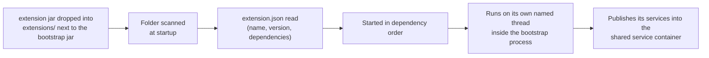
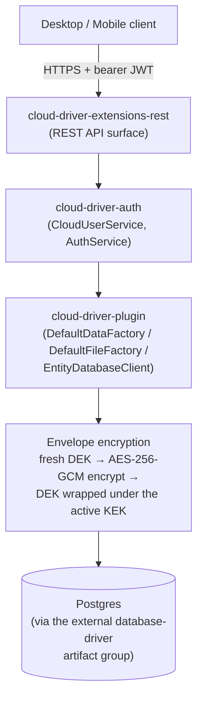
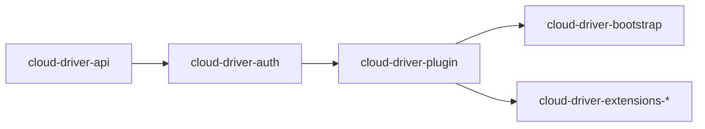

# Architecture

This page covers how the system fits together. For the module-by-module map (and the diagrams
that visualize what this page describes), see the [root README](../README.md); for
implementation detail, the source (and its Javadoc) of the module in question is the reference.

## Components

| Component | Kind | Deployable unit |
|---|---|---|
| `cloud-driver-api` | Backend contracts | Compiled into `cloud-driver-bootstrap` |
| `cloud-driver-auth` | Backend auth engine | Compiled into `cloud-driver-bootstrap` |
| `cloud-driver-plugin` | Backend implementations | Compiled into `cloud-driver-bootstrap` |
| `cloud-driver-bootstrap` | Backend entry point | One shaded, runnable jar (`java -jar`) |
| `cloud-driver-extensions-*` | Backend feature modules (REST API, Postgres change watcher, terminal, backup, metrics, thumbnails, versioning, search, webhooks, content scanning, semantic-search bridge) | Unshaded jars, loaded into the bootstrap process from a folder at startup |
| `cloud-driver-intelligence` | Semantic-search service (Python) | **Its own process**, started and stopped independently |
| `cloud-driver-platforms-desktop` | Desktop client app | Native installer (macOS/Windows/Linux) |
| `cloud-driver-platforms-mobile` | Mobile client app (iOS) — GUI only | iOS app build |
| `cloud-driver-multiplatform-java` | Client networking library (Java) | Consumed by the desktop app only |
| `cloud-driver-multiplatform-swift` | Client networking library (Swift) | Consumed by the mobile app only |
| `cloud-driver-multiplatform-python` | Client SDK (Python) | Standalone `pip` package |

## How the backend actually runs

The backend is **one JVM process** (`cloud-driver-bootstrap`), not a fleet of independently deployed
services. What look like separate "services" are `cloud-driver-extensions-*` modules: each one is a
plain, unshaded jar dropped into an `extensions/` folder next to the running bootstrap jar, scanned
and loaded into that same process at startup, and run on its own dedicated thread inside it. This
gives most of the benefit of modular services — a feature can be built, versioned, and reasoned
about independently — without the operational overhead of running and coordinating separate
processes.

| Extension | Responsibility |
|---|---|
| `cloud-driver-extensions-rest` | The JWT-authenticated REST API (login, registration, files, folders, sharing, trash, admin routes, live push) |
| `cloud-driver-extensions-watcher` | Postgres `LISTEN`/`NOTIFY` change notification; forwards live updates to connected clients over WebSocket |
| `cloud-driver-extensions-terminal` | The operator-facing interactive terminal and its command catalog |
| `cloud-driver-extensions-backup` | Streaming, keyset-paginated database backup job |
| `cloud-driver-extensions-metrics` | Prometheus-scrapeable `/metrics` endpoint on its own loopback-only port |
| `cloud-driver-extensions-thumbnails` | Generates preview thumbnails for images and PDF first pages |
| `cloud-driver-extensions-versioning` | Keeps prior versions of a file's content on overwrite, with a restore path |
| `cloud-driver-extensions-search` | Keyword search index over file names and extracted text — Postgres `tsvector`/GIN-backed (persistent, restart-surviving, shared across instances; a documented plaintext exception, see docs/security.md), with an in-memory fallback when Postgres isn't available |
| `cloud-driver-extensions-webhooks` | Delivers signed, retried HTTP callbacks for file events |
| `cloud-driver-extensions-scan` | Malware-scans uploaded content via an external `clamd` daemon |
| `cloud-driver-extensions-intelligence` | Bridges uploads to the `cloud-driver-intelligence` Python service, and backs semantic search |

### The exception: external processes

Three pieces of the backend are genuinely separate processes rather than in-process extensions,
because each owns something a JVM extension cannot: `clamd` (virus definitions), Redis (state that
survives a restart), and `cloud-driver-intelligence` (an embedding model and vector store, in
Python). None of the three is required for `cloud-driver` to boot, and each has an in-process
counterpart that degrades rather than fails when it is absent.

`cloud-driver-intelligence` additionally never touches Postgres — its only data store is its own
vector store — and it is never permitted to decide who may see what. Every semantic search is
two-staged on the Java side: a **pre-filter** offers the service only the file ids the caller
currently has access to (resolved from authoritative ownership/sharing data), and a **post-check**
re-validates every returned id against that same access check, treating the service's answer as
untrusted input. A compromised or stale instance can therefore at worst return nothing — never
another account's files.

## Request flow, end to end

Reading reverses every step, additionally verifying the AES-256-GCM authentication tag and (for
files) a plaintext checksum before the caller ever sees decrypted data. Nothing plaintext is ever
written to the database — with one deliberate, documented exception: the keyword-search index
table (derived lexemes, see docs/security.md).

## Layering rule

The codebase follows one rule almost everywhere: **`cloud-driver-api` defines the contract,
`cloud-driver-plugin`/`cloud-driver-auth` supply the implementation.**

- **`CloudDriver` is a facade, not a monolith.** It exposes an `IFactoryContainer`
  (data/file/extension/event/REST factories) and an `IServiceContainer` (auth service, cloud-user
  service, live-update publisher, metrics, audit log), plus a connectivity checker and a terminal.
  It holds no persistence or lifecycle logic of its own.
- **Abstract primitives + generic concrete async methods.** Every factory-shaped contract
  (`DataFactory`, `FileFactory`, `ExtensionFactory`, `EventFactory`, `RestFactory`) shares one
  shape: a handful of abstract synchronous primitives a concrete class must implement, plus every
  async variant implemented once, generically, on the abstract class itself. Adding a new facade
  means implementing the primitives; the async surface comes for free.
- **A layered security stack.** Raw AEAD (one-shot for in-memory payloads, chunked streaming for
  file content of any size — STREAM-style AES-GCM, O(chunk size) memory) → DEK/KEK envelope
  encryption → hashing/password → secret redaction → entity binding (ties an entity's type and
  primary key into the encryption's authenticated data) → the one class that actually touches the
  database. Each layer is independently replaceable.
- **Extensions are host-agnostic plugins, not compiled-in features.** A jar dropped into the
  configured extensions folder is picked up purely by declaring a concrete extension class and
  shipping a small manifest file — no compile-time dependency on `cloud-driver-bootstrap` required.

## Dependency direction

An arrow `A --> B` reads "B builds on A" — i.e. `B` is allowed to depend on `A`'s types, never
the reverse.

Never add a dependency the other way — `cloud-driver-api` must never depend on `cloud-driver-auth`
or `cloud-driver-plugin`, and `cloud-driver-auth` must never depend on `cloud-driver-plugin`.
`cloud-driver-multiplatform-java`/`cloud-driver-multiplatform-swift`/`cloud-driver-multiplatform-python`/`cloud-driver-platforms-desktop`/
`cloud-driver-platforms-mobile` sit entirely outside this chain — none of them depend on any
server-side module, only on each other (desktop depends on `cloud-driver-multiplatform-java`; mobile depends on
`cloud-driver-multiplatform-swift`; the Python SDK depends on neither, being a separate-ecosystem client of the
same HTTP/WebSocket API).

## Data handling

- **Files are entities, not a separate storage path.** A stored file goes through the exact same
  encryption/persistence pipeline as any other record, plus a double integrity check on read (the
  encryption's own authentication tag, then a plaintext checksum recorded at upload time).
- **Cross-process staleness is explicit, not silent.** Once a running process has read an entity
  type's data once, a row written by a *different* process is invisible to it indefinitely — not
  just past a cache expiry — until an explicit reload happens. The Postgres change-notification
  feature module exists specifically to trigger that reload automatically in reaction to a
  database-level change notification.
- **Offline uploads are deferred, not dropped.** An upload attempted with no network connectivity
  is queued locally and retried automatically once connectivity returns, rather than failing
  outright.

## Performance and scalability notes

- Every async method and batch operation is dispatched onto a shared virtual-thread executor
  rather than looping sequentially — a batch of many operations pays for roughly one round trip's
  worth of wall-clock latency, not one per item.
- Each entity type gets its own isolated database section and decryption cache, so one hot or
  misbehaving type can't starve another's throughput.
- The decryption cache is bounded and time-limited (default 30 seconds / 1,000 entries) since it
  holds decrypted plaintext in memory.
- Independent of that decryption cache, each entity type's underlying database section also has
  its own cache mode (`database-driver` ≥ 1.3.15 `SectionConfig`/`CacheMode` — `FULL`/`LAZY`/
  `BOUNDED`/`NONE`), defaulting to `FULL` (every row loaded once, kept for the process's
  lifetime). `StoredFile` overrides this to `NONE` in `EntityDatabaseClient`/`FactoryContainer`,
  since a legacy row can still carry a file's full inline content and the decryption cache above
  already serves its hot path — `FULL` there would hold that content twice.
- REST handlers never block a request-handling thread — the underlying database/encryption work
  always runs on a virtual thread.
- Chunk-level diffing: every server-mediated content write also records a
  per-chunk plaintext SHA-256 manifest (`FileChunkManifest`, envelope-encrypted like every
  entity; chunk boundary = the 1 MiB encryption chunk, `Constraints.CONTENT_CHUNK_SIZE_BYTES`).
  A sync client diffs against `GET /files/{id}/chunk-manifest` and sends only changed chunks via
  `PATCH /files/{id}/content` — the server reassembles and re-encrypts with a fresh DEK (the v2
  object layout is unchanged; splicing ciphertext in place would reuse GCM nonces). Version
  history uses the same mechanism: a captured version stores only its changed chunks as a delta
  against the previous version, with a full keyframe every 10 versions capping reconstruction
  replay; the purge scheduler never severs a chain (its boundary snaps back to a keyframe).
- Large direct-transfer uploads go through resumable multipart sessions:
  `POST /files/upload-session` starts one (the required declared checksum first runs a
  per-account dedup precheck — a match registers an alias with zero bytes uploaded), the client
  uploads fixed 8 MiB byte ranges of its (client-encrypted, deterministic) object stream through
  per-part presigned URLs, and after any interruption asks the session's status — the part list
  comes from S3's own `ListParts` — to re-send only what's missing. Completion assembles the
  object and runs the same length-verified registration as a single-`PUT` presigned upload; the
  pending-upload purge sweep aborts abandoned sessions' multipart uploads (S3 bills for
  incomplete parts until aborted). There is deliberately no third "single presigned PUT for one
  large object, no resume" path.
- Server-mediated uploads above a 32 MiB threshold stream end to end: the request body lands in a
  scratch file, and the checksum, chunked AES-GCM encryption, and S3 write all run straight off
  that file (`StoredFile.createFromContentFile` → `DefaultFileFactory.prepareForPersistence`) —
  heap use is O(chunk size) regardless of file size. Below the threshold, the in-memory path is
  kept deliberately: it is what powers DEFLATE compression and search/intelligence text
  extraction, which the streaming path forgoes (matching presigned direct transfers).
- Change notification uses push (Postgres `LISTEN`/`NOTIFY`), not a polling loop, so latency is
  bounded by notification delivery rather than a poll interval.
- The backup job uses keyset pagination rather than a single unbounded query, since file-content
  tables can reach sizes that would otherwise exhaust client memory.
- Multi-instance coordination is Redis-backed and strictly optional: with a
  Redis configured, the five periodic schedulers (trash purge, version purge, pending-upload
  flush, presigned-ticket purge, database backup) each run on exactly one instance per tick
  window (`RedisSchedulerLock`, built on the existing rate-limit counter primitive — a
  duplicate run on lock failure is harmless, every scheduler is idempotent), and a
  pending-upload enqueue is visible across instances (`RedisPendingUploadCache` — only minimal
  metadata crosses Redis, never content or names; the enqueueing instance alone can retry, since
  it alone holds the bytes). No Redis, or a failing Redis, means every instance simply behaves
  single-instance — Redis is never a hard dependency.
- Hot per-user/per-file lookups (login by email, an account's file/folder listings, share and
  version resolution) go through keyed in-memory secondary indexes (`SecondaryIndexed` /
  `DataFactory.getEntitiesByIndex`), not full scans: each entity hand-declares its index keys (no
  reflection), and `EntityDatabaseClient` builds a per-type `index → key → entities` snapshot
  over the decrypted list cache, rebuilt only when that cached list itself changes (any write to
  the type, a reload, or the list-cache TTL). These are deliberately not SQL indexes — rows are
  ciphertext, so the database can't see fields to index. A few deliberate full scans remain
  (purge-scheduler sweeps, the cross-owner folder-tree walk, the multi-target activity feed).
