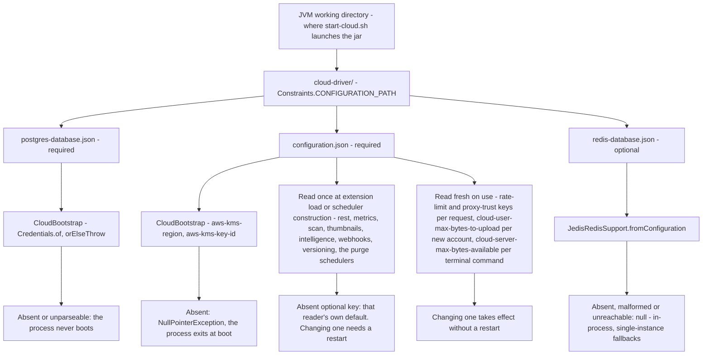
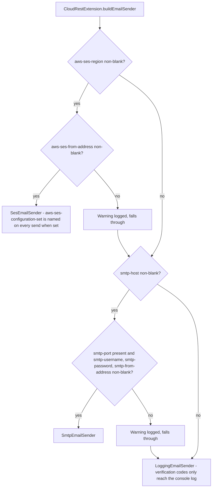

# Configuration

All environment-specific values live in gitignored JSON files in `cloud-driver/`, a subdirectory of
the JVM's working directory (`Constraints.CONFIGURATION_PATH`; `start-cloud.sh` runs the jar from
its own directory, so in a normal deployment that is the directory holding the jar) — two required
files (below) plus an optional `redis-database.json` (see Notes). Never commit real values found in
any of them.

| File | Holds |
|---|---|
| `postgres-database.json` | Live Postgres connection credentials |
| `configuration.json` | JWT signing key, REST API bind settings, SMTP credentials, feature-specific limits (see table below) |

## `configuration.json` keys

| Key | Type | Default if unset | Required for |
|---|---|---|---|
| `jwt-signing-key` | string | **Blank** → the REST API is skipped with a logged warning and the rest of the process boots normally. **Absent** → `JsonDocument#getString` throws `NullPointerException` and the whole REST extension fails to load (routed to `CloudRestExtension#onException`) | JWT-authenticated REST API |
| `rest-server-port` | int | **required** — startup fails if unset | REST API |
| `rest-server-bind-host` | string | `0.0.0.0` (every interface) — but only when the key is **present and blank**; an **absent** key throws `NullPointerException` out of the REST extension's load, exactly as `jwt-signing-key` does | REST API — set to `127.0.0.1` when fronted by a TLS-terminating reverse proxy. A non-loopback value logs a startup warning (Javalin serves plain HTTP; see docs/security.md "Transport security") |
| `aws-s3-max-concurrency` | int | `50` | Concurrent-connection cap of the shared async S3 client; with several instances against one bucket, size it per instance count, not per process |
| `webhook-dispatch-pool-size` | int | `4` | Webhook first-attempt delivery concurrency; queue depth is observable as the `cloud_driver_webhook_dispatch_queue_depth` gauge |
| `smtp-host` | string | Falls back to logging verification codes instead of e-mailing them | Outgoing verification e-mails |
| `smtp-port` | int | — | SMTP sending |
| `smtp-username` | string | — | SMTP sending |
| `smtp-password` | string | — | SMTP sending (secret) |
| `smtp-from-address` | string | — | SMTP sending |
| `cloud-user-max-bytes-to-upload` | long | **1 MiB (strict)** if unset — not unlimited | Per-account upload quota |
| `metrics-port` | int | `9404` | Metrics endpoint |
| `metrics-bind-host` | string | `127.0.0.1` (loopback-only) | Metrics endpoint |
| `trust-proxy-headers` | boolean | `false` | Rate-limit identity resolution behind a reverse proxy |
| `trusted-proxy-addresses` | string | unset → falls back to `trust-proxy-headers` | Comma-separated list of reverse-proxy addresses whose `X-Forwarded-For` may be believed. Authoritative when present. Match the spelling the backend sees: IPv4 loopback is `127.0.0.1`, IPv6 loopback renders as `0:0:0:0:0:0:0:1` |
| `auth-rate-limit-max-requests` | int | `10` | Per-IP auth rate limit |
| `auth-rate-limit-window-seconds` | long | `300` | Per-IP auth rate limit window |
| `trash-retention-days` | long | `30` | Trash purge scheduler |
| `aws-kms-region` | string | **required** — the process crashes at boot if unset | Key encryption (AWS KMS) |
| `aws-kms-key-id` | string | **required** — the process crashes at boot if unset | Key encryption (AWS KMS) |
| `aws-s3-region` | string | — | S3-backed file content storage |
| `aws-s3-bucket` | string | Unset → S3-backed storage disabled, files stored inline | S3-backed file content storage |
| `aws-s3-key-prefix` | string | `""` | S3-backed file content storage (optional) |
| `intelligence-shared-secret` | string | **required** — the extension refuses to load without it | Semantic search (secret) |
| `intelligence-host` | string | `127.0.0.1` | Semantic search |
| `intelligence-port` | int | `8600` | Semantic search |
| `intelligence-timeout-seconds` | long | `30` | Semantic search |
| `intelligence-max-bytes` | long | 100 MiB | Semantic search — files above this are left un-indexed |
| `aws-ses-region` | string | Blank/unset → e-mail falls through to SMTP, then log-only | Outgoing e-mail via AWS SES |
| `aws-ses-from-address` | string | — | AWS SES sending identity (must be SES-verified) |
| `aws-ses-configuration-set` | string | None named on sends | SES bounce/complaint event routing — only set once the set actually exists in the target account/region |
| `clamav-host` | string | `localhost` | Malware scanning (`cloud-driver-extensions-scan`) |
| `clamav-port` | int | `3310` | Malware scanning |
| `clamav-timeout-seconds` | long | `30` | Malware scanning |
| `content-scan-max-bytes` | long | 100 MiB | Files above this are marked clean unscanned (logged); the size is read from the file's record, so nothing is fetched from storage first. Content within the cap is streamed to the scanner, never held in memory whole |
| `thumbnail-max-source-bytes` | long | 64 MiB | Preview generation (`cloud-driver-extensions-thumbnails`) — a larger file simply gets no thumbnail |
| `thumbnail-max-decoded-pixels` | long | `50000000` | Raster budget the image decoder and the PDF renderer both refuse to exceed, checked against the image header and the PDF crop box before any raster is allocated |
| `thumbnail-render-timeout-seconds` | long | `20` | A decode or render that runs longer is abandoned and logged; the file keeps no thumbnail |
| `api-rate-limit-read-max-requests` | int | `300` | Per-identity limit — the authenticated account when there is one, otherwise the client address. Covers every GET/HEAD **and** the low-volume writes: any method under `/webhooks`, and any path ending in `/share` or `/public-link`. `GET /files/{id}/thumbnail` is exempt; `/public/…` is not covered by this budget at all — it has the two dedicated keys below, and `/files/upload-session…` is metered under its own budget instead |
| `api-rate-limit-read-window-seconds` | long | `60` | Per-user read rate limit window |
| `public-download-rate-limit-max-requests` | int | `30` | Anonymous public-link downloads (`GET /public/files/{token}`) — their own, tighter budget, in a bucket keyed on the client address **and** the link token, so neither one link nor one client can exhaust the allowance of the others |
| `public-download-rate-limit-window-seconds` | long | `60` | Public-link download rate limit window |
| `file-versioning-max-versions-per-file` | int | `10` | Version pruning (`cloud-driver-extensions-versioning`) |
| `file-versioning-retention-days` | long | `30` | Version pruning by age |
| `presigned-upload-ticket-retention-hours` | long | `6` | Orphaned presigned-upload cleanup (S3 deployments only) |
| `resumable-upload-session-retention-hours` | long | `72` | How long an unfinished resumable upload session survives before it is dropped and its multipart upload aborted |
| `resumable-upload-max-open-sessions-per-account` | int | `8` | How many resumable upload sessions one account may hold open at once; each open session also reserves its declared size against the account's upload quota until it completes, is aborted, or is aged out |
| `upload-session-rate-limit-max-requests` | int | `1200` | Per-identity budget for the `/files/upload-session…` routes (begin, status, part URL, complete, abort), in its own bucket so it neither consumes nor is consumed by the general read budget |
| `upload-session-rate-limit-window-seconds` | long | `60` | Window for the upload-session budget |
| `cloud-server-max-bytes-available` | long | **no default** — the terminal's `cloudUser limit`/`stats` commands fail without it | Operator terminal storage commands |

Where the three files live, who reads them, and what a missing value costs:

E-mail transport is resolved once, at REST-extension load, in this order:

## Notes

- `configuration.json` is re-read from disk on every access, so "does this need a restart?" is a
  per-key question. Read fresh on every use: the six rate-limit keys and both proxy-trust keys
  (per request), `cloud-user-max-bytes-to-upload` (per new account), `cloud-server-max-bytes-available`
  (per terminal command) and `trash-retention-days` for the purge timestamps shown in the trash
  listings. Every other key — including both retention windows used by the purge schedulers
  themselves — is read once, when its extension loads or its scheduler is built, and needs a restart.
- The Type column is the type the backend *reads* the key as. Several numeric keys are written as
  JSON **strings** by both the reference file and `cloud-driver-installer` — `rest-server-port`,
  `cloud-server-max-bytes-available` and `cloud-user-max-bytes-to-upload` — while `metrics-port`,
  `smtp-port`, `clamav-port` and `intelligence-port` are written as numbers. Both spellings work
  (the JSON reader coerces), so match whichever the existing file uses rather than "fixing" it.
- `cloud-user-max-bytes-to-upload` is the one key here that does **not** fail safe when left
  unset — an account created while it is unset is stamped with a strict 1 MiB quota. The value is
  resolved **once, when the `CloudUser` row is created**, and stored on that row, so setting or
  raising the key later applies only to accounts created afterwards; an existing account's quota is
  changed from the operator terminal with `cloudUser limit <email> <bytes> <unit>`. Set it
  deliberately on first deploy if a different limit (or effectively no limit) is intended.
- AWS credentials themselves (for KMS, S3 **and SES**) are never read from `configuration.json` — they
  resolve through the AWS SDK's own default credential provider chain (environment, shared config
  file, instance role, etc.), deliberately keeping a third place a secret could be committed by
  mistake out of the picture.
- Behind exactly one reverse proxy that is the only way to reach the backend, set
  `trusted-proxy-addresses` to the address the proxy connects from (`127.0.0.1` in the reference
  deployment) and leave `trust-proxy-headers` on for consistency. Only the rightmost entry of the
  header is read.
- Leaving both unset behind a proxy is not the safe default it looks like: every request then keys
  on the proxy's own address, so all callers share one `/auth/*` window (10 requests per 5 minutes
  by default) and a single host can hold everyone at `429`.
- Setting either while clients can reach the JVM directly — a non-loopback `rest-server-bind-host`
  with no proxy in front — lets a client choose its own rate-limit identity. The two keys belong
  only with a loopback bind behind a proxy.
- A deployment carrying only the older boolean keeps working unchanged: it means "trust a loopback
  peer". The allowlist makes that explicit and takes precedence whenever it is present and
  non-blank.
- Widening `metrics-bind-host` beyond loopback is a real access-control decision — the metrics
  endpoint carries no authentication of its own.
- `intelligence-shared-secret` must match `CLOUD_DRIVER_INTELLIGENCE_SECRET` on the Python
  service. It is the one `intelligence-*` key with no default, deliberately: an extension that
  authenticated with a well-known constant would be worse than one that refuses to load. A
  missing or blank value disables only semantic search, exactly as any other extension's load
  failure disables only itself.
- `intelligence-max-bytes` defaults to 100 MiB, but is worth lowering deliberately: content
  travels base64-encoded in a JSON body (~1.37x), so the default permits a ~137 MiB request for a
  large binary that will almost certainly yield nothing embeddable anyway. A value in the low tens
  of MiB is more proportionate.
- A second credentials file, `redis-database.json` (same directory, same
  `address`/`userName`/`password`/`port`/`database`/`fileRepository` shape as
  `postgres-database.json` — but `database` here is a numeric Redis logical-database *index*, e.g.
  `"0"`, not a name: it is passed straight to `Integer.parseInt`, so a non-numeric value makes Redis
  stay off), optionally enables Redis-backed rate limiting, durable webhook delivery history, and
  multi-instance coordination (once-per-window scheduler locks and cross-instance pending-upload
  visibility) — absent, malformed, or unreachable simply falls back to in-process, single-instance
  behavior.
- `start-cloud.env` is **not** a configuration file the backend reads. It sits next to
  `start-cloud.sh` and carries the launcher's own settings (`JVM_XMX`, `SCREEN_SESSION`,
  `SCREEN_LOG_FILE`); `cloud-driver-installer` writes it — see
  [deployment.md](deployment.md#gui-installer-cloud-driver-installer).
- [`requirements.md`](requirements.md) §3 covers the same keys again from the operator's
  perspective, including which ones fail loudly versus silently when misconfigured. This page is
  the type-and-default reference; §3 is the "what breaks when it is missing" angle. Both lists
  carry all 42 keys the backend reads — keep them in step whenever a key is added or removed.
