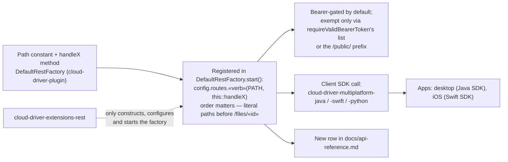

# Contributing

## Module boundaries

Dependency direction is one-way — see [architecture.md](architecture.md) for the full diagram.
Never introduce a dependency against that direction; if a type feels like it needs to cross the
boundary, it belongs at a lower layer instead.

## Code conventions (backend, Java)

| Convention | Detail |
|---|---|
| Instance-field access | Always qualified as `this.field`, never a bare `field` |
| Null-checking, concrete methods | Lombok's `@NonNull` on parameters (runtime-checked) |
| Null-checking, abstract/interface methods | `@NotNull` (documentation-only annotation, since there's no method body to inject a check into) |
| Hand-written null checks | Go through a shared assertion helper that names both the failing class/method and argument, rather than a bare null-check with a generic message |
| Javadoc | Every public/protected class, method, and field — a short summary sentence, then `@param`/`@return`/`@throws` as applicable |
| Thin pass-through methods | Point at the interface method they implement rather than repeating its documentation |
| Operator-terminal commands | Never hand-roll argument scanning: declare flags through `Command#flags()` (`CommandFlag.of` / `CommandFlag.valued`) and read them through `CommandArguments` (`hasFlag`, `flag`, `flagAs*`, `unknownFlags`), which already keeps flags out of the positional indices (`command(i)`, `hasLength`, `length`, `join`) |
| Command usage text | Declare each invocation as a `CommandUsage` in `Command#usages()` and print it via the inherited `sendUsage()` — never a hand-written syntax block, or `help <command>` goes stale |
| Variable-length command output | Goes through `Terminal#displayPaged` (continued by the `more` command): the console usually runs in a `screen` session with no scrollback, so anything past the window height is lost. Operator-facing syntax for both is in [api-usage.md](api-usage.md) §6 |
| Commit style | Prefer new commits over amending; never force-push a shared branch |

## Code conventions (Python)

Three packages are Python: `cloud-driver-installer`, `cloud-driver-intelligence` and the
`cloud-driver-multiplatform-python` SDK. All three build with hatchling, require Python >= 3.10,
and — unlike the JVM and Swift code — have real `pytest` suites ([testing.md](testing.md)).

| Convention | Detail |
|---|---|
| Module names | Never name a module after a standard-library module. `secrets.py` and `profile.py` were renamed to `credentials.py` and `profiles.py` because running a file inside the package puts its own directory on `sys.path`, where they shadowed the stdlib for the whole process; `cloud_driver_installer/__init__.py` strips that directory from `sys.path` for the same reason |
| Installer units of work | Every unit of work is a `Step` with `check` (read-only), `apply` (idempotent, safe to call twice) and `verify` (a real probe — a `psql` login, a Redis `PING`, the API answering — never `apply`'s own exit code). An installing step also implements `remove()` / `describe_removal()` and sets `removable = True`; only the smoke test is not removable |
| Installer step catalog | The sixteen steps live in six modules grouped by what they touch — `steps/system.py`, `datastores.py`, `daemons.py`, `awsresources.py`, `application.py`, `intelligence.py` — and `steps/__init__.py` is the single source of truth: `STEP_ORDER` fixes the ids and their run order, and `all_steps()` instantiates every one of them (it raises if the two disagree). A step module that `all_steps()` does not build is dead code, however finished it looks, and a second implementation of a step is how a whole test suite ends up green for code that never runs |
| Installer GUI | The window holds no logic: it edits an `InstallPlan` and renders `StepEvent`s from a worker thread. Three page rules — content lives in a `card()`, every label/field pair goes through `Form`, and nothing sets a colour of its own (take one from `COLORS`). Every pane is a `ScrollFrame`, wheel events are routed centrally by `install_wheel_router()`, and ttk's `clam` theme is forced on every platform |
| Optional heavy dependencies | The unpublished database-driver Python edition stays in a `driver` extra, deliberately outside `dev`, so CI installs from public indexes only and the dependent tests skip rather than fail |

## Keeping documentation current

Documentation lives in exactly two places: the root `README.md` (the map — modules, diagrams,
quick start) and `docs/` — eleven pages: [architecture.md](architecture.md),
[security.md](security.md), [configuration.md](configuration.md),
[requirements.md](requirements.md), [getting-started.md](getting-started.md),
[api-reference.md](api-reference.md), [api-usage.md](api-usage.md), [testing.md](testing.md),
[deployment.md](deployment.md), [troubleshooting.md](troubleshooting.md), and this page. Update
the relevant page **in the same change as the code it describes**, not as a separate
follow-up — a new route belongs in [api-reference.md](api-reference.md), a new
config key in [configuration.md](configuration.md), a new module in the root README's module
table. Modules deliberately do not carry their own `README.md` files; module-level detail belongs
in source Javadoc.

## Adding a new backend feature module

1. Create the module under `cloud-driver-extensions/` (directory name
   `cloud-driver-extensions-<name>`, `packaging` `jar`, parent
   `de.lino.cloud.extensions:cloud-driver-extensions`) and add it to that aggregator pom's
   `<modules>` list — the reactor will not build it otherwise. Depend on `cloud-driver-plugin`
   (ten of the eleven shipped extensions do; the watcher needs only `cloud-driver-api` plus
   `database-driver-plugin`). Do not shade the jar: extension jars are plain jars that resolve
   shared classes off the bootstrap jar's classpath, so deploy both from the same commit.
2. Add `src/main/resources/extension.json` — `name`, `version`, `description`, `authors`,
   `dependencies`. `dependencies` names *other extensions by their own manifest `name`*, and every
   one of the eleven shipped manifests declares exactly `["cloud-driver-bootstrap"]`, satisfied by
   the no-op extension the bootstrap registers for itself before scanning. Note the manifest name
   need not match the module name (the rest module's manifest is `cloud-driver-rest-server`).
3. Implement the four `Extension` hooks — `onLoading`, `onRunning(String[])`, `onEnding`,
   `onException(RuntimeException)`. Registration is automatic: the bootstrap scans
   `<working dir>/extensions` for jars at startup and starts each on its own thread, in dependency
   order. See [api-usage.md](api-usage.md) §1.4 for a worked example.
4. Add a row for it to the module table in this repository's root `README.md` and, if it's
   security- or config-relevant, to [security.md](security.md) / [configuration.md](configuration.md).
5. Keep the manifest's `version` in step with the reactor version by hand. The release automation
   bumps an explicit list of `extension.json` files rather than globbing them, so a manifest that
   is not on that list silently stops tracking the pom version — six of the eleven are currently
   off it (intelligence, scan, search, thumbnails, versioning, webhooks) and lag behind. Deployment
   itself is unaffected (`deploy-cloud.sh` uploads every `cloud-driver-extensions/*/target/*.jar`
   and jar names come from the pom), but the manifest version is what the operator terminal's
   `extensions` command reports.

## Adding a new REST route

1. Add the path constant, the `handle…` method and the registration in `cloud-driver-plugin`'s
   `DefaultRestFactory` — *not* in the REST extension module, which only constructs, configures
   and starts the factory. Routes are declared as `config.routes.<verb>(PATH, this::handleX)`
   lambdas inside `DefaultRestFactory#start`'s `Javalin.create(config -> { … })` block (one flat
   list, no `ApiBuilder` DSL, no annotations). Two constraints that are not style choices:
   - **Registration order matters.** Javalin's `PathMatcher` scans registered routes linearly in
     registration order with no static-segment-over-path-param precedence, so a literal path such
     as `/files/trash` must be registered *before* `GET /files/{id}` or the `{id}` handler swallows
     it (a real bug, fixed 2026-09-02; see the comment block above the `/files` registrations).
   - **Authentication is decided by path, not by placement.** The `requireValidBearerToken`
     before-filter exempts exactly seven fixed `/auth/*` paths plus everything under the `/public/`
     prefix; any new route is bearer-gated unless it is added there, and any `/admin/`-prefixed
     route is additionally gated by `requireAdmin`.
2. Add the client-side call to whichever of the three SDKs under
   [`cloud-driver-multiplatform/`](../cloud-driver-multiplatform/) should carry it —
   `cloud-driver-multiplatform-java` (`ApiClient`, blocking plus `…Async` forms),
   `cloud-driver-multiplatform-swift` (`APIClient`), `cloud-driver-multiplatform-python`
   (`CloudDriverClient`) — then wire it into the app that consumes that SDK: the desktop app uses
   the Java SDK, the iOS app the Swift SDK. The Python SDK has no app of its own. Coverage is
   deliberately uneven (webhooks, resumable upload sessions and chunk patching are Java-only; the
   admin routes are Java and Python but not Swift), so a new route does not have to land in all
   three.
3. Add a row to [api-reference.md](api-reference.md).

## Pull requests

- Keep a change scoped to one concern — a bug fix should not also carry an unrelated refactor.
- Call out any known limitation or deliberately deferred follow-up directly in the PR description,
  rather than leaving it to be rediscovered later.
- Six GitHub Actions workflows run on pushes and pull requests: the Maven reactor build, the
  iOS/Swift build, `pytest` for each of the three Python packages, and a Qodana inspection. The
  Swift, Python, intelligence and installer workflows each list the paths of the module they cover,
  so a change elsewhere never starts them. The Maven reactor build filters the other way round —
  it excludes the two client apps, the Python and Swift SDKs, the intelligence service and every
  `*.md` file — so it still runs for a change anywhere else in the tree, an installer or homepage
  edit included. Qodana is not path-filtered at all, so a documentation-only change runs it and
  nothing else. A seventh publishes the reactor and runs on a release, not on ordinary pushes.
  What each one does — and what it deliberately does not install — is in
  [testing.md](testing.md); note that nothing in CI *runs* the Java/Kotlin/Swift code, so verify
  those by building and running the artifact yourself.
