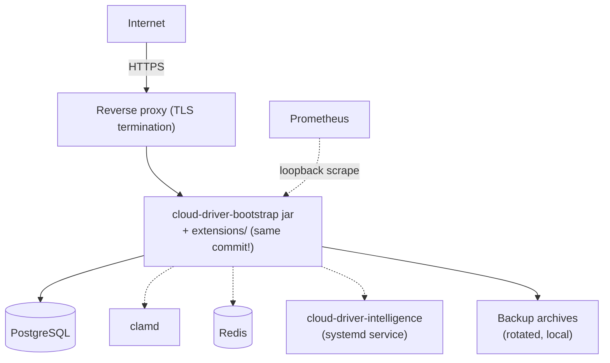
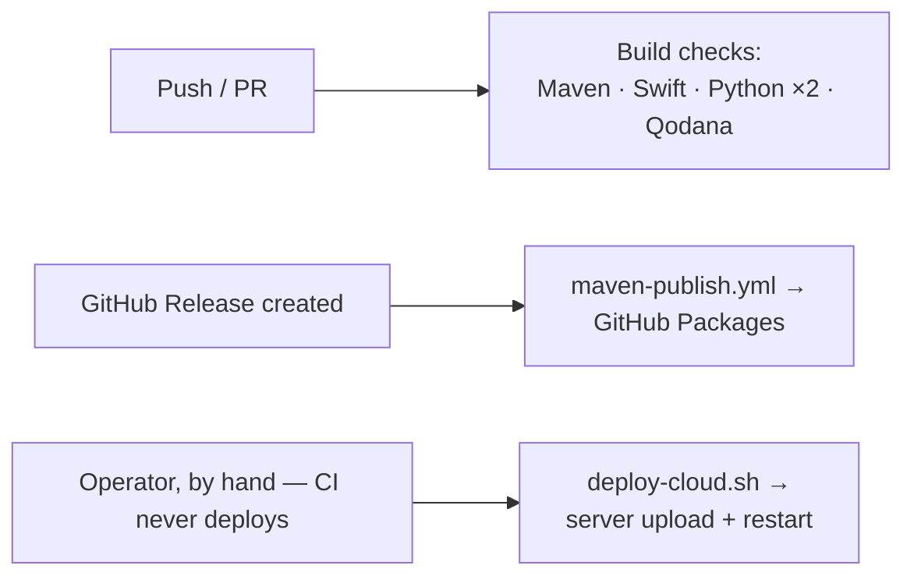

# Deployment

## Backend



The backend deploys as a single jar to one server — there is no orchestration platform (Kubernetes,
etc.) involved. A handful of shell scripts under [`shell/`](../shell/) handle the mechanics:

| Script | Runs where | Purpose |
|---|---|---|
| `provision-root-server.sh` | Locally, targets a fresh server | One-shot OS-level bring-up of a brand-new root server: JDK 21, PostgreSQL (role + database), Caddy, `ufw` firewall, a swapfile, hardened `clamd`, password-protected loopback-only Redis, the `/home/cloud` directory layout `deploy-cloud.sh` expects, and scaffolded (mostly placeholder) config JSON files. Idempotent; does not touch AWS or deploy the jar itself — see §"Provisioning a new root server" below |
| `deploy-cloud.sh` | Locally | Uploads the already-built, shaded bootstrap jar to the server, compressed and checksum-verified |
| `start-cloud.sh` | On the server | Starts the jar in a detached session with an explicit heap size (`-Xmx6g` by default, override with `JVM_XMX` — or with a sibling `start-cloud.env`, see §"GUI installer"), auto-restarting it if it ever exits. The bootstrap jar is the single `cloud-driver-bootstrap-*.jar` in the script's own directory, so a version bump needs no edit. The JVM runs with `-XX:+ExitOnOutOfMemoryError`, so heap exhaustion terminates the process and the loop restarts it instead of leaving it running with threads the error killed |
| `release-and-package.sh` | Locally | One-shot release automation: bumps every version reference, builds, tags, pushes, and cuts a release. **The one script not in version control** — it is operator-local |
| `deploy-homepage.sh` | Locally | Uploads `homepage/` to the server (checksum-verified), points Caddy's apex `cloud-driver.de` block at it (backing up and validating the Caddyfile first), reloads Caddy, and smoke-tests the live URL |

None of these scripts build anything by themselves — always run `mvn clean install` (or the
targeted `-pl ... -am package` form) first.

Every script above except `release-and-package.sh` is checked into version control: each takes
the target host as an argument (or reads it from an SSH alias) instead of hardcoding
server-specific connection details, so none carries a secret of its own. Keep it that way — a
script that would need a real hostname, credential, or key baked in belongs outside the
repository, like `release-and-package.sh` does.

## Provisioning a new root server

To bring up a brand-new root server (a fresh Debian/Ubuntu box with nothing installed — from
IONOS, Strato, Hetzner, or any equivalent provider) to the point where only AWS setup and the
application deploy itself remain, from a local checkout:

```bash
./shell/provision-root-server.sh <ssh-host-or-alias> [api-domain]
```

This covers every mandatory and commonly-enabled-optional piece in
[requirements.md](requirements.md) at the OS level: JDK 21, PostgreSQL (dedicated owner role +
database, per requirements.md §2.1), the `ufw` firewall (this application does not manage its own
— requirements.md §6), a 4 GB swapfile (requirements.md §7), `clamd` bound to loopback with raised
size limits and the systemd socket-activation drop-in (requirements.md §4.3), Redis bound to
loopback with a generated password, Caddy (installed always; a reverse-proxy site block for
`api-domain` is added if given), and the `/home/cloud/{cloud-driver,extensions}` layout
`deploy-cloud.sh`/`start-cloud.sh` already assume. It also scaffolds
`postgres-database.json`/`redis-database.json` (real, generated credentials) and
`configuration.json` (a real generated `jwt-signing-key`, but `REPLACE-ME` placeholders for every
`aws-*` key) — never overwriting files that already exist.

It deliberately stops short of anything requiring your AWS account or an already-built jar; the
script prints the remaining manual checklist on completion:

1. Create the AWS KMS CMK (required — boot crashes without it) and, if wanted, the S3 bucket and
   SES sending identity (see requirements.md §4.1/§4.2 for exact IAM permissions and the SES
   sandbox caveat), then fill the `REPLACE-ME` values into the server's `configuration.json`.
2. Configure AWS credentials on the host itself (`aws configure`, or a `~/.aws/credentials` file)
   — never in `configuration.json`, per requirements.md §3.1.
3. Point DNS at the new server's IP.
4. `mvn clean install` locally, then `./shell/deploy-cloud.sh` (ships the jars, `configuration.json`,
   and `start-cloud.sh` itself, restoring its executable bit) and, on the server, `./start-cloud.sh`.
5. Optional: `cloud-driver-intelligence/deploy/install-on-server.sh` for semantic search.

Cutting production over to the new box afterward is a DNS change plus repointing whatever SSH
alias `deploy-cloud.sh`/`deploy-homepage.sh` use at the new server — neither script needs editing
if the alias name is kept the same and `/home/cloud` is the deploy target on both.

**A rebuilt feature-module jar must always be redeployed together with a bootstrap jar built from
the same commit.** Feature-module jars resolve shared types off the running bootstrap jar's own
classpath at load time — mixing versions crashes the process at startup, and the auto-restart loop
will simply repeat that crash indefinitely rather than recovering.

## GUI installer (`cloud-driver-installer`)

For a server you are standing up (or re-checking) interactively, `cloud-driver-installer` does
everything `provision-root-server.sh` does and everything it deliberately left out — the AWS
resources, the config files, the jars, the companion services — from one window, over one SSH
connection entered at startup:

```bash
cd cloud-driver-installer
python3 -m venv .venv && ./.venv/bin/pip install -e .
./.venv/bin/cloud-driver-installer
```

(On Python 3.14 an editable install's `.pth` file is ignored, so run it as
`PYTHONPATH=src ./.venv/bin/python -m cloud_driver_installer` there, or install non-editable.
The GUI needs `tkinter`: on Debian/Ubuntu operator machines, `apt-get install python3-tk`.)

Sixteen steps run in the order the server needs them:

| # | Step | Does |
|---|---|---|
| 1 | Server | Refuses a non-root, non-apt or non-systemd host; discovers OS, RAM, disk, clock, versions and everything already installed; takes the existing `configuration.json` over; creates the directory layout; optionally installs your public key and writes an `~/.ssh/config` alias |
| 2 | Base packages | `screen`, `curl`, `gnupg`, `ca-certificates`, `apt-transport-https`, `openssl`, `unzip`, `cron`, `logrotate`, `fonts-dejavu-core` (+ `awscli` for off-site backups) |
| 3 | Java 21 | `openjdk-21-jdk-headless`, verified to report 21 |
| 4 | Python 3 | `python3`, `python3-venv`, `python3-pip`, verified by actually building a throwaway virtual environment |
| 5 | PostgreSQL | Server, role, database owned by the role, `postgres-database.json`; verifies the login *and* that the role can create objects |
| 6 | Redis | Loopback bind, `requirepass`, `redis-database.json`, verified with a `PING` |
| 7 | ClamAV | `clamav-daemon` + `freshclam`, the systemd socket drop-in on `127.0.0.1:3310`, raised size limits |
| 8 | Firewall | `ufw`: the real sshd port(s) first, then 80 and 443, then deny-incoming and enable |
| 9 | Swap | A swapfile (an existing one is kept, never switched off under a running JVM) |
| 10 | AWS | KMS key + alias, the content bucket, a separate backup bucket, a least-privilege IAM user, and that user's access key in `/root/.aws/credentials` |
| 11 | E-mail | The SES identity (domain with Easy DKIM, or a single address) or the SMTP settings |
| 12 | Reverse proxy | Caddy, the API site block, validated before the swap and reloaded |
| 13 | Configuration files | `configuration.json`, `postgres-database.json`, `redis-database.json`, `start-cloud.env` — and the same `configuration.json` back into the checkout |
| 14 | Application | The bootstrap jar, the extension jars, `start-cloud.sh`, the managed cron block, the logrotate stanza, and a clean restart |
| 15 | Intelligence service | `/opt/cloud-driver-intelligence`, its virtual environment, env file and systemd unit |
| 16 | Smoke test | The API, the metrics port, the daemons, the reboot autostart and the public URL |

Every step is **check → apply → verify**: the check only reads, the apply is idempotent, and the
verify probes the real thing (a `psql` login, a Redis `PING`, clamd's socket, the API answering
`401` on `/auth/me`). Re-running against a provisioned box is the normal case, so:

- a credential is only ever rotated together with the file that records it, and a password already
  on the server is read back and kept unless *rotate* is ticked;
- the KMS key and S3 bucket named in the server's own `configuration.json` are adopted
  automatically — replacing either, or disabling S3 while content is stored there, needs an
  explicit acknowledgement, because existing rows would otherwise become unreadable;
- a disabled feature's keys are removed from `configuration.json` (a left-over `aws-s3-bucket`
  would keep S3 active against a bucket the plan no longer knows), while keys the installer does
  not manage pass through untouched;
- every file it rewrites is copied first into `/var/backups/cloud-driver-installer/<run>/`, and
  written through an atomic rename so the running JVM — which re-reads `configuration.json` on
  every access — can never see a half-written file;
- secrets travel over stdin, never on a command line, are written `0600`, and are masked in the
  log.

**`start-cloud.env`** is the launcher's own environment file, written next to `start-cloud.sh`:
`JVM_XMX` (the heap the installer sizes from the box's RAM minus Postgres, clamd and the
intelligence service), `SCREEN_SESSION`, and `SCREEN_LOG_FILE` (`/var/log/cloud-driver/cloud.log`,
root-only and rotated weekly — the JVM writes no log of its own, and a detached `screen` has no
scrollback). The jar name is deliberately *not* pinned, so a later `deploy-cloud.sh` release bump
keeps working. The same run installs a managed crontab region (`# cloud-driver-installer
BEGIN/END`): the `@reboot` relaunch — inside `screen`, because the operator terminal needs a pty —
an hourly sweep of abandoned upload scratch files, and the daily off-site backup copy into the
backup bucket.

**Config write-back matters**: `shell/deploy-cloud.sh` ships the *local* `cloud-driver/configuration.json`
on every run, so the installer writes the file it generated back into the checkout. Leave that
switched off and the next routine deploy reverts the server to whatever the checkout still holds.

What it deliberately does not do: create DNS records, request SES production access, configure the
provider-level firewall, deploy the homepage, or rebuild the client apps (both hardcode
`https://api.cloud-driver.de`). `provision-root-server.sh` stays as the scriptable path for the
OS-level half.

## Companion processes

The optional external processes (`clamd`, Redis, the Python intelligence service) run as ordinary
system services beside the JVM — none is deployed by the scripts above. The intelligence service
ships its own systemd unit and idempotent installer under `cloud-driver-intelligence/deploy/`
(run from a local checkout against the target server); `clamd` and Redis are installed through
the host OS's own package manager and bound to loopback. The installer installs the service with
the `embeddings` and `store` extras, mirrors the `lino-database-driver-*` packages from the
sibling `database-driver-v2` clone into `/opt/cloud-driver-intelligence/vendor/` (they are on no
package index yet), and — whenever that vendor directory exists — (re)installs them plus the
`encryption` extra on every run, so redeploys can never silently drop the encrypted store.
Vector at-rest encryption is enabled once with `install-on-server.sh --enable-encryption`: the
key is generated server-side, appended to the root-owned env file (every later redeploy
preserves it), and the freshly encrypted store starts empty — re-index with
`intelligence backfill all --content` from the operator terminal, then delete the old plaintext
Chroma files under the store directory.

## Homepage (cloud-driver.de)

The static informational homepage under [`homepage/`](../homepage/) (`index.html`, the
English-language legal pages `impressum.html`/`datenschutz.html`, `style.css`, and the
animation layer `script.js`) is served by the same reverse proxy that fronts the API, directly
as files — the Java backend is not involved. The pages are deliberately self-contained: the
only JavaScript is the dependency-free, self-hosted `script.js` (animations only — no cookies,
no data collection), and nothing is ever loaded from third parties (fonts, analytics, CDNs) —
which is exactly what `datenschutz.html` claims, so keep it that way. All animation is disabled
under `prefers-reduced-motion`, and the page renders fully with JS off.

Deploying is one command — [`shell/deploy-homepage.sh`](../shell/deploy-homepage.sh):

```bash
./shell/deploy-homepage.sh
```

It uploads every file in `homepage/` to `/var/www/cloud-driver-homepage` on the server
(checksum-verified, stale remote files removed), ensures the Caddyfile's apex block is

```caddyfile
cloud-driver.de {
    root * /var/www/cloud-driver-homepage
    header Cache-Control "no-cache"
    file_server
}
```

(replacing the original block that reverse-proxied the apex to the REST API — the reason the
domain used to show no homepage), validates the rewritten Caddyfile before swapping it in
(timestamped backup kept), reloads Caddy without touching the `api.`/`auth.` blocks, and
smoke-tests `https://cloud-driver.de`. It refuses to deploy while any page still contains a
`class="todo"` placeholder, so unfinished legal text can never go live.

### Cache correctness

`Cache-Control: no-cache` in that block is not optional. Caddy's `file_server` sends only
`ETag` and `Last-Modified`; with no `Cache-Control` at all, browsers fall back to *heuristic*
freshness — roughly 10% of the time since `Last-Modified` — and reuse a cached `style.css` or
`script.js` **without revalidating**. A stylesheet untouched for two days therefore stays
"fresh" for hours after a deploy, so a visitor gets the new `index.html` rendered against the
old CSS, and new markup lands unstyled. `no-cache` still lets the browser cache; it just forces
a revalidation that answers `304 Not Modified` when nothing changed.

As a second layer, the HTML links its assets with a version query — `style.css?v=20260912-2`,
`script.js?v=20260912-2` (the deploy date, plus a `-N` counter for further changes the same
day). Bump that stamp in all three pages whenever `style.css` or `script.js` changes: a new URL cannot be served from an old cache entry, in any browser or intermediary,
regardless of headers.

The pages state facts about the running system (version number, route count, extension count) —
when those change in a release, update `homepage/index.html` in the same change.

## Continuous integration



Six GitHub Actions workflows exist (`.github/workflows/`) — five automatic checks plus one
publisher:

| Workflow | Trigger | Does |
|---|---|---|
| `maven.yml` — Java CI with Maven | Push / pull request (backend changes) | Runs `mvn package` across the whole reactor |
| `swift.yml` — Swift | Push / pull request (mobile app changes) | Builds the mobile app against the iOS Simulator SDK |
| `python.yml` — Python | Push / pull request (Python SDK changes) | Installs the SDK and runs its `pytest` suite (3.10/3.11/3.12) |
| `intelligence.yml` — Intelligence Service | Push / pull request (intelligence service changes) | Installs the service and runs its `pytest` suite |
| `qodana_code_quality.yml` — Qodana | Push / pull request | JetBrains Qodana static analysis |
| `maven-publish.yml` — Maven Package | GitHub Release creation | Publishes every backend module to this repository's own GitHub Packages registry |

No workflow deploys to a live server automatically — that step is always run by hand via
`deploy-cloud.sh`, on purpose, since pushing to production is a separate decision from cutting a
release.

## Desktop app distribution

Native installers are built per-OS from the same Gradle project (see
[getting-started.md](getting-started.md)) and installed directly into the OS's normal application
location with a desktop shortcut — there is no app-store distribution for the desktop app today.

## Mobile app distribution

Built and signed through Xcode. There is no automated App Store submission pipeline configured —
distribution today is a manual Xcode archive/export step.
