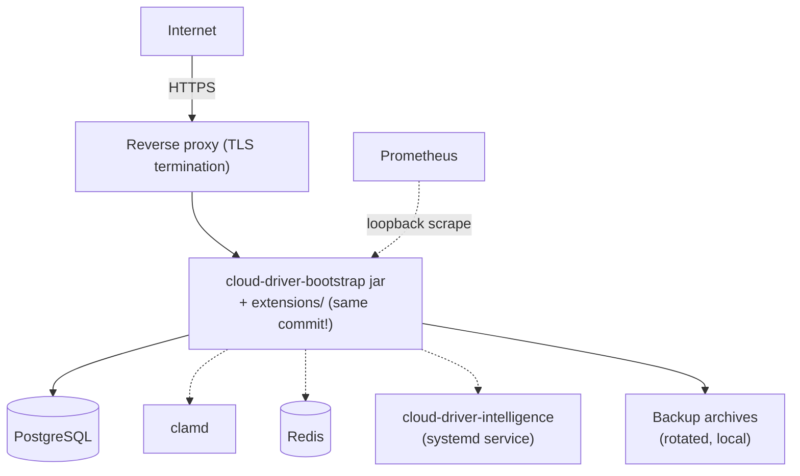
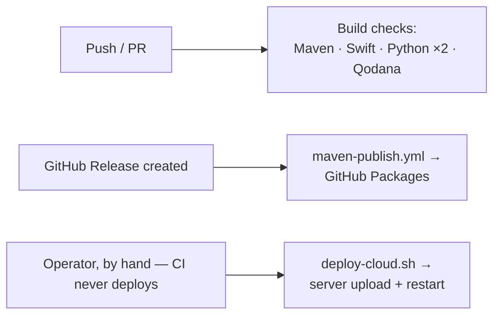

# Deployment

## Backend



The backend deploys as a single jar to one server — there is no orchestration platform (Kubernetes,
etc.) involved. A handful of shell scripts (kept local to each operator's machine, not tracked in
version control since they hardcode server-specific connection details) handle the mechanics:

| Script | Runs where | Purpose |
|---|---|---|
| `deploy-cloud.sh` | Locally | Uploads the already-built, shaded bootstrap jar to the server, compressed and checksum-verified |
| `start-cloud.sh` | On the server | Starts the jar in a detached session with an explicit heap size, auto-restarting it if it ever exits |
| `test-bootstrap.sh` | Locally | Assembles a clean throwaway run directory for a manual smoke test |
| `release-and-package.sh` | Locally | One-shot release automation: bumps every version reference, builds, tags, pushes, and cuts a release |

None of these scripts build anything by themselves — always run `mvn clean install` (or the
targeted `-pl ... -am package` form) first.

**A rebuilt feature-module jar must always be redeployed together with a bootstrap jar built from
the same commit.** Feature-module jars resolve shared types off the running bootstrap jar's own
classpath at load time — mixing versions crashes the process at startup, and the auto-restart loop
will simply repeat that crash indefinitely rather than recovering.

## Companion processes

The optional external processes (`clamd`, Redis, the Python intelligence service) run as ordinary
system services beside the JVM — none is deployed by the scripts above. The intelligence service
ships its own systemd unit and idempotent installer under `cloud-driver-intelligence/deploy/`
(run from a local checkout against the target server); `clamd` and Redis are installed through
the host OS's own package manager and bound to loopback.

## Homepage (cloud-driver.de)

The static informational homepage under [`homepage/`](../homepage/) (`index.html`, the
English-language legal pages `impressum.html`/`datenschutz.html`, `style.css`, and the
animation layer `script.js`) is served by the same reverse proxy that fronts the API, directly
as files — the Java backend is not involved. The pages are deliberately self-contained: the
only JavaScript is the dependency-free, self-hosted `script.js` (animations only — no cookies,
no data collection), and nothing is ever loaded from third parties (fonts, analytics, CDNs) —
which is exactly what `datenschutz.html` claims, so keep it that way. All animation is disabled
under `prefers-reduced-motion`, and the page renders fully with JS off.

Deploying is a plain file copy plus a Caddy site block for the apex domain:

```bash
rsync -av --delete homepage/ user@server:/var/www/cloud-driver-homepage/
```

```caddyfile
cloud-driver.de {
    root * /var/www/cloud-driver-homepage
    file_server
}
```

**Before the legal pages go live**: `datenschutz.html` still contains two values marked with
`class="todo"` — a highlighted span in the rendered page — for the hosting provider and the AWS
region. Verify both against the actual deployment, then remove the markers.

The pages state facts about the running system (version number, route count, extension count) —
when those change in a release, update `homepage/index.html` in the same change.

## Continuous integration



Six GitHub Actions workflows exist (`.github/workflows/`) — five automatic checks plus one
publisher:

| Workflow | Trigger | Does |
|---|---|---|
| `maven.yml` — Java CI with Maven | Push / pull request (backend changes) | Runs `mvn package` across the whole reactor |
| `swift.yml` — Swift | Push / pull request (mobile app changes) | Builds the mobile app against the iOS Simulator SDK |
| `python.yml` — Python | Push / pull request (Python SDK changes) | Installs the SDK and runs its `pytest` suite (3.10/3.11/3.12) |
| `intelligence.yml` — Intelligence Service | Push / pull request (intelligence service changes) | Installs the service and runs its `pytest` suite |
| `qodana_code_quality.yml` — Qodana | Push / pull request | JetBrains Qodana static analysis |
| `maven-publish.yml` — Maven Package | GitHub Release creation | Publishes every backend module to this repository's own GitHub Packages registry |

No workflow deploys to a live server automatically — that step is always run by hand via
`deploy-cloud.sh`, on purpose, since pushing to production is a separate decision from cutting a
release.

## Desktop app distribution

Native installers are built per-OS from the same Gradle project (see
[getting-started.md](getting-started.md)) and installed directly into the OS's normal application
location with a desktop shortcut — there is no app-store distribution for the desktop app today.

## Mobile app distribution

Built and signed through Xcode. There is no automated App Store submission pipeline configured —
distribution today is a manual Xcode archive/export step.
