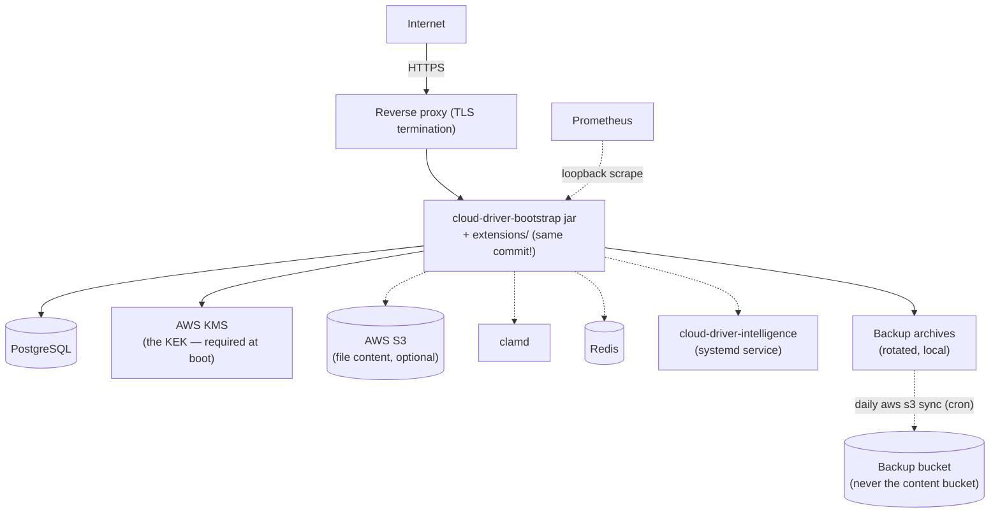
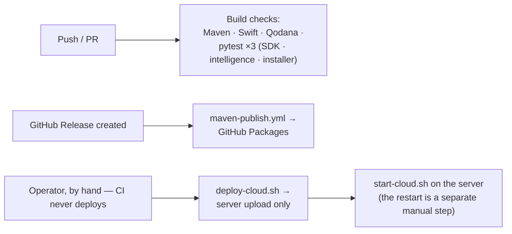

# Deployment

## Backend



The backend deploys as a single jar to one server — there is no orchestration platform (Kubernetes,
etc.) involved. A handful of shell scripts under [`shell/`](../shell/) handle the mechanics:

| Script | Runs where | Purpose |
|---|---|---|
| `provision-root-server.sh` | Locally, targets a fresh server | One-shot OS-level bring-up of a brand-new root server: JDK 21, PostgreSQL (role + database), Caddy, `ufw` firewall, a swapfile, hardened `clamd`, password-protected loopback-only Redis, the `/home/cloud` directory layout `deploy-cloud.sh` expects, and scaffolded (mostly placeholder) config JSON files. Idempotent; does not touch AWS or deploy the jar itself — see §"Provisioning a new root server" below |
| `deploy-cloud.sh` | Locally | Uploads the already-built shaded bootstrap jar, every built extension jar, the local `cloud-driver/configuration.json` and `start-cloud.sh` itself (executable bit restored) over one multiplexed SSH connection, up to 6 in parallel, each verified with SHA-256 on both ends. Prunes previous releases' jars once every upload has verified, and refuses an extension jar whose name does not carry the bootstrap jar's version, or two jars for the same module — the bootstrap refuses to start when two jars claim the same extension name. Files are sent uncompressed on purpose — jars are already DEFLATE-compressed. It builds nothing and never restarts the running instance |
| `start-cloud.sh` | On the server | Starts the jar in a detached session with an explicit heap size (`-Xmx6g` by default, override with `JVM_XMX` — or with a sibling `start-cloud.env`, see §"GUI installer"), auto-restarting it if it ever exits. The bootstrap jar is the single `cloud-driver-bootstrap-*.jar` in the script's own directory, so a version bump needs no edit. The JVM runs with `-XX:+ExitOnOutOfMemoryError`, so heap exhaustion terminates the process and the loop restarts it instead of leaving it running with threads the error killed |
| `release-and-package.sh` | Locally | One-shot release automation: bumps the version references it lists — every `pom.xml`, the desktop Gradle build, the iOS `project.yml` and the Python SDK, plus six of the twelve `extension.json` manifests (the bootstrap's, and `rest`, `backup`, `terminal`, `metrics`, `watcher`); the other six extensions' manifests are not in that hardcoded list and keep their previous version, so check them by hand after a release. Then rebuilds the reactor with `mvn clean install`, commits, tags, pushes, cuts a GitHub Release and waits for the publish workflow. Operator-local — one of the two scripts deliberately kept out of version control (the other is `deploy-homepage.sh`) |
| `deploy-homepage.sh` | Locally | Uploads `homepage/` to the server (checksum-verified), points Caddy's apex `cloud-driver.de` block at it (backing up and validating the Caddyfile first), reloads Caddy, and smoke-tests the live URL |

None of the deploy/run scripts build anything by themselves — always run `mvn clean install` (or
the targeted `-pl ... -am package` form) before `deploy-cloud.sh`. `release-and-package.sh` is the
exception: building the reactor is part of what it does.

Two of the scripts above — `release-and-package.sh` and `deploy-homepage.sh` — are deliberately
kept out of version control (both are listed in `.gitignore`, alongside the `homepage/` directory
itself). The three that are checked in — `provision-root-server.sh`, `deploy-cloud.sh` and
`start-cloud.sh` — take the target host as an argument or read it from an SSH alias instead of
hardcoding server-specific connection details, so none carries a secret of its own. Keep it that
way: a script that would need a real hostname, credential, or key baked in belongs outside the
repository, like those two do.

## Provisioning a new root server

To bring up a brand-new root server (a fresh Debian/Ubuntu box with nothing installed — from
IONOS, Strato, Hetzner, or any equivalent provider) to the point where only AWS setup and the
application deploy itself remain, from a local checkout:

```bash
./shell/provision-root-server.sh <ssh-host-or-alias> [api-domain]
```

This covers every mandatory and commonly-enabled-optional piece in
[requirements.md](requirements.md) at the OS level: JDK 21, PostgreSQL (dedicated owner role +
database, per requirements.md §2.1), the `ufw` firewall (this application does not manage its own
— requirements.md §6), a 4 GB swapfile (requirements.md §7), `clamd` bound to loopback with raised
size limits and the systemd socket-activation drop-in (requirements.md §4.3), Redis bound to
loopback with a generated password, Caddy (installed always; a reverse-proxy site block for
`api-domain` is added if given), and the `/home/cloud/{cloud-driver,extensions}` layout
`deploy-cloud.sh`/`start-cloud.sh` already assume. It also scaffolds
`postgres-database.json`/`redis-database.json` (real, generated credentials) and
`configuration.json` (a real generated `jwt-signing-key`, but `REPLACE-ME` placeholders for all six
`aws-*` keys **and for `cloud-server-max-bytes-available`**, the server's total capacity — fill that
one in too, or the operator terminal's `cloudUser` and `statistics` commands fail on it) — never
overwriting files that already exist.

The API site block it writes is the shape the backend is configured against:

```caddyfile
api.example.com {
    reverse_proxy 127.0.0.1:8080 {
        header_up X-Forwarded-For {remote_host}
    }
}
```

The header is **overwritten**, not appended, so no client-supplied value survives the hop — the
backend reads the address Caddy itself observed. The scaffolded `configuration.json` pairs with
that by setting `trust-proxy-headers`/`trusted-proxy-addresses` to that same loopback peer, which
is what lets the rate limiter key on the real client instead of collapsing every caller on the
internet into the proxy's own address.

**Upgrading a host provisioned before this shape:** the script leaves an existing
`configuration.json` untouched on a re-run, so it will not add the two keys. Add them by hand and
restart, or the auth limiter stays one window shared by everybody:

```json
"trust-proxy-headers": true,
"trusted-proxy-addresses": "127.0.0.1",
```

Confirm afterwards with `rateLimit status` in the operator terminal; `rateLimit reset 127.0.0.1`
clears a leftover shared window immediately.

It deliberately stops short of anything requiring your AWS account or an already-built jar; the
script prints the remaining manual checklist on completion:

1. Create the AWS KMS CMK (required — boot crashes without it) and, if wanted, the S3 bucket and
   SES sending identity (see requirements.md §4.1/§4.2 for exact IAM permissions and the SES
   sandbox caveat), then fill the `REPLACE-ME` values into the server's `configuration.json`.
2. Configure AWS credentials on the host itself (`aws configure`, or a `~/.aws/credentials` file)
   — never in `configuration.json`, per requirements.md §3.1.
3. Point DNS at the new server's IP.
4. `mvn clean install` locally, then `./shell/deploy-cloud.sh` (ships the jars, `configuration.json`,
   and `start-cloud.sh` itself, restoring its executable bit) and, on the server, `./start-cloud.sh`.
5. Optional: `cloud-driver-intelligence/deploy/install-on-server.sh` for semantic search.

Cutting production over to the new box afterward is a DNS change plus repointing whatever SSH
alias `deploy-cloud.sh`/`deploy-homepage.sh` use at the new server — neither script needs editing
if the alias name is kept the same and `/home/cloud` is the deploy target on both.

**A rebuilt feature-module jar must always be redeployed together with a bootstrap jar built from
the same commit.** Feature-module jars resolve shared types off the running bootstrap jar's own
classpath at load time — mixing versions crashes the process at startup, and the auto-restart loop
will simply repeat that crash indefinitely rather than recovering. Two jars in `extensions/`
declaring the same extension name abort the boot before any extension starts, naming both files,
so nothing serves and the launcher repeats the crash. Both deploy paths therefore remove the
previous release's jars — and they do it only after the replacement has landed and verified, so a
failed run never leaves the host with neither release.

## GUI installer (`cloud-driver-installer`)

For a server you are standing up (or re-checking) interactively, `cloud-driver-installer` does
everything `provision-root-server.sh` does and everything it deliberately left out — the AWS
resources, the config files, the jars, the companion services — from one window, over one SSH
connection entered at startup:

```bash
cd cloud-driver-installer
python3 -m venv .venv && ./.venv/bin/pip install -e .
./.venv/bin/cloud-driver-installer
```

(On Python 3.14 an editable install's `.pth` file is ignored, so run it as
`PYTHONPATH=src ./.venv/bin/python -m cloud_driver_installer` there, or install non-editable.
The GUI needs `tkinter`: on Debian/Ubuntu operator machines, `apt-get install python3-tk`.)

The window works down to 760×480: the step list, every page and the connect dialog scroll on their
own, and the wheel moves whichever pane the pointer is over, so a small screen hides nothing.

Sixteen steps run in the order the server needs them:

| # | Step | Does |
|---|---|---|
| 1 | Server | Refuses a non-root, non-apt or non-systemd host; discovers OS, RAM, disk, clock, versions and everything already installed; takes the existing `configuration.json` over; creates the directory layout; optionally installs your public key and writes an `~/.ssh/config` alias |
| 2 | Base packages | `screen`, `curl`, `gnupg`, `ca-certificates`, `apt-transport-https`, `openssl`, `unzip`, `cron`, `logrotate`, `fonts-dejavu-core` (+ `awscli` for off-site backups) |
| 3 | Java 21 | `openjdk-21-jdk-headless`, verified to report 21 |
| 4 | Python 3 | `python3`, `python3-venv`, `python3-pip`, verified by actually building a throwaway virtual environment |
| 5 | PostgreSQL | Server, role, database owned by the role, `postgres-database.json`; verifies the login *and* that the role can create objects |
| 6 | Redis | Loopback bind, `requirepass`, `redis-database.json`, verified with a `PING` |
| 7 | ClamAV | `clamav-daemon` + `freshclam`, the systemd socket drop-in on `127.0.0.1:3310`, raised size limits |
| 8 | Firewall | `ufw`: the real sshd port(s) first, then 80 and 443 (plus the REST port itself when the reverse proxy is switched off and the JVM is the public listener), then deny-incoming and enable |
| 9 | Swap | A swapfile (an existing one is kept, never switched off under a running JVM) |
| 10 | AWS | KMS key + alias, the content bucket, a separate backup bucket, a least-privilege IAM user, and that user's access key in `/root/.aws/credentials` |
| 11 | E-mail | The SES identity (domain with Easy DKIM, or a single address) or the SMTP settings |
| 12 | Reverse proxy | Caddy, the API site block, validated before the swap and reloaded, writing `header_up X-Forwarded-For {remote_host}` so the header carries the real peer and never a client-supplied value. The API domain is optional: with one, Caddy obtains a Let's Encrypt certificate for it; left empty, the site block is the plain-HTTP `:80` form serving whatever address the request arrived on (which also replaces Caddy's packaged placeholder site) |
| 13 | Configuration files | `configuration.json`, `postgres-database.json`, `redis-database.json`, `start-cloud.env` — and the same `configuration.json` back into the checkout |
| 14 | Application | Optionally runs `mvn clean install` in the checkout first (*Build with Maven*), then uploads the bootstrap jar and only the extension jars this plan enables (`scan` follows ClamAV, `intelligence` the intelligence service), refusing any jar whose name does not carry the bootstrap's version and aborting when `rest`, `watcher` or `terminal` is not built; prunes the previous release's jars — including an extension jar built against a different bootstrap version, even when this run deploys no replacement for it — then `start-cloud.sh`, the managed cron block, the logrotate stanza, and a clean restart |
| 15 | Intelligence service | `/opt/cloud-driver-intelligence`, its virtual environment, env file and systemd unit |
| 16 | Smoke test | The API, the metrics port, the daemons, the reboot autostart and the public URL — `https://<domain>`, or `http://<server address>` without one, or `http://<server address>:<REST port>` with no proxy at all |

Every step is **check → apply → verify** (plus **remove**, see below): the check only reads, the
apply is idempotent, and the verify probes the real thing (a `psql` login, a Redis `PING`, clamd's
socket, the API answering `401` on `/auth/me`) and says what a failure means rather than repeating
the tool's wording — a refused `psql` login names the password, the missing database, the missing
`pg_hba.conf` entry or the unreachable address, and says which of those this step can fix itself
(on an external server it never creates or changes a role). Re-running against a provisioned box is the normal
case, so:

- a credential is only ever rotated together with the file that records it, and a password already
  on the server is read back and kept unless *rotate* is ticked;
- the KMS key and S3 bucket named in the server's own `configuration.json` are adopted
  automatically — replacing either, or disabling S3 while content is stored there, needs an
  explicit acknowledgement, because existing rows would otherwise become unreadable;
- a disabled feature's keys are removed from `configuration.json` (a left-over `aws-s3-bucket`
  would keep S3 active against a bucket the plan no longer knows), while keys the installer does
  not manage pass through untouched;
- every file it rewrites is copied first into `/var/backups/cloud-driver-installer/<run>/`, and
  written through an atomic rename so the running JVM — which re-reads `configuration.json` on
  every access — can never see a half-written file;
- secrets travel over stdin, never on a command line, are written `0600`, and are masked in the
  log.

**`start-cloud.env`** is the launcher's own environment file, written next to `start-cloud.sh`:
`JVM_XMX` (the heap the installer sizes from the box's RAM minus Postgres, clamd and the
intelligence service), `SCREEN_SESSION`, and `SCREEN_LOG_FILE` (`/var/log/cloud-driver/cloud.log`,
root-only and rotated weekly — the JVM writes no log of its own, and a detached `screen` has no
scrollback). The jar name is deliberately *not* pinned, so a later `deploy-cloud.sh` release bump
keeps working. The same run installs a managed crontab region (`# cloud-driver-installer
BEGIN/END`): the `@reboot` relaunch — inside `screen`, because the operator terminal needs a pty —
an hourly sweep of abandoned upload scratch files, and the daily off-site backup copy into the
backup bucket.

**Config write-back matters**: `shell/deploy-cloud.sh` ships the *local* `cloud-driver/configuration.json`
on every run, so the installer writes the file it generated back into the checkout. Leave that
switched off and the next routine deploy reverts the server to whatever the checkout still holds.

**Removing a step again.** Every step that installs something carries a *Remove…* button next to
its *Check* and *Apply* buttons, and undoes exactly what that step did: PostgreSQL purges the
server and deletes `/var/lib/postgresql` (an external server only loses this deployment's
database), Caddy loses its site block — and the package too, but only when no other site, the apex
homepage included, is left in the Caddyfile — ClamAV takes its signature database with it, the
application step stops the JVM and clears the managed crontab region, and the configuration files
are copied into `/var/backups/cloud-driver-installer/` before they go. Two deliberate exceptions:
the **AWS** step deletes only the credentials file on the server, never the KMS key, the buckets or
the IAM user (the key is what every stored row is encrypted under, and the bucket is the file
content itself — those are console decisions, made once, knowing the data goes with them); and the
**base packages** and **Python** steps keep what a Debian host needs to keep working (`cron`,
`curl`, `ca-certificates`, `python3` itself). Each button first shows the step's own description of
what it is about to delete; the run then re-checks the step, so the sidebar shows what is left.

**Export setup (`Setup.md`).** *File → Export setup*, or the button beside the generated secrets on
the summary page, writes one markdown document describing the whole deployment: the endpoint, every
setting of every step, the paths on the server, the commands to run it — and every credential in
clear text (database and Redis passwords, the JWT signing key, the intelligence shared secret, the
server's AWS access key, the SMTP password). That is the point of the file: a copy that masks the
passwords is worth nothing when the deployment has to be rebuilt. It is written `0600` and carries
the warning in its own first lines; keep it in a password manager or an encrypted volume, never in
the repository. A *profile* (`File → Save profile`) is the opposite document — the same plan with
every secret stripped, meant to be checked in or shared.

**A domain is optional, everywhere.** Nothing in the installer requires one: leave the API domain
empty and the run still completes — Caddy proxies port 80 to the loopback REST port for the
server's own address, and the summary says out loud that such a deployment has no certificate, so
passwords and tokens cross the network unencrypted and the shipped apps (HTTPS-only) cannot
connect. Switching the reverse proxy off entirely is the other domain-free shape: the JVM is then
the public listener itself, which needs a non-loopback `rest-server-bind-host` (the firewall step
opens that port, and `trust-proxy-headers`/`trusted-proxy-addresses` both stay unset — there is no
proxy to trust, and setting either would let a client choose its own rate-limit identity). Filling the
domain in later and re-running step 12 writes a TLS site block for that name, but does not rewrite
the domain-less one: the site address changed, so the new block is appended and the old `:80` block
stays in the Caddyfile until it is removed by hand (or by removing the step before re-applying it).

What it deliberately does not do: create DNS records, request SES production access, configure the
provider-level firewall, deploy the homepage, or rebuild the client apps (both hardcode
`https://api.cloud-driver.de`). `provision-root-server.sh` stays as the scriptable path for the
OS-level half.

## Companion processes

The optional external processes (`clamd`, Redis, the Python intelligence service) run as ordinary
system services beside the JVM — none of them is deployed by `deploy-cloud.sh` or started by
`start-cloud.sh`, which only ship and start the jar. `clamd` and Redis are installed through the
host OS's own package manager and bound to loopback, either by `provision-root-server.sh` (its
steps 6/9 and 7/9) or by the GUI installer's *ClamAV* and *Redis* steps. The intelligence service
is the one neither of those touches: it ships its own systemd unit and idempotent installer under
`cloud-driver-intelligence/deploy/` (run from a local checkout against the target server). That
installer installs the service with the `embeddings` and `store` extras, mirrors the
`lino-database-driver-*` packages from the sibling `database-driver-v2` clone into `/opt/cloud-driver-intelligence/vendor/` (they are on no
package index yet), and — whenever that vendor directory exists — (re)installs them plus the
`encryption` extra on every run, so redeploys can never silently drop the encrypted store.
Vector at-rest encryption is enabled once with `install-on-server.sh --enable-encryption`: the
key is generated server-side, appended to the root-owned env file (every later redeploy
preserves it), and the freshly encrypted store starts empty — re-index with
`intelligence backfill all --content` from the operator terminal, then delete the old plaintext
Chroma files under the store directory. The GUI installer's *Intelligence service* step offers the
same at-rest encryption — it vendors the `lino-database-driver-*` packages from the
`database-driver-v2` clone and refuses the option without them, rather than letting the service
fall back to an unencrypted store — plus the optional `ocr` and `clip` extras.

## Homepage (cloud-driver.de)

The static informational homepage under `homepage/` (deliberately gitignored, not published with
this repository — `index.html`, the English-language legal pages
`impressum.html`/`datenschutz.html`, `style.css`, and the
animation layer `script.js`) is served by the same reverse proxy that fronts the API, directly
as files — the Java backend is not involved. The pages are deliberately self-contained: the
only JavaScript is the dependency-free, self-hosted `script.js` (animations only — no cookies,
no data collection), and nothing is ever loaded from third parties (fonts, analytics, CDNs) —
which is exactly what `datenschutz.html` claims, so keep it that way. All animation is disabled
under `prefers-reduced-motion`, and the page renders fully with JS off.

Deploying is one command — `shell/deploy-homepage.sh` (operator-local, also gitignored):

```bash
./shell/deploy-homepage.sh
```

It uploads every file in `homepage/` to `/var/www/cloud-driver-homepage` on the server
(checksum-verified, stale remote files removed), ensures the Caddyfile's apex block is

```caddyfile
cloud-driver.de {
    root * /var/www/cloud-driver-homepage
    header Cache-Control "no-cache"
    file_server
}
```

(replacing the original block that reverse-proxied the apex to the REST API — the reason the
domain used to show no homepage), validates the rewritten Caddyfile before swapping it in
(timestamped backup kept), reloads Caddy without touching the `api.`/`auth.` blocks, and
smoke-tests `https://cloud-driver.de`. It refuses to deploy while any page still contains a
`class="todo"` placeholder, so unfinished legal text can never go live.

### Cache correctness

`Cache-Control: no-cache` in that block is not optional. Caddy's `file_server` sends only
`ETag` and `Last-Modified`; with no `Cache-Control` at all, browsers fall back to *heuristic*
freshness — roughly 10% of the time since `Last-Modified` — and reuse a cached `style.css` or
`script.js` **without revalidating**. A stylesheet untouched for two days therefore stays
"fresh" for hours after a deploy, so a visitor gets the new `index.html` rendered against the
old CSS, and new markup lands unstyled. `no-cache` still lets the browser cache; it just forces
a revalidation that answers `304 Not Modified` when nothing changed.

As a second layer, the HTML links its assets with a version query — `style.css?v=20260912-2`,
`script.js?v=20260912-2` (the deploy date, plus a `-N` counter for further changes the same
day). Bump that stamp in all three pages whenever `style.css` or `script.js` changes: a new URL cannot be served from an old cache entry, in any browser or intermediary,
regardless of headers.

The pages state facts about the running system (version number, route count, extension count) —
when those change in a release, update `homepage/index.html` in the same change.

## Continuous integration



Seven GitHub Actions workflows exist (`.github/workflows/`) — six automatic checks plus one
publisher:

| Workflow | Trigger | Does |
|---|---|---|
| `maven.yml` — Java CI with Maven | Push / pull request (backend changes) | Runs `mvn package` across the whole reactor |
| `swift.yml` — Swift | Push / pull request (mobile app changes) | Builds the mobile app against the iOS Simulator SDK |
| `python.yml` — Python | Push / pull request (Python SDK changes) | Installs the SDK and runs its `pytest` suite (3.10/3.11/3.12) |
| `intelligence.yml` — Intelligence Service | Push / pull request (intelligence service changes) | Installs the service and runs its `pytest` suite |
| `installer.yml` — Installer | Push / pull request (installer changes) | Installs `cloud-driver-installer` and runs its `pytest` suite (3.10/3.11/3.12). `tkinter` is deliberately not installed on the runner, so the window tests skip themselves |
| `qodana_code_quality.yml` — Qodana | Push / pull request | JetBrains Qodana static analysis |
| `maven-publish.yml` — Maven Package | GitHub Release creation | Publishes every backend module to this repository's own GitHub Packages registry |

No workflow deploys to a live server automatically — that step is always run by hand via
`deploy-cloud.sh`, on purpose, since pushing to production is a separate decision from cutting a
release.

## Desktop app distribution

Native installers are built per-OS from the same Gradle project (see
[getting-started.md](getting-started.md)) and installed directly into the OS's normal application
location with a desktop shortcut — there is no app-store distribution for the desktop app today.

## Mobile app distribution

Built and signed through Xcode. There is no automated App Store submission pipeline configured —
distribution today is a manual Xcode archive/export step.
