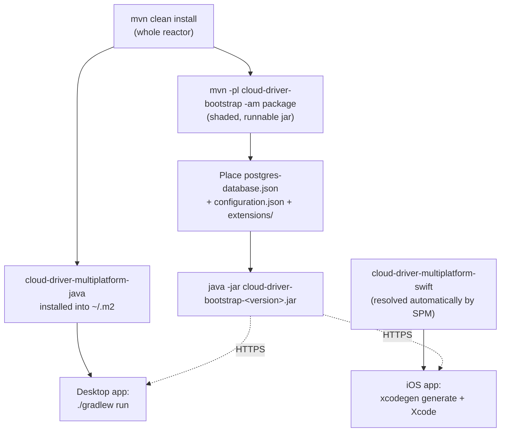

# Getting Started

This page covers building and running each component locally. For system design, see
[architecture.md](architecture.md); for required config files, see [configuration.md](configuration.md).

## Prerequisites

| Requirement | Needed for |
|---|---|
| Java 21 | Every backend module |
| A local Maven install (no wrapper is committed) | Every backend module |
| PostgreSQL instance | `cloud-driver-bootstrap` at runtime |
| Full Xcode with an iOS SDK (Command Line Tools alone are not sufficient) | Mobile app |
| [XcodeGen](https://github.com/yonaskolb/XcodeGen) | Mobile app project generation |
| No separate Gradle install needed | Desktop app ships its own wrapper |

The overall build/run order — the backend jar and the Java client library both come out of the
one Maven build, and each client builds on top of it:



## 1. Build the backend

```
mvn clean install
```

Builds every backend module in dependency order. To build one module and its dependencies only:

```
mvn -pl <module-name> -am compile
```

## 2. Produce the runnable backend jar

```
mvn -pl cloud-driver-bootstrap -am package
```

This produces one self-contained, shaded jar with every dependency bundled in:

```
java -jar cloud-driver-bootstrap/target/cloud-driver-bootstrap-<version>.jar
```

Before running it, put the two required config files (see [configuration.md](configuration.md))
in place. Feature modules (the REST API, terminal, watcher, backup, metrics) are loaded from a
separate `extensions/` folder placed next to the jar at runtime — build those modules under
`cloud-driver-extensions/` individually and copy their jars there if the feature is needed.

## 3. Run the desktop app

The desktop app is a Gradle project (Kotlin Multiplatform / Compose Desktop), not a Maven module,
and depends on `cloud-driver-multiplatform-java` (the Java REST client library) resolved from the local Maven
repository:

```
mvn -pl cloud-driver-multiplatform/cloud-driver-multiplatform-java -am install
cd cloud-driver-platforms/cloud-driver-platforms-desktop
./gradlew run
```

To build and install a native application (macOS/Linux/Windows):

```
./gradlew packageDistributionForCurrentOS
```

Or run the module's `./build-app.sh`, which builds and installs the app into the OS's normal
application location with a desktop shortcut (and works around a known macOS codesigning race the
plain Gradle task can hit).

## 4. Run the mobile app

The mobile app is a plain Xcode project, generated (not hand-maintained) from a committed
specification file. Its networking/session layer is `cloud-driver-multiplatform-swift`
(`cloud-driver-multiplatform/cloud-driver-multiplatform-swift`), a local Swift Package Manager library
dependency declared by path in `project.yml` — `xcodegen generate`/Xcode resolve it automatically,
no separate install step needed (unlike `cloud-driver-multiplatform-java`, there is nothing to `mvn install`
first):

```
cd cloud-driver-platforms/cloud-driver-platforms-mobile
xcodegen generate
open CloudDriverMobile.xcodeproj
```

Build and run from Xcode against a simulator or a real device. Requires full Xcode; regenerate the
project (`xcodegen generate`) after adding, removing, or renaming any source file in either this
module or `cloud-driver-multiplatform-swift`.

## Verifying the backend is reachable

Once the backend is running with the REST feature module loaded, the API responds on the
configured `rest-server-port`. Both client apps point at a fixed backend address hardcoded in
their own source — `DEFAULT_SERVER_URL` in the desktop app's `Main.kt`, and `APIClient`'s
`baseURL` in `cloud-driver-multiplatform-swift` for the mobile app — change the constant and
rebuild when testing against a different deployment.

## Next steps

- [Configuration](configuration.md) — every environment-specific setting
- [API Reference](api-reference.md) — the REST contract both clients rely on
- [Testing](testing.md) — how this codebase verifies changes today
- [Deployment](deployment.md) — how the backend actually reaches a server
