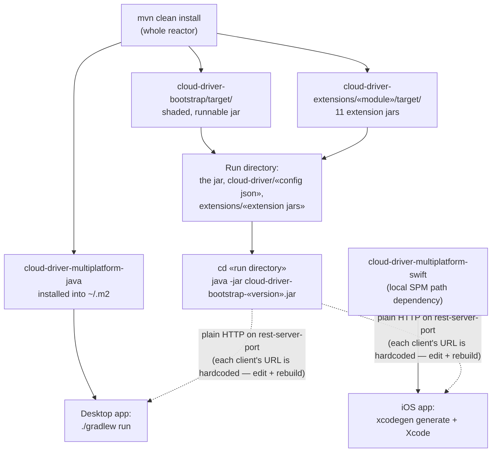

# Getting Started

This page covers building and running the backend, the desktop app and the mobile app locally.
For system design, see [architecture.md](architecture.md); for required config files, see
[configuration.md](configuration.md).

The three Python components have their own homes:

| Component | Run it |
|---|---|
| `cloud-driver-installer` (GUI installer) | [deployment.md](deployment.md) — its own venv, then `cloud-driver-installer` |
| `cloud-driver-multiplatform-python` (Python SDK) | `pip install -e .` from its directory; see [api-usage.md](api-usage.md) |
| `cloud-driver-intelligence` (semantic-search service) | `pip install -e ".[embeddings,store]"`, then `uvicorn cloud_driver_intelligence.app:app --host 127.0.0.1 --port 8600` with `CLOUD_DRIVER_INTELLIGENCE_SECRET` set to the same value as the backend's `intelligence-shared-secret` |

For their test suites, see [testing.md](testing.md) — `.[dev]` is the *test* extra, not a
runnable intelligence deployment: without `embeddings` every `/index` and `/search` answers as
unavailable, and without `store` the vectors live only in memory and are lost on restart.

## Prerequisites

| Requirement | Needed for |
|---|---|
| Java 21 | Every backend module |
| A local Maven install (no wrapper is committed) | Every backend module |
| GitHub Packages read access (a PAT with `read:packages`, as server id `database-driver-github` in `~/.m2/settings.xml`) | Every backend module — the external `de.lino.database:database-driver-*` artifacts are not on Maven Central, so a fresh `~/.m2` 404s without it (see [requirements.md](requirements.md)) |
| PostgreSQL instance | `cloud-driver-bootstrap` at runtime |
| An AWS KMS key plus working AWS credentials | `cloud-driver-bootstrap` at runtime — `aws-kms-region`/`aws-kms-key-id` are read unguarded at boot and there is no non-KMS code path |
| Python 3.10+ | The installer, the Python SDK and the intelligence service |
| Full Xcode with an iOS SDK (Command Line Tools alone are not sufficient) | Mobile app |
| [XcodeGen](https://github.com/yonaskolb/XcodeGen) | Mobile app project generation |
| No separate Gradle install needed | Desktop app ships its own wrapper |

The overall build/run order — the backend jar and the Java client library both come out of the
one Maven build, and each client builds on top of it:



## 1. Build the backend

```
mvn clean install
```

Builds every backend module in dependency order. To build one module and its dependencies only:

```
mvn -pl <module-name> -am compile
```

## 2. Produce the runnable backend jar

```
mvn -pl cloud-driver-bootstrap -am package
```

This produces one self-contained, shaded jar with every dependency bundled in, at
`cloud-driver-bootstrap/target/cloud-driver-bootstrap-<version>.jar`.

Every path the process uses is resolved against its **working directory**, not the jar's own
location — so copy the jar into a run directory and start it from inside that directory:

```
<run dir>/
├── cloud-driver-bootstrap-<version>.jar
├── cloud-driver/        # postgres-database.json + configuration.json (see configuration.md);
│                        # redis-database.json is optional
└── extensions/          # the extension jars to load (created automatically if absent)
```

```
cd <run dir> && java -jar cloud-driver-bootstrap-<version>.jar
```

Run it from a real terminal: the operator console is a `jline` terminal built with `.dumb(false)`,
so construction fails where there is no pty — an IDE run configuration, a piped stdin, or a
background job without one. Production runs it inside `screen` for the same reason (see
[deployment.md](deployment.md)).

The same `mvn clean install` already produced all eleven feature modules — the REST API, watcher,
terminal, backup, metrics, thumbnails, versioning, search, webhooks, malware scan and the
intelligence bridge — at `cloud-driver-extensions/<module>/target/`; copy in the jars the
deployment needs. The bootstrap jar and every extension jar must come from the **same build**:
extension jars resolve shared classes off the host jar's classpath, and two jars claiming the same
extension name abort startup. The full operator-facing prerequisite list is in
[requirements.md](requirements.md).

## 3. Run the desktop app

The desktop app is a Gradle project (Kotlin Multiplatform / Compose Desktop), not a Maven module,
and depends on `cloud-driver-multiplatform-java` (the Java REST client library) resolved from the local Maven
repository:

```
mvn -pl cloud-driver-multiplatform/cloud-driver-multiplatform-java -am install
cd cloud-driver-platforms/cloud-driver-platforms-desktop
./gradlew run
```

To build and install a native application (macOS/Linux/Windows):

```
./gradlew packageDistributionForCurrentOS
```

Or run the module's `./build-app.sh`, which builds and installs the app into the OS's normal
application location with a desktop shortcut (and works around a known macOS codesigning race the
plain Gradle task can hit).

## 4. Run the mobile app

The mobile app is a plain Xcode project, generated (not hand-maintained) from a committed
specification file. Its networking/session layer is `cloud-driver-multiplatform-swift`
(`cloud-driver-multiplatform/cloud-driver-multiplatform-swift`), a local Swift Package Manager library
dependency declared by path in `project.yml` — `xcodegen generate`/Xcode resolve it automatically,
no separate install step needed (unlike `cloud-driver-multiplatform-java`, there is nothing to `mvn install`
first):

```
cd cloud-driver-platforms/cloud-driver-platforms-mobile
xcodegen generate
open CloudDriverMobile.xcodeproj
```

Build and run from Xcode against a simulator or a real device. Requires full Xcode; regenerate the
project (`xcodegen generate`) after adding, removing, or renaming any source file in either this
module or `cloud-driver-multiplatform-swift`.

## Verifying the backend is reachable

Once the backend is running with the REST feature module loaded, the API responds on the
configured `rest-server-port`. There is no health route; the standard probe is an unauthenticated
`GET /auth/me`, which answers `401` exactly when the server is up and the JWT layer is active:

```
curl -s -o /dev/null -w '%{http_code}' http://127.0.0.1:<rest-server-port>/auth/me   # 401 = up
```

If it answers nothing at all, check the log for `'jwt-signing-key' is not set` — a blank
`jwt-signing-key` makes the REST extension log a warning and skip starting the server entirely
while the rest of the process boots normally.

Both client apps point at a fixed backend address hardcoded in their own source — change it and
rebuild when testing against a different deployment. The desktop app has one such constant
(`DEFAULT_SERVER_URL` in `Main.kt`, passed as both of `CloudDriverClient`'s base URLs); the mobile
app has **two**: `APIClient.shared`'s `baseURL` in `cloud-driver-multiplatform-swift`, and a second
literal in the app's own `AppViewModel.publicLinkURL(token:)`, which builds public-link URLs from a
hardcoded host despite its doc comment saying otherwise. Miss the second and public links still
point at the old deployment. Both shipped constants are `https://`, so reaching a local jar (which
serves plain HTTP) means changing the scheme too.

## Next steps

- [Configuration](configuration.md) — every environment-specific setting
- [API Reference](api-reference.md) — the REST contract both clients rely on
- [Testing](testing.md) — how this codebase verifies changes today
- [Deployment](deployment.md) — how the backend actually reaches a server
