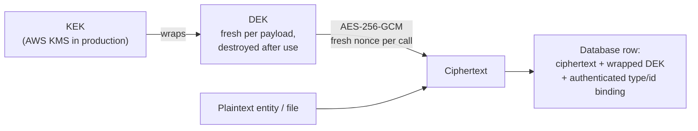
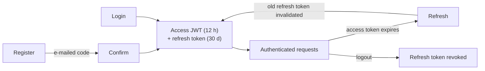
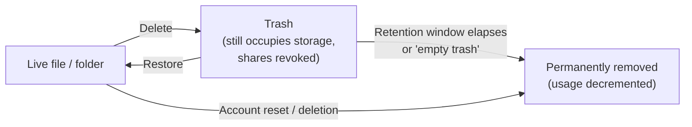

# Security Model

## Encryption at rest

| Guarantee | Detail |
|---|---|
| Nothing plaintext ever reaches the database | Every stored entity is routed through envelope encryption before any database write. **One deliberate, signed-off exception (2026-09-12): the keyword-search index.** `cloud_driver_search_index` (owned by `cloud-driver-extensions-search`, not the entity layer) stores file names, folder ids, and `tsvector` lexemes *derived* from extracted file content in plaintext — that is what makes a database-side GIN full-text index possible at all. It never holds raw content, everything in it is rebuildable derived state, and the trade was accepted explicitly: anyone with database access can read filenames and content-derived terms from it |
| Cipher | AES-256-GCM, a fresh random nonce per call, authentication tag always verified — a failed check throws rather than returning tampered plaintext |
| Key structure | DEK/KEK envelope encryption with rotation: a fresh data-encryption key is generated per payload and wrapped under the currently active key-encryption key |
| Type/identity binding | An entity's type name and primary key are bound into the encryption's authenticated data, so a swapped ciphertext of the same size can't silently decrypt as the wrong record |
| S3-backed file content | Same envelope scheme, applied to the file's content bytes before they leave the process; the file's id is bound into the authenticated data. Large content is chunk-encrypted as a stream (STREAM-style chunked AES-GCM: per-chunk nonce = random base + counter, chunk index and final-chunk flag authenticated, truncation fails closed), so memory use is O(chunk size), not O(file size). Objects written before the streaming layout existed remain readable — both layouts carry a version tag and are dispatched on read |
| Presigned direct-to-storage transfers | Content bytes bypass the server, but never the DEK/KEK scheme: the server issues a fresh per-file content key (wrapped under the same KMS-held KEK, raw material handed to the authenticated client over TLS for that one transfer only), and the **client** performs the same chunked streaming encryption before its direct `PUT` — the stored object is byte-identical in layout to a server-encrypted one. On completion the server verifies the object's real length is exactly what the declared plaintext size must produce, deleting mismatches. On download the recovered raw key is returned alongside the presigned URL and the client decrypts locally. S3's own SSE-S3 stays enabled underneath as defense-in-depth, no longer as the sole protection; objects uploaded before this existed remain readable and are flagged to clients as legacy plaintext |

## Key management implementations

| Implementation | Production-ready | Notes |
|---|---|---|
| In-memory | No | Key material lost on restart |
| File-backed | No | Key material bound to one machine's filesystem |
| Database-backed | No | Key material shared across processes, but not HSM-protected |
| AWS KMS-backed | **Yes** | Key material never leaves AWS's HSMs; supports rotation via a real key-creation call. Requires network access and AWS credentials at runtime |

## Authentication

Two independent, mutually exclusive mechanisms exist for the REST API — never combined on one
instance:

| Mechanism | Used for | Detail |
|---|---|---|
| Static API key | Machine-to-machine access | Constant-time comparison against a stored digest; the raw key is never compared directly |
| Per-user JWT | End-user clients (desktop, mobile) | HMAC-SHA256, 12-hour access token, paired with a longer-lived (30-day), single-use refresh token that rotates on every use |

- Password hashing uses Argon2id with cost parameters encoded into the hash itself.
- General-purpose hashing is restricted to SHA-256/384/512 — weaker algorithms are not offered by
  the type system at all.
- Login never distinguishes "no such account" from "wrong password," to prevent account
  enumeration.
- Self-registration is opt-in and e-mail-verified: registering only sends a time-limited
  verification code; the account itself is created only once that code is confirmed.
- An account-level admin flag exists, but it can only ever be set through the operator terminal —
  never through a network route — to avoid a privilege-escalation path.

## Authorization

- A record type can opt into per-caller ownership scoping: writes have their owner field
  overwritten server-side (a spoofed value is a no-op), and a caller reading a record it doesn't
  own gets a "not found" response rather than "forbidden," to avoid confirming the record's
  existence at all.
- File/folder sharing between accounts is a separate, additive mechanism layered on top of
  ownership, not a change to how ownership itself is enforced. Exactly three operations honor a
  share: reading a shared file's content (a folder share covers everything nested inside it),
  browsing a shared folder's contents, and — only under an explicit `EDIT`-level grant on that
  specific file — replacing its content. Everything else (upload, rename, move, delete, restore,
  re-sharing) remains strictly owner-only. Shares can carry an expiry, after which they behave as
  if they never existed.
- Public file links are the one unauthenticated access path: read-only, files-only, backed by a
  high-entropy random token, optionally expiring, and revoked automatically when the file is
  deleted.

## Network-facing hardening

| Concern | Mitigation |
|---|---|
| Credential-stuffing / brute force on auth routes | A per-IP rate limit (configurable, defaults to 10 requests per 5-minute window) |
| Reverse-proxy IP spoofing | Rate-limit identity is only ever read from a forwarded-for header when explicitly enabled for a confirmed single-trusted-proxy deployment; otherwise the raw connection address is used |
| Metrics endpoint | Loopback-only bind by default, unauthenticated by design — widen the bind host only deliberately, behind a firewall or reverse-proxy allowlist |
| Oversized uploads | A per-account upload quota and a hard request-size ceiling, both enforced before an oversized payload is fully read into memory |

## Transport security (TLS)

Encryption in transit is terminated **outside** the Java process, at a reverse proxy — the
process itself only ever speaks plain HTTP/WebSocket on its bind address:

- In the reference deployment (see `shell/provision-root-server.sh`), **Caddy terminates TLS**
  for the API domain and reverse-proxies to Javalin at `127.0.0.1:8080`. Caddy provisions and
  renews certificates itself (ACME/Let's Encrypt); no certificate material ever touches the Java
  process or its configuration.
- The REST server is expected to bind loopback only (`rest-server-bind-host`: `127.0.0.1`, as
  the provisioning script writes) so it is reachable exclusively through the proxy — the same
  "loopback-only by default, widen deliberately" convention the metrics endpoint documents above.
  ClamAV and Redis are likewise loopback-bound; PostgreSQL is co-located.
- Since 2026-09-12, the REST extension logs a **startup warning** whenever it is about to bind a
  non-loopback address (including the out-of-the-box `0.0.0.0` default): plain HTTP on a reachable
  interface exposes every request, JWTs included. The warning never refuses startup — a
  deliberately plain-HTTP deployment (e.g. LAN-only testing) can ignore it.
- An operator who widens the bind host without putting a TLS-terminating proxy in front has a
  plaintext-HTTP deployment: credentials, JWTs, and file content would cross the network
  unencrypted. Don't — nothing in the application layer compensates for a missing TLS hop.
- The forwarded-for/rate-limit interplay for such a proxy is covered in "Network-facing
  hardening" above: forwarded-header trust is opt-in and only correct behind exactly one trusted
  proxy.

## What "deleted" actually means

- A single file/folder delete is a soft delete (moved to a recoverable trash), not immediate
  removal — recoverable until an explicit restore or a configured retention window elapses.
- A full account reset/deletion bypasses the trash entirely and is not recoverable.
- Deleting or emptying-trashing a shared file/folder also revokes any outstanding shares on it, so
  a later restore never silently re-grants access to a previous recipient.
