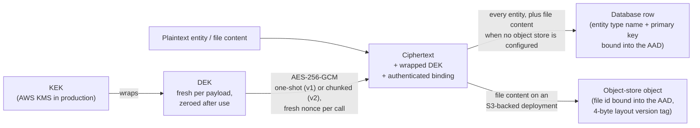
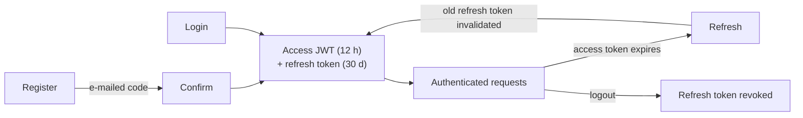
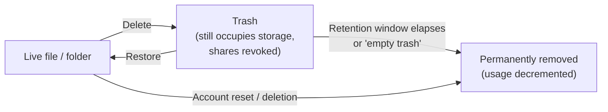

# Security Model

## Encryption at rest

| Guarantee | Detail |
|---|---|
| Nothing plaintext ever reaches the database | Every stored entity is routed through envelope encryption before any database write. **One deliberate, signed-off exception (2026-09-12): the keyword-search index.** `cloud_driver_search_index` (owned by `cloud-driver-extensions-search`, not the entity layer) stores file names, folder ids, and `tsvector` lexemes *derived* from extracted file content in plaintext — that is what makes a database-side GIN full-text index possible at all. It never holds raw content, everything in it is rebuildable derived state, and the trade was accepted explicitly: anyone with database access can read filenames and content-derived terms from it. It is not part of the database backup — the backup job exports only `id`/`data`-shaped entity tables — so no plaintext leaves the database through a backup archive. A confirmed hard reset (`hardReset confirm`) clears it along with the entity sections it derives from, so a wipe leaves no plaintext filenames or content-derived lexemes behind. A second store of content-derived data lives outside this guarantee entirely when semantic search is enabled: `cloud-driver-intelligence` keeps its own vector store (never Postgres), encrypted at rest with AES-GCM only when the operator configures an encryption key for it, and unencrypted-but-persistent otherwise — see [architecture.md](architecture.md) for how that service is isolated and why its answers are treated as untrusted input. That vector store lies outside the hard reset as well and must be cleared with that service's own tooling when a deployment is decommissioned |
| Cipher | AES-256-GCM, a fresh random nonce per call, authentication tag always verified — a failed check throws rather than returning tampered plaintext |
| Key structure | DEK/KEK envelope encryption with rotation: a fresh data-encryption key is generated per payload and wrapped under the currently active key-encryption key |
| Type/identity binding | An entity's type name and primary key are bound into the encryption's authenticated data, so a swapped ciphertext of the same size can't silently decrypt as the wrong record |
| S3-backed file content | Same envelope scheme, applied to the file's content bytes before they leave the process; the file's id is bound into the authenticated data. Large content is chunk-encrypted as a stream (STREAM-style chunked AES-GCM: per-chunk nonce = random base + counter, chunk index and final-chunk flag authenticated, truncation fails closed), so memory use is O(chunk size), not O(file size). Objects written before the streaming layout existed remain readable — both layouts carry a version tag and are dispatched on read, and an object whose tag names neither layout is rejected rather than parsed as the older one. Every length prefix inside a stored object is validated before anything is allocated: a metadata field against a fixed small bound, the content field against the stored object's own size |
| Presigned direct-to-storage transfers | Content bytes bypass the server, but never the DEK/KEK scheme: the server issues a fresh per-file content key (wrapped under the same KMS-held KEK, raw material handed to the authenticated client over TLS for that one transfer only), and the **client** performs the same chunked streaming encryption before its direct `PUT` — the stored object is byte-identical in layout to a server-encrypted one. On completion the server verifies the object's real length is exactly what the declared plaintext size must produce, deleting mismatches. On download the recovered raw key is returned alongside the presigned URL and the client decrypts locally. S3's own SSE-S3 stays enabled underneath as defense-in-depth, no longer as the sole protection; objects uploaded before this existed remain readable and are flagged to clients as legacy plaintext. A client-encrypted object is only ever read back as the chunked layout, so an uploader cannot choose which parser runs over the bytes it supplied. For the client-side chunked encryption the object's nonce base is **derived** from the issued content key (HKDF-SHA-256 with a fixed info string) rather than drawn at random, so a resumed multipart session regenerates byte-identical ciphertext instead of splicing two encryptions into one object. That is safe because a content key is issued fresh per file, and the key/nonce pairing is held to a single plaintext by recording the session's declared content digest: the client refuses to re-encrypt different content under an open session, and completion refuses a different declaration |

## Key management implementations

| Implementation | Production-ready | Notes |
|---|---|---|
| In-memory | No | Key material lost on restart |
| File-backed | No | Key material bound to one machine's filesystem |
| Database-backed | No | Key material shared across processes, but not HSM-protected |
| AWS KMS-backed | **Yes** | Key material never leaves AWS's HSMs; supports rotation via a real key-creation call. Requires network access and AWS credentials at runtime |

There is no configuration switch between these: the bootstrap constructs the AWS KMS implementation
unconditionally from `aws-kms-region`/`aws-kms-key-id`, so a deployment without those keys does not
boot at all. The other three live in a `security/keys/develop` package and are reachable only from
code (the worked examples under `src/test` use the in-memory one) — they exist to make the layer
testable without AWS, not as a deployment option.

## Authentication

Two independent, mutually exclusive mechanisms exist for the REST API — never combined on one
instance:

| Mechanism | Used for | Detail |
|---|---|---|
| Static API key | Machine-to-machine access — present in the REST factory, but **not enabled by the shipped backend**: the constructor the REST extension uses leaves the key unset, so the API-key filter is never registered on the deployed instance | Constant-time comparison against a stored SHA-256 digest (32 random bytes, base64url); the raw key is never compared directly |
| Per-user JWT | End-user clients (desktop, mobile) | HMAC-SHA256, 12-hour access token, paired with a longer-lived (30-day), single-use refresh token that rotates on every use |

- Password hashing uses Argon2id with cost parameters encoded into the hash itself.
- General-purpose hashing is restricted to SHA-256/384/512 — weaker algorithms are not offered by
  the type system at all.
- Login never distinguishes "no such account" from "wrong password," to prevent account
  enumeration.
- Self-registration is opt-in and e-mail-verified: registering only sends a time-limited
  verification code; the account itself is created only once that code is confirmed.
- An account-level admin flag exists, but it can only ever be set through the operator terminal —
  never through a network route — to avoid a privilege-escalation path.
- Every bearer-gated request re-checks the account behind the token, not just the token: a token
  whose account has been deleted, and a token whose account is suspended, are both refused with the
  same `401` an invalid token gets. Suspending an account also revokes all of its refresh tokens and
  closes its open live-update sockets, so the lock takes effect immediately rather than whenever the
  current access token happens to expire. (The suspension flag is service-level only today — nothing
  in the operator terminal or the REST API sets it yet.)

## Authorization

- A record type can opt into per-caller ownership scoping, and the "don't confirm existence" rule
  it encodes runs through the whole API: a caller reading a record it doesn't own gets a "not
  found" response rather than "forbidden." The generic resource bindings also stamp the owner field
  server-side on a write (a spoofed value is a no-op) and check the existing owner before an update
  or delete — though the shipped backend mounts only the read half of that machinery (the account
  listing); every file, folder and account mutation goes through the hand-written,
  ownership-checked handlers instead, never a generic CRUD pass-through.
- File/folder sharing between accounts is a separate, additive mechanism layered on top of
  ownership, not a change to how ownership itself is enforced. A `VIEW` grant (the default, and the
  only level a folder grant carries any meaning at) covers every read a recipient can make on the
  shared file: downloading its content, its thumbnail, its conditional-request checksum (`ETag`),
  its chunk manifest, a presigned download URL, its retained version list and any of those
  versions' content, its activity feed and its tag suggestions — and, for a folder share, browsing
  the folder's contents (everything nested inside it) plus the folder's activity feed. An `EDIT`
  grant on that specific file adds exactly one power, content replacement: a full replace, a
  chunk-diff `PATCH`, and restoring a retained version all route through the same single check,
  because a restore is no more powerful than the overwrite an `EDIT` grantee already holds. Every
  structural operation — upload into a shared folder, rename, move, trash, restore-from-trash,
  re-sharing, minting a public link — stays strictly owner-only at any permission level. Shares can
  carry an expiry, after which they behave as if they never existed.
- Public file links are the one unauthenticated access path: read-only, files-only, backed by a
  high-entropy random token, optionally expiring, and revoked automatically when the file is
  deleted.
- A presigned upload can only be completed by the account that began it, and only onto a file id
  that does not exist yet. Knowing another account's file id — which every share recipient
  necessarily does — therefore grants no ability to claim or overwrite that file. A ticket that
  belongs to someone else and an id that was never issued produce the same response, so neither
  reveals anything.

## Audit trail

- Security-relevant actions are persisted as audit events, not just logged: login success/failure
  (a failure never says which half was wrong), registration, password reset, e-mail change, admin
  grant/revoke, account suspend/unsuspend, account reset/delete, and the file/folder lifecycle
  (upload, rename, move, delete, restore, content replacement, folder create/update/delete/restore).
  The enum is deliberately limited to actions the code actually records.
- Audit events are ordinary entities, so they are envelope-encrypted at rest like everything else,
  and every event's free-text metadata passes through a redactor first — bearer tokens,
  `Authorization` headers and common secret query parameters (`token=`, `api_key=`, `password=`, …)
  are replaced with `[REDACTED]` before the row is written. Best-effort defense in depth, not a
  licence to put secrets there.
- The trail is readable through `GET /admin/audit-log` (admin-only) and through the operator
  terminal's `auditLog` command; a per-file and per-folder slice of the same events backs the
  activity feeds.

## Malware scanning

When the content-scan extension is deployed, a file is unreadable until a verdict lands on it, and
that rule holds on every path that returns content or a way to fetch it.

- A newly uploaded file is recorded as pending and refused by every read until a verdict lands on
  it.
- Two verdicts are reached without the bytes ever meeting the scanner, deliberately: content larger
  than `content-scan-max-bytes` (default 100 MiB) is marked clean unscanned rather than risking
  `clamd`'s own stream limits — that size is read off the file's own record, so such a file is
  never fetched from storage at all — and a scan that keeps failing (connection refused, timeout, an
  unexpected `clamd` answer) is attempted three times in total — the first scan plus two retries —
  and then **fails open** — marked clean with a loud `WARNING`, rather than leaving the file
  permanently unreadable because the scanner had a hiccup. The cost is explicit: a scanner outage
  during an upload silently leaves that one file unprotected. A file within the cap is streamed to
  `clamd` in chunks rather than loaded into memory, so a file's size bounds how long its scan takes,
  not how much memory it costs.
- The one failure that never fails open is content the server cannot read back: bytes that do not
  match the checksum the uploading client declared, or that fail authentication outright — tampered,
  truncated, or not that file's stored content at all. Such a file is marked **flagged**, not clean,
  and is not retried: the failure repeats identically every time, and on the direct-transfer path
  the uploading account chose the stored bytes itself, so retrying and then failing open would hand
  out a permanent clean verdict with nothing ever scanned. A flagged file is refused by every read,
  the same as one the scanner flagged.
- A direct-transfer upload's declared checksum is proven when the content is first read back, not
  when the upload is completed: completion proves only that the stored object has exactly the
  ciphertext length the declared plaintext size must produce. The scan worker is what proves the
  checksum, so on a deployment without the content-scan extension, or for content above
  `content-scan-max-bytes`, a declared checksum stays unproven until something reads the file.
- A file that is not clean is refused to its owner, to anyone it is shared with, through a
  presigned download URL, and through a public link. A public link cannot be created for a file
  that is not clean, and an existing link to one stops resolving — reporting the same "invalid
  link" as an expired or unknown token, since there is no authenticated caller to tell more.
- Preview generation sits inside the same gate. A thumbnail is decoded only from content that is
  already clean, and only when the file is within `thumbnail-max-source-bytes` and the raster it
  would need fits `thumbnail-max-decoded-pixels` — both checked from stored metadata and from the
  image header or PDF page box before a single pixel is allocated, so a small file declaring an
  enormous image is refused rather than decoded. A render that outlives
  `thumbnail-render-timeout-seconds` is abandoned and logged. When a verdict later turns clean, the
  file is offered to the generator again, so the preview still appears once the scan finishes.
- Replacing a file's content, patching it, or restoring an earlier version all count as new,
  unscanned bytes: the file returns to pending and is rescanned before it can be read again. A
  verdict is never inherited across a content change, in either direction — replacing flagged
  content does not silently clear the flag.
- A rename, a move or a trash does not change the bytes and does not trigger a rescan.
- With the extension absent, nothing is stamped or blocked, so a deployment without scanning
  behaves exactly as it did before.

## Network-facing hardening

| Concern | Mitigation |
|---|---|
| Credential-stuffing / brute force on auth routes | A per-IP rate limit on every `/auth/*` route (configurable, defaults to 10 requests per 5-minute window); `GET /auth/me` is deliberately excluded — a cheap read the desktop app polls on every login and every dashboard visit, which would otherwise exhaust that tight window. Since the general limiter below skips the whole `/auth/` prefix, that exclusion leaves `GET /auth/me` metered by neither limiter |
| Scraping / enumeration, and cheap-to-issue writes | A second, general fixed-window limit (defaults to 300 requests per 60-second window) keyed by the authenticated account — falling back to the connection address before a token is resolved. It covers every `GET`/`HEAD` outside the `/auth/` prefix (which the tighter auth limiter above owns), plus the low-volume writes that are cheap to issue and expensive to serve: registering a webhook, minting a share, minting a public link. `GET /files/{id}/thumbnail` is exempt (a file browser fires dozens at once), and a public-link download does not share this budget at all: it has its own, tighter one (its own two configuration keys), in a bucket keyed by link *and* client so neither one link nor one client can exhaust the allowance of the others. Public-link content is streamed straight out of storage rather than buffered, so a linked file's size never becomes server memory. Ordinary writes are deliberately unmetered — an upload is one request per file and is bounded by the upload quota and the request-size ceiling instead. Both limiters keep their counters in Redis when one is configured, so a restart or a second instance does not reset the window, and fall back to per-process buckets when Redis is absent or unreachable |
| Reverse-proxy IP spoofing | A forwarded-for header is believed only when the immediate TCP peer is a trusted proxy. `trusted-proxy-addresses` (a comma-separated allowlist of exact peer addresses) decides that when it is set and non-blank; otherwise the older `trust-proxy-headers` boolean applies, and it means only "trust a loopback peer". With neither key set the raw connection address is always used. When the header is trusted, only its **rightmost** entry is read — behind exactly one trusted hop that is the one value a client cannot have written (and the reference Caddy block overwrites the header rather than appending to it) |
| Metrics endpoint | Loopback-only bind by default, unauthenticated by design — widen the bind host only deliberately, behind a firewall or reverse-proxy allowlist |
| Oversized uploads | A hard request-size ceiling (256 MiB) enforced *mid-stream*: a server-mediated upload is written to a scratch file in 8 KiB chunks and rejected the moment the running total exceeds the ceiling, before the rest of the body is read and without ever buffering it in heap. The per-account upload quota is enforced on top of that — up front, before a single byte moves, on the presigned and resumable paths (which also cap how many sessions one account may hold open at once), and on the received file for a server-mediated upload |

## Transport security (TLS)

Encryption in transit is terminated **outside** the Java process, at a reverse proxy — the
process itself only ever speaks plain HTTP/WebSocket on its bind address:

- In the reference deployment (see `shell/provision-root-server.sh`), **Caddy terminates TLS**
  for the API domain and reverse-proxies to Javalin at `127.0.0.1:8080`. Caddy provisions and
  renews certificates itself (ACME/Let's Encrypt); no certificate material ever touches the Java
  process or its configuration.
- The REST server is expected to bind loopback only (`rest-server-bind-host`: `127.0.0.1`, as
  the provisioning script writes) so it is reachable exclusively through the proxy — the same
  "loopback-only by default, widen deliberately" convention the metrics endpoint documents above.
  In that script-provisioned shape ClamAV and Redis are likewise loopback-bound and PostgreSQL is
  co-located. The GUI installer additionally supports pointing a deployment at an **external**
  PostgreSQL or Redis server instead of installing one locally; those connections then leave the
  host, and protecting them (network placement, the datastore's own TLS) is the operator's, not the
  application's.
- Since 2026-09-12, the REST extension logs a **startup warning** whenever it is about to bind a
  non-loopback address (including the out-of-the-box `0.0.0.0` default): plain HTTP on a reachable
  interface exposes every request, JWTs included. The warning never refuses startup — a
  deliberately plain-HTTP deployment (e.g. LAN-only testing) can ignore it.
- `cloud-driver-installer` supports three transport shapes, and only the first is safe for real
  accounts: reverse proxy **with** an API domain (HTTPS on that name, the intended shape); reverse
  proxy **without** one (Caddy answers on `:80` for whatever address the request arrived on — there
  is no name to put on a certificate, so passwords and tokens travel unencrypted and the shipped
  clients, which speak `https://` only, cannot connect); and **no reverse proxy at all**, where the
  JVM itself is the public listener, the firewall step opens the REST port for it, and the endpoint
  is `http://<server address>:<REST port>`. The installer states the exposure as an explicit plan
  warning in the last two cases. The forwarded-header reasoning above still holds for the proxied
  shapes (exactly one trusted proxy on loopback); the transport protection does not.
- An operator who widens the bind host without putting a TLS-terminating proxy in front has a
  plaintext-HTTP deployment: credentials, JWTs, and file content would cross the network
  unencrypted. Don't — nothing in the application layer compensates for a missing TLS hop.
- The forwarded-for/rate-limit interplay for such a proxy is covered in "Network-facing
  hardening" above: forwarded-header trust is opt-in and only correct behind exactly one trusted
  proxy.

## What "deleted" actually means

- A single file/folder delete is a soft delete (moved to a recoverable trash), not immediate
  removal — recoverable until an explicit restore or a configured retention window elapses.
- A full account reset/deletion bypasses the trash entirely and is not recoverable.
- Deleting or emptying-trashing a shared file/folder also revokes any outstanding shares on it, so
  a later restore never silently re-grants access to a previous recipient.
