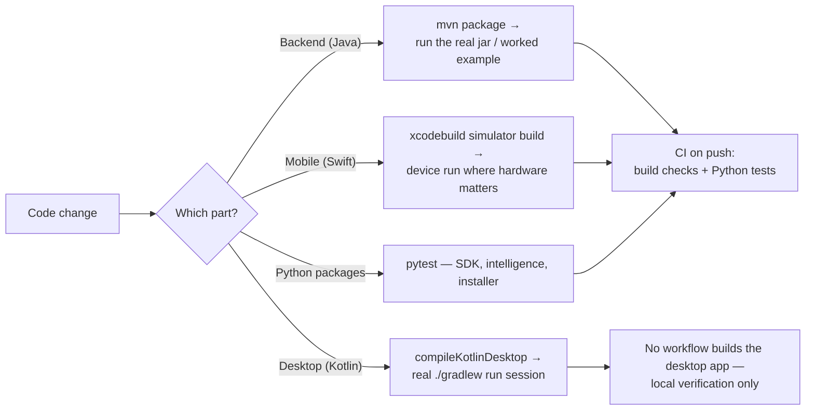

# Testing

No automated test framework (JUnit, XCTest, etc.) is wired into the Java, Kotlin, or Swift parts
of this codebase today — the three Python packages are the exception, each carrying a real
`pytest` suite run in CI. This page documents how changes are actually verified.



## Backend (Java/Maven modules)

- Files under a module's `src/test` directory are **runnable worked examples with a `main`
  method**, not `mvn test` targets — a repo-wide convention. Run one directly from an IDE, or via:

  ```
  mvn -pl <module> -am test-compile
  ```

  then run the compiled class on the built classpath. The ones that assert something and print a
  pass/fail tally (rather than just demonstrating an API) are the closest thing to a test suite
  here:

  | Worked example | Module | Covers |
  |---|---|---|
  | `ChunkedStreamingEncryptionSample` | `plugin` | The v2 chunked-AEAD layout: round-trip, truncation, tampering |
  | `StreamedUploadSample` | `plugin` | Content-file-backed uploads above the 32 MiB threshold |
  | `ConditionalDownloadSample` | `plugin` | `ETag`/`If-None-Match`/`304` on the content routes |
  | `IndexedLookupSample` | `plugin` | `SecondaryIndexed` lookups against equivalent full scans |
  | `ResumableUploadSample` | `plugin` | Multipart session geometry, resume, abort, dedup precheck |
  | `RedisClusteringSample` | `plugin` | Scheduler locks and the cross-instance pending-upload cache |
  | `S3ObjectStorageServiceSample` | `plugin` | Object-storage put/get/delete against a real bucket |
  | `ChunkPatchSample` | `versioning` | Chunk manifests, `PATCH` reassembly, version delta chains |
  | `PostgresSearchIndexSample` | `search` | The `tsvector`/GIN index against a real local Postgres: schema creation, filename-over-content ranking, per-account scoping, metadata-only re-index (`createdb cloud_driver_search_sample` first) |
  | `CommandFlagSample` | `api` | Terminal command flags: positional/flag split, values, aliases |

  Two further samples in `plugin` are demonstrations rather than checks — they assert nothing and
  print no tally: `RestFactorySample` mounts generic `/notes` CRUD on the unauthenticated
  `DefaultRestFactory`, and `RestFactoryCloudUserSample` boots the JWT-gated constructor, which
  mounts the whole authenticated surface — the `/auth`, `/admin`, `/cloudUsers`, `/trash`,
  `/files`, `/folders`, `/search`, `/activity`, `/webhooks` and `/public` routes plus the
  `/ws/updates` socket — and seeds one demo account so the printed login → upload → list → delete
  walkthrough works against it. Each starts a server and prints the `curl` lines to try by hand.
- A scripted end-to-end check lives in the repo:
  `python3 .claude/skills/run-cloud-driver-backend/driver.py all` stages the bootstrap jar, the
  extension jars and a generated config set into a throwaway run directory outside the repo,
  creates its own local Postgres database, boots the process on a pseudo-terminal (the operator
  console is jline-based and needs a real TTY on stdin) and drives a register → confirm → upload →
  list → download-and-compare → conditional `304` → search flow, printing a `PASS`/`FAIL` line per
  check and exiting non-zero if any of them failed. It only stops early when registration,
  confirmation or the upload itself fails — there is nothing left to check after that.
- Assembling that same layout by hand is the manual equivalent — the layout a real deployment
  expects (the bootstrap jar plus a sibling `extensions/` folder holding the feature-module jars,
  and a `cloud-driver/` folder holding the config files — `configuration.json` and
  `postgres-database.json`, plus `redis-database.json` when the run should use Redis). Run
  `mvn clean install` first, then:

  ```bash
  mkdir -p /tmp/cd-smoke/extensions /tmp/cd-smoke/cloud-driver
  cp cloud-driver-bootstrap/target/cloud-driver-bootstrap-*.jar /tmp/cd-smoke/
  cp cloud-driver-extensions/*/target/cloud-driver-extensions-*.jar /tmp/cd-smoke/extensions/
  cp cloud-driver/*.json /tmp/cd-smoke/cloud-driver/          # real config, never committed
  cd /tmp/cd-smoke && java -Xmx6g -jar cloud-driver-bootstrap-*.jar
  ```

  The bootstrap jar and every extension jar must come from the same build — extension jars
  resolve shared classes off the host jar's classpath, so a mixed pair crashes at startup.
- New backend functionality is verified by actually running the built jar (or a worked example)
  against a real or local database, not by a unit test suite.

## Desktop app

- No automated test target exists. Changes are verified by compiling
  (`./gradlew compileKotlinDesktop`) and by an actual `./gradlew run` session exercising the
  feature by hand.
- Before packaging a release build, a real `./gradlew createDistributable` (or the platform
  install script) should be run at least once — a plain compile does not catch every packaging
  issue (e.g. JDK module trimming for the native runtime image).

## Mobile app

- No XCTest target exists either. Changes are verified via a real
  `xcodebuild ... -sdk iphonesimulator build` (not just a syntax check) and, where camera/file
  access is involved, an actual device run — the iOS Simulator cannot exercise every feature (for
  example, the document scanner requires real camera hardware).
- Regenerate the Xcode project (`xcodegen generate`) after adding, removing, or renaming any
  source file, before building.

## Client SDKs

The Java SDK (`cloud-driver-multiplatform-java`) has no `src/test` at all — it is verified only by
compiling in the reactor and by the desktop app that consumes it. The Swift SDK
(`cloud-driver-multiplatform-swift`) declares no test target either; its only automated check is
being compiled transitively as the iOS app's local SPM path dependency in `swift.yml`. The Python
SDK is the one with a suite of its own (below).

## Python packages

The exception to the above: `cloud-driver-multiplatform-python` (the SDK),
`cloud-driver-intelligence` (the semantic-search service) and `cloud-driver-installer` (the GUI
installer) each have a real `pytest` suite — network calls mocked in the SDK's case, so no live
server is needed:

```
cd <package-dir>
python3 -m venv .venv && source .venv/bin/activate
pip install -e ".[dev]"
pytest
```

On Python 3.14 an editable install's `.pth` hook is ignored, so the SDK and intelligence suites
collect nothing there (`ModuleNotFoundError: No module named …`) — run them as
`PYTHONPATH=src pytest`. The installer is unaffected: its `pyproject.toml` pins
`pythonpath = ["src", "tests"]` for exactly this reason. CI runs 3.10/3.11/3.12, where the plain
flow works.

A handful of tests in two of the three suites — the intelligence service's encrypted-store tests
and the SDK's `DatabaseTokenStore` tests — additionally need the `lino-database-driver-*` packages
(the Python edition of the external `database-driver-v2` repository, not on any package index yet;
install them into the venv from that clone with
`pip install -e <clone>/python/database-driver-api -e <clone>/python/database-driver-plugin`).
Without them those tests **skip** rather than fail, which is also what CI does — the workflows
install only the `dev` extra from public indexes.

The installer's suite needs neither a server nor an AWS account: SSH is replaced by a scripted
fake with the same surface every step talks to (`tests/fake_remote.py`), so a test can assert on
the exact commands a step ran and the files it wrote. The AWS side is deliberately left out — no
test builds an `AwsProvisioner`, so `Context.aws` raises `AWS access is not configured` and the
AWS step's `check` reports "needs apply"; what is covered is only its server-side half (the
`/root/.aws/credentials` file its removal deletes, and the SES/SMTP config keys the e-mail half
renders). Beyond each step's `check`/`apply`/`verify`, the suite covers every removable step's
`remove()` and `describe_removal()` (`test_step_removal.py` — what each removal deletes and, as
importantly, what it refuses to touch: the KMS key, the buckets, an external database server), the
`Setup.md` export and its secret warning (`test_setup_export.py`), the scrolling panes and the
wheel router (`test_gui_scrolling.py`), and a guard that no module in the package shadows a
standard-library name (`test_import_hygiene.py`, which re-imports the package in a subprocess with
the package directory first on `sys.path`). Its window tests build a real Tk window and skip
themselves wherever tkinter is missing or there is no display — on the CI runner it is the former:
`installer.yml` deliberately never installs tkinter.

## CI

Six automated checks run on pushes/pull requests (see [deployment.md](deployment.md) for the
full pipeline):

| Workflow | Verifies |
|---|---|
| Backend build (`maven.yml`) | `mvn package` across the whole Maven reactor — build only, no tests |
| Mobile build (`swift.yml`) | An Xcode simulator build of the mobile app, which also compiles the Swift SDK as a local package — build only |
| Python SDK (`python.yml`) | `pytest` across Python 3.10/3.11/3.12 |
| Intelligence service (`intelligence.yml`) | `pytest` across Python 3.10/3.11/3.12, with only the `dev` extra — a stub embedding model and the in-memory vector store |
| GUI installer (`installer.yml`) | `pytest` across Python 3.10/3.11/3.12 (the window tests skip — tkinter is deliberately not installed there) |
| Qodana (`qodana_code_quality.yml`) | Static analysis |
