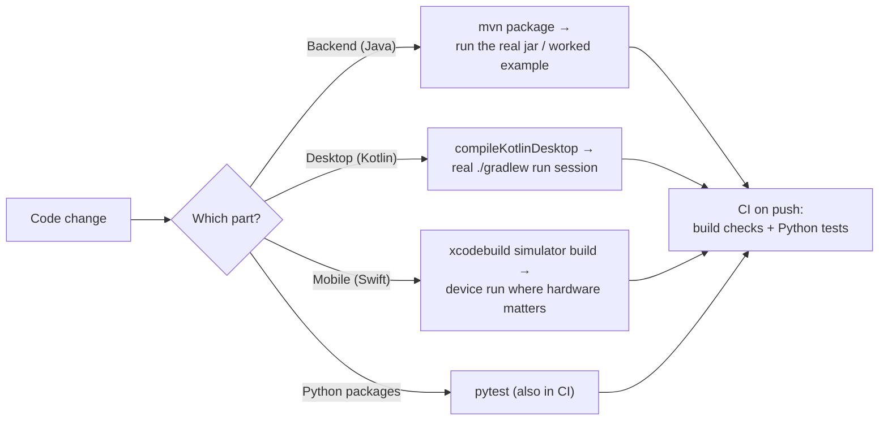

# Testing

No automated test framework (JUnit, XCTest, etc.) is wired into the Java, Kotlin, or Swift parts
of this codebase today — the two Python packages are the exception, each carrying a real `pytest`
suite run in CI. This page documents how changes are actually verified.



## Backend (Java/Maven modules)

- Files under a module's `src/test` directory are **runnable worked examples with a `main`
  method**, not `mvn test` targets — a repo-wide convention. Run one directly from an IDE, or via:

  ```
  mvn -pl <module> -am test-compile
  ```

  then run the compiled class on the built classpath.
- `shell/test-bootstrap.sh` (operator-only, not part of any build) assembles a clean, throwaway
  run directory: it builds the bootstrap jar and every feature-module jar, lays them out the way a
  real deployment expects (bootstrap jar + a sibling `extensions/` folder), and runs the process
  from inside that directory — the closest thing to an end-to-end smoke test this repo has. Run
  `mvn clean install` first; this script does not build anything itself.
- New backend functionality is verified by actually running the built jar (or a worked example)
  against a real or local database, not by a unit test suite.

## Desktop app

- No automated test target exists. Changes are verified by compiling
  (`./gradlew compileKotlinDesktop`) and by an actual `./gradlew run` session exercising the
  feature by hand.
- Before packaging a release build, a real `./gradlew createDistributable` (or the platform
  install script) should be run at least once — a plain compile does not catch every packaging
  issue (e.g. JDK module trimming for the native runtime image).

## Mobile app

- No XCTest target exists either. Changes are verified via a real
  `xcodebuild ... -sdk iphonesimulator build` (not just a syntax check) and, where camera/file
  access is involved, an actual device run — the iOS Simulator cannot exercise every feature (for
  example, the document scanner requires real camera hardware).
- Regenerate the Xcode project (`xcodegen generate`) after adding, removing, or renaming any
  source file, before building.

## Python packages

The exception to the above: `cloud-driver-multiplatform-python` (the SDK) and
`cloud-driver-intelligence` (the semantic-search service) each have a real `pytest` suite —
network calls mocked in the SDK's case, so no live server is needed:

```
cd <package-dir>
python3 -m venv .venv && source .venv/bin/activate
pip install -e ".[dev]"
pytest
```

## CI

Five automated checks run on pushes/pull requests (see [deployment.md](deployment.md) for the
full pipeline):

| Workflow | Verifies |
|---|---|
| Backend build (`maven.yml`) | `mvn package` across the whole Maven reactor — build only, no tests |
| Mobile build (`swift.yml`) | An Xcode simulator build of the mobile app — build only |
| Python SDK (`python.yml`) | `pytest` across Python 3.10/3.11/3.12 |
| Intelligence service (`intelligence.yml`) | `pytest` for the semantic-search service |
| Qodana (`qodana_code_quality.yml`) | Static analysis |
